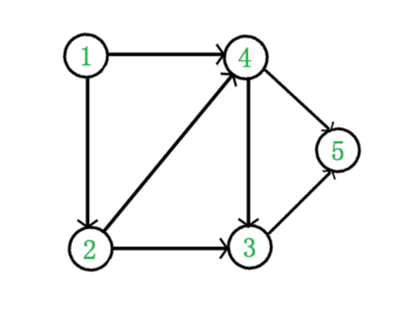
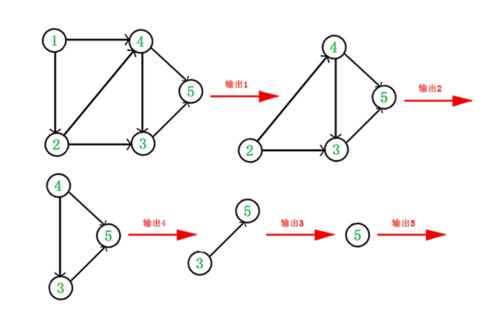

# 拓扑排序
* 拓扑排序是一个**有向无环图**

* 每个顶点仅出现一次

* 若存在一条从$A$到$B$的路径，那么**在序列中$A$出现在$B$的前面**





> 1. 从图中选择一个没有前驱（入度为0）的顶点并输出

> 2. 从图中删除该顶点和所有以它为起点的边

> 3. 重复1和2直到**当前图为空**或**当前图中不存在无前驱的顶点为止**，其中后一种情况说明有向图中必然存在环

# 拓扑排序的实现

```c
int V; // 顶点个数
bool topological_sort()
{
    for(int i = 1; i <= V; i++)
    {
        if(indegree[i] == 0)
        {
            push(i)// 将所有入度为0的顶点入队
        }
    }

    int count = 0; // 记录已输出顶点数
    while(!is_empty())
    {
        int v = pop(); // 从队列中取出一个顶点
        cout << v << endl;
        count++;

        // 将所有v指向的顶点的入度减1，并将入度为0的顶点入栈
        for i in v: // 这里使用python代替，根据实际数据结构进行修改
        {
            indegree[i]--;
            if(indegree[i] == 0)
            {
                push(i);
            }
        }
    }
    if(count != V)
    {
        return false; // 没有输出全部顶点，有向图中存在回路
    }
    return true;
}
```