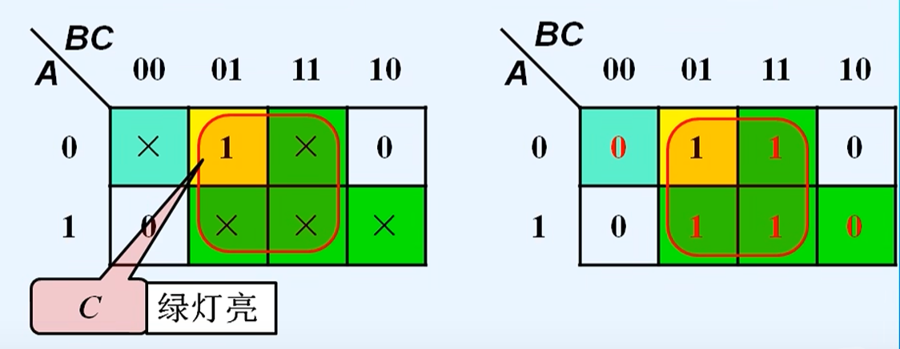

# 具有无关项的逻辑函数及其化简
<https://www.bilibili.com/video/BV1uL411j77m/?spm_id_from=333.337.search-card.all.click&vd_source=c65196c22fdd3605640aeccf1b3b4a0e>

## 无关项
- 约束项：由于输入变量取值的限制，而不可能出现的最小项

- 任意项：取值为$0$或$1$都不影响正常逻辑功能的最小项

- 无关项：
    - 约束项和任意项统称为无关项

    - 逻辑函数中用$d$表示，卡诺图中用$\times$表示

## 利用无关项化简逻辑函数
- 加入无关项的目的：矩形圈最大，矩形数量最少

