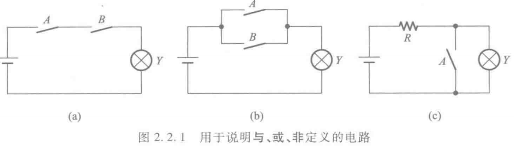
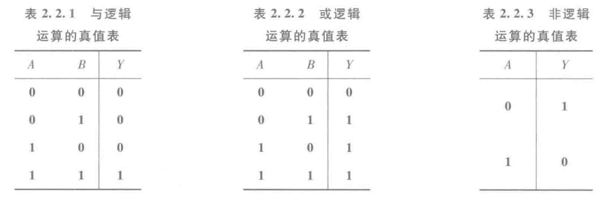
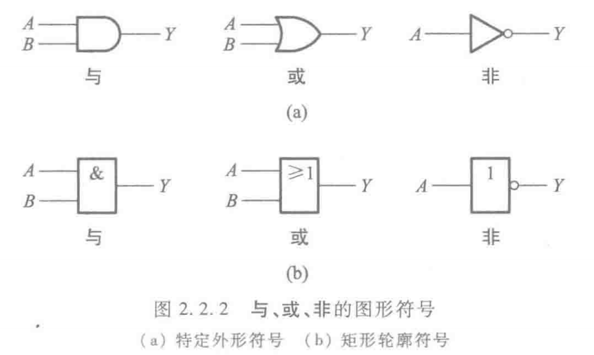
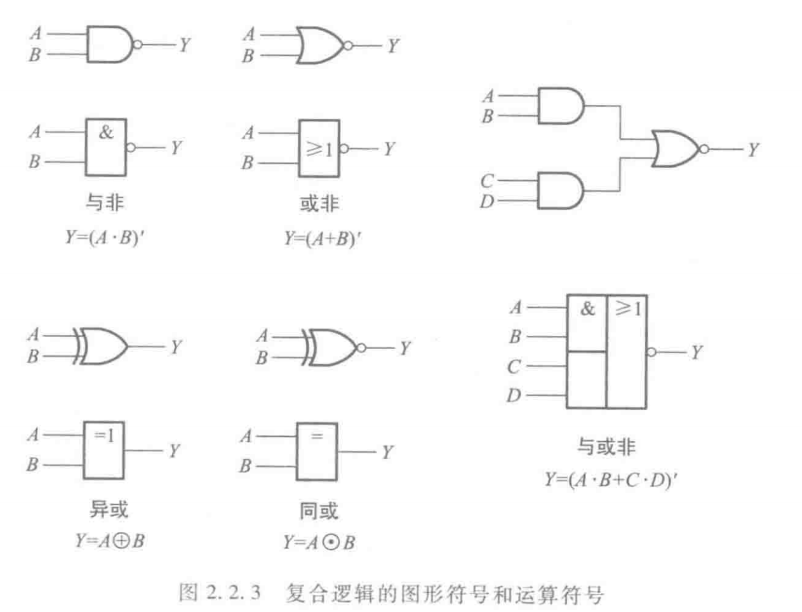

# 逻辑与、逻辑或和逻辑非

|与运算|或运算|非运算|
|-|-|-|
|$Y = A \cdot B$|$Y = A + B$|$Y = A'$|

## 逻辑真值表

## 图像符号

## 异或和同或

|异或|同或|
|-|-|
|$Y = A \oplus B = A \cdot B' + A' \cdot B$|$Y = A \odot B = A \cdot B + A' \cdot B'$|

- 异或与同或互为反运算：$A \oplus B = (A \odot B)'$
