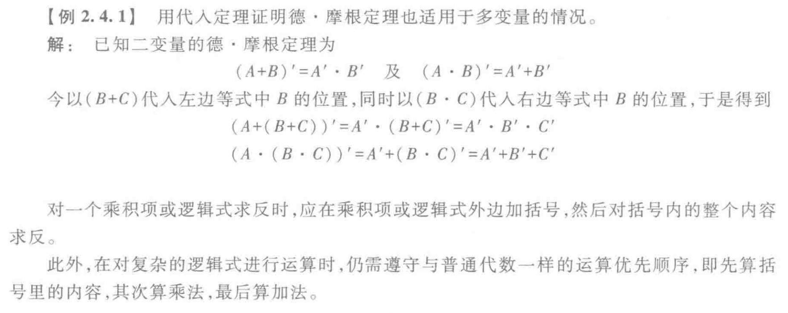
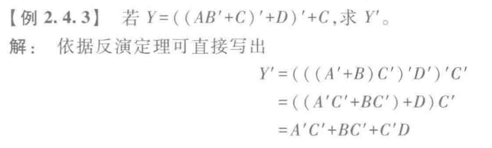
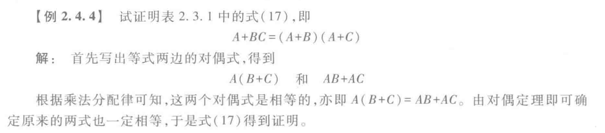

# 逻辑代数基本定理

## 代入定理
- 定理：在任何一个包含变量$A$的逻辑等式中，若以另外一个逻辑式代入式中所有$A$的位置，则等式仍然成立

## 反演定理
- 定理：对于任意一个逻辑式$Y$，若将其中所有“$\cdot$”换成“$+$”，“$+$”换成“$\cdot$”，“$0$”换成“$1$”，“$1$”换成“$0$”，原变量换成反变量，反变量换成原变量，则得到的结果为$Y'$

- 规则
    - 遵守“先括号、然后乘、最后加”的运算优先次序

    - 不属于**单个**变量上的反号应保留不变

## 对偶定理
- 定理：若两逻辑式相等，则它们的对偶式也相等

- 对偶式：对于任意一个逻辑式$Y$，若将其中的“$\cdot$”换成“$+$”，“$+$”换成“$\cdot$”，“$0$”换成“$1$”，“$1$”换成“$0$”，则得到一个新的逻辑式$Y^D$，这个$Y^D$就称为$Y$的对偶式，或者说$Y$和$Y^D$互为对偶式

