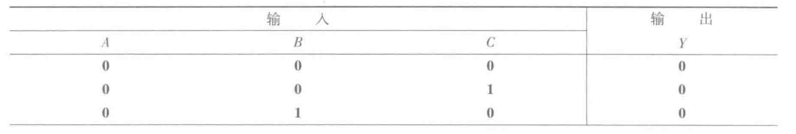
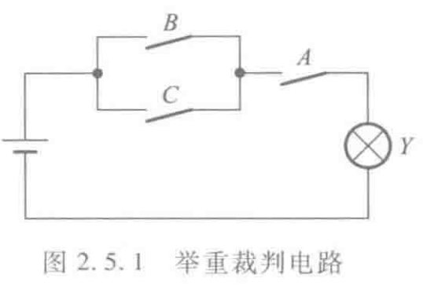
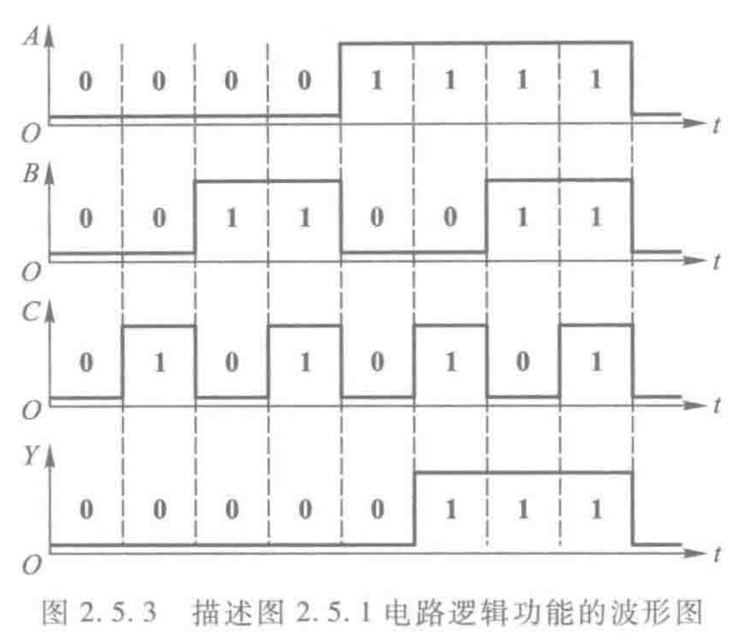
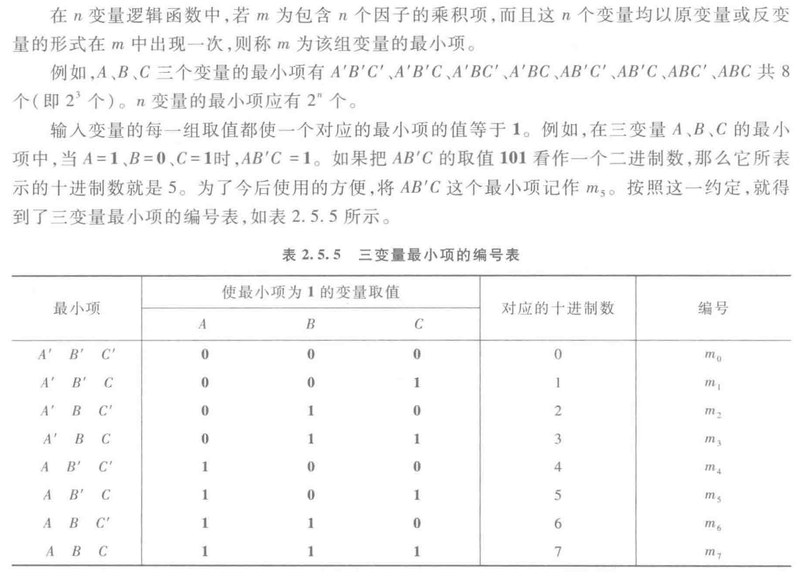
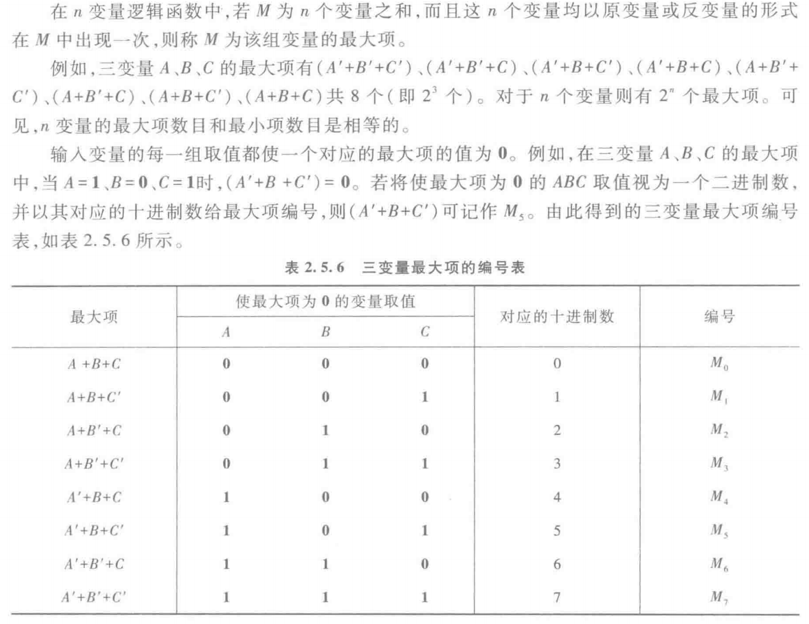
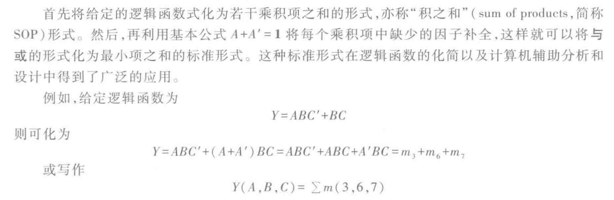
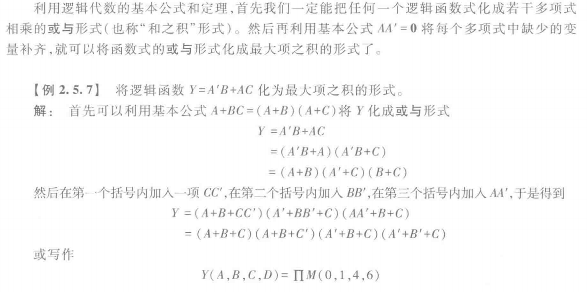

# 逻辑函数及其描述方法

## 逻辑函数
- 逻辑函数$Y = F(A, B, C, ...)$：以逻辑变量作为输入，以运算结果作为输出

## 逻辑函数的描述方法

### 逻辑真值表

### 逻辑函数式

### 逻辑图

### 波形图

### 描述方法之间的转换
1. 真值表转化为逻辑函数
    - 找出真值表中使逻辑函数$Y = 1$的那些输入变量取值的组合

    - 每组输入变量取值的组合对应一个乘积项，其中取值为$1$的写入原变量，取值为$0$的写入反变量

    - 将这些乘积项相加，即得$Y$的逻辑函数式

2. 逻辑函数式与逻辑图的相互转换
    - 用逻辑图形符号代替逻辑函数式中的逻辑运算符号并按照运算优先顺序将它们连接起来

    - 从逻辑图的输入段到输出端逐级写出每个图形符号的输出逻辑式

3. 波形图与真值表的相互转换

    

## 逻辑函数的两种标准形式

### 最小项和最大项
- 最小项

    

- 最小项的性质
    1. 在输入变量的任何取值下必有一个最小项，而且仅有一个最小项的值为$1$

    2. 全体最小项之和为$1$

    3. 任意两个最小项的乘积为$0$

    4. 具有相邻性的两个最小项之和可以合并成一项并消去一对因子

    > 若两个最小项只有一个因子不同，则称这两个最小项具有相邻性：$A'BC' + ABC' = (A' + A)BC' = BC'$

- 最大项

    

- 最大项的性质
    1. 在输入变量的任何取值下必有一个最大项，而且只有一个最大项的值为$0$

    2. 全体最大项之积为$0$

    3. 任意两个最大项之和为$1$
    
    4. 只有一个变量不同的两个最大项的乘积等于各相同变量之和

- 最小项和最大项存在关系：$M_i = m_i'$

> 例如，$m_0 = A'B'C'$，则$m_0' = (A'B'C')'A + B + C = M_0$

### 逻辑函数的最小项之和形式

### 逻辑函数的最大项之积形式

