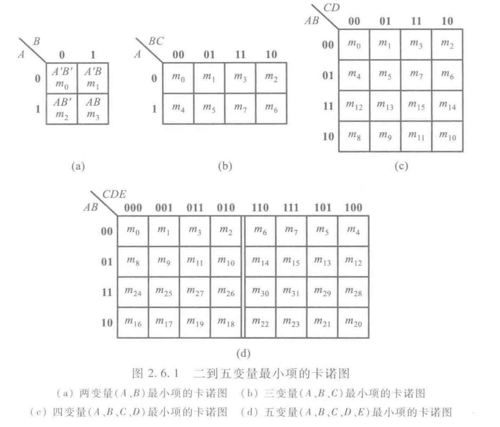
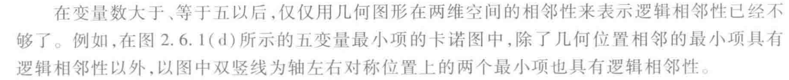
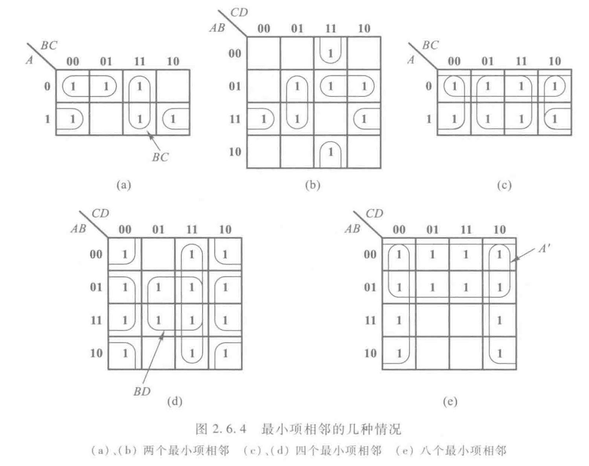
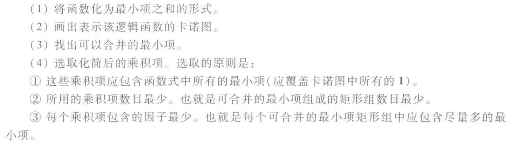

# 逻辑函数的化简方法
- 最简形式：在**与或**逻辑函数式时，若其中包含的乘积项已经最少，而且每个乘积项里的因子也不能再减少

- 化简逻辑函数的目的是消去多余的乘积项和每个乘积项中多余的因子，以得到逻辑函数式的最简形式

## 卡诺图化简法

### 卡诺图表示法
- 卡诺图：将$n$变量的全部最小项各用一个方块表示，并使具有**逻辑相邻性的最小项**在几何位置上也相邻地排列起来，所得图形称为$n$变量最小项的卡诺图

### 卡诺图化简逻辑函数
1. 合并最小项的原则
    - 若**两个**最小项相邻，则可合并为一项并消去一对因子，合并后只剩下公共因子

    - 若**四个**最小项相邻并排列成一个**矩形组**，则可合并为一项并消去**两对**因子，结果只剩下公共因子

    - 若**八个**最小项相邻并排列成一个**矩形组**，则可合并为一项并消去**三对**因子，结果只剩下公共因子

    - 一般规则：如果有$2^n$个最小项相邻并排列成一个**矩形组**，则它们可以合并为一项，并消去$n$对因子，结果只剩下公共因子

    

2. 卡诺图化简法的步骤

    
