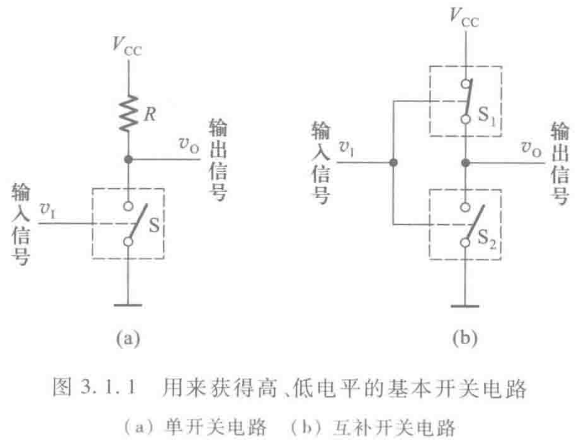
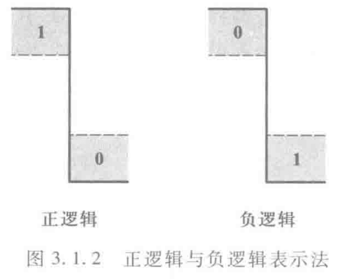

# 概述

## 基本开关电路

- 单开关电路：
    - S断开时，输出电压$v_0$为高电平$V_{CC}$
    
    - S接通时，输出为低电平0

    - 开关S由半导体三极管组成

    - 功耗比较大：S导通时，输出为低电平，电源电压全部加载电阻上，消耗$\frac{V^2_{DD}}{R}$

- 互补开关电路：
    - $S_1$和$S_2$的状态是相反的

    - $S_1$和$S_2$总有一个是断开的，所以流过$S_1$和$S_2$的电流始终为0，电路功耗极小

## 逻辑状态表示方法

