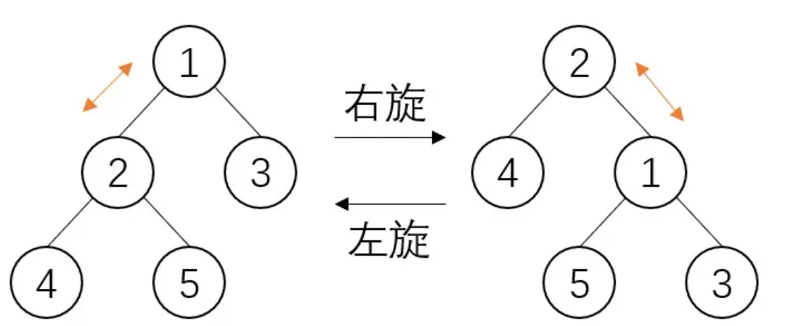
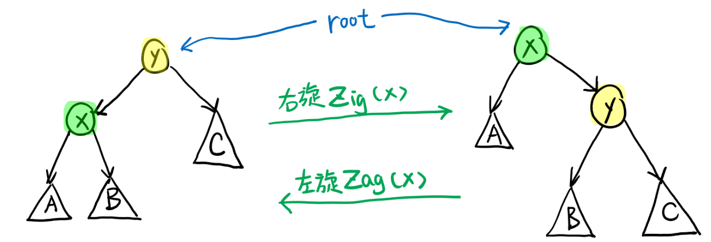
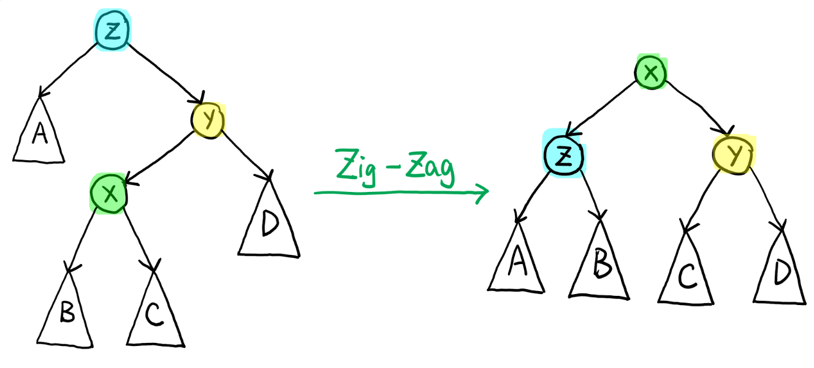

# 伸展树
<https://zhuanlan.zhihu.com/p/346741421>

* Splay树不关心二叉排序树是否时刻平衡，而是通过在每次操作时进行微调来使得树趋于平衡

* 每当对二叉排序树进行一次操作（查询、插入、删除等）时，将操作的结点通过**旋转**操作挪到根节点上，并且使得整棵树依旧满足二叉排序树的性质，这一系列过程**为splay操作**

* splay操作不单单是将操作节点挪到根节点，还将从原根节点到操作节点路径上的所有节点都进行了一次优化，使得其深度缩减，通过这一方法来使得二叉排序树不至于退化为链









# 伸展树实现

```c
/* 以下五个数组用来存splay 树。numNodes是附加信息：用来存子树的节点数，方便执行Get和Rank操作 */
int parent[maxm];	// 父亲
int lchild[maxm];	// 左孩子
int rchild[maxm];	// 右孩子
int val[maxm];		// 数据
int numNodes[maxm]; // 以该点为根的结点个数

int splay[maxm]; // 记录每次操作splay的次数.即输出的第2行。

int m, root = null, count = 0; // count为最新节点的序号。

inline void update(int x)
{ // 更新结点数
	numNodes[x] = numNodes[lchild[x]] + numNodes[rchild[x]] + 1;
}

void splayTree(int x)
{
	int f = parent[x];
	if (f == null)
		return;
	splay[m_count]++; // 第m_count次的splay的次数

	int g = parent[f];
	if (g == null)
	{ /*zig or zag*/
		if (lchild[f] == x)
		{	/*zig*/
			lchild[f] = rchild[x];
			parent[lchild[f]] = f;
			rchild[x] = f;
			parent[f] = x;
		}
		else
		{	/*zag*/
			rchild[f] = lchild[x];
			parent[rchild[f]] = f;
			lchild[x] = f;
			parent[f] = x;
		}
		update(f);
		update(x);
		parent[x] = null;
		root = x;
		return;
	}

	int h = parent[g];
	if (lchild[g] == f && lchild[f] == x)
	{	/*zig-zig*/
		lchild[g] = rchild[f];
		parent[lchild[g]] = g;
		lchild[f] = rchild[x];
		parent[lchild[f]] = f;
		rchild[f] = g;
		parent[g] = f;
		rchild[x] = f;
		parent[f] = x;
	}
	else if (rchild[g] == f && rchild[f] == x)
	{	/*zag-zag*/
		rchild[g] = lchild[f];
		parent[rchild[g]] = g;
		rchild[f] = lchild[x];
		parent[rchild[f]] = f;
		lchild[f] = g;
		parent[g] = f;
		lchild[x] = f;
		parent[f] = x;
	}
	else if (lchild[g] == f && rchild[f] == x)
	{	/*zig-zag*/
		rchild[f] = lchild[x];
		parent[rchild[f]] = f;
		lchild[g] = rchild[x];
		parent[lchild[g]] = g;
		lchild[x] = f;
		parent[f] = x;
		rchild[x] = g;
		parent[g] = x;
	}
	else if (rchild[g] == f && lchild[f] == x)
	{	/*zag-zig*/
		rchild[g] = lchild[x];
		parent[rchild[g]] = g;
		lchild[f] = rchild[x];
		parent[lchild[f]] = f;
		lchild[x] = g;
		parent[g] = x;
		rchild[x] = f;
		parent[f] = x;
	}

	update(g);
	update(f);
	update(x);
	if (h == null)
	{
		root = x;
		parent[root] = null; // 更新根节点
	}
	else
	{
		parent[x] = h;
		if (val[x] < val[h])
			lchild[h] = x;
		else
			rchild[h] = x;
		splayTree(x);
	}
}

int search(int x)
{ // 调用search时确保root!=null
	int p = root;
	while (val[p] != x)
	{
		if (x < val[p])
		{
			if(lchild[p] == null)
			{
				return p;
			}
			p = lchild[p];
		}
		else
		{
			if(rchild[p] == null)
			{
				return p;
			}
			p = rchild[p];
		}
	}
	return p;
}

void Insert(int x)
{
	count++;
	numNodes[count]++;
	val[count] = x; // 创建结点，count为其索引
	lchild[count] = rchild[count] = null;
	if (root == null)
	{ // 根节点为空
		root = count;
		parent[root] = null;
	}
	else
	{
		int p = search(x);
		if(x < val[p])
			lchild[p] = count;
		else
			rchild[p] = count;
		parent[count] = p;
		splayTree(count);
	}
}

void Delete(int p)
{
	if (lchild[p] != null && rchild[p] != null)
	{ // 待删除节点2个孩子
		int s = lchild[p];
		while (rchild[s] != null)
			s = rchild[s];
            //此时待删除节点变为了s。f仍然是p的父亲。 p只有<=1个孩子了。
		p = s;
	}
	int f = parent[p], s = lchild[p] + rchild[p]; // s是空(当p为叶子）或者是p的唯一的孩子
	if (f == null)
	{ /*删除的节点p是根节点*/
		root = s;
		parent[root] = null;
	}
	else
	{
		if(lchild[f] == p)
			lchild[f] = s;
		else
			rchild[f] = s;
		parent[s] = f;
		int t = f;
		while(t != null)
		{
			numNodes[t]--;
			t = parent[t];
		}
		splayTree(f);
	}
}

int Rank(int x)
{
	int q = root;
	int cnt = 0;
	while (true)
	{
		int n = numNodes[lchild[q]];
		if (x > val[q])
		{
			cnt += n + 1;
			q = rchild[q];
		}
		else if (x < val[q])
			q = lchild[q];
		else
		{
			splayTree(q);
			return cnt + n + 1;
		}
	}
}

int Get(int k)
{ // 找第k小的数
	int q = root;
	while (true)
	{
		int n = numNodes[lchild[q]];
		if (k > n + 1)
		{
			k -= n + 1;
			q = rchild[q];
		}
		else if (k <= n) 
			q = lchild[q];
		else // k == n + 1
		{
			splayTree(q);
			return val[q];
		}
	}
}
```