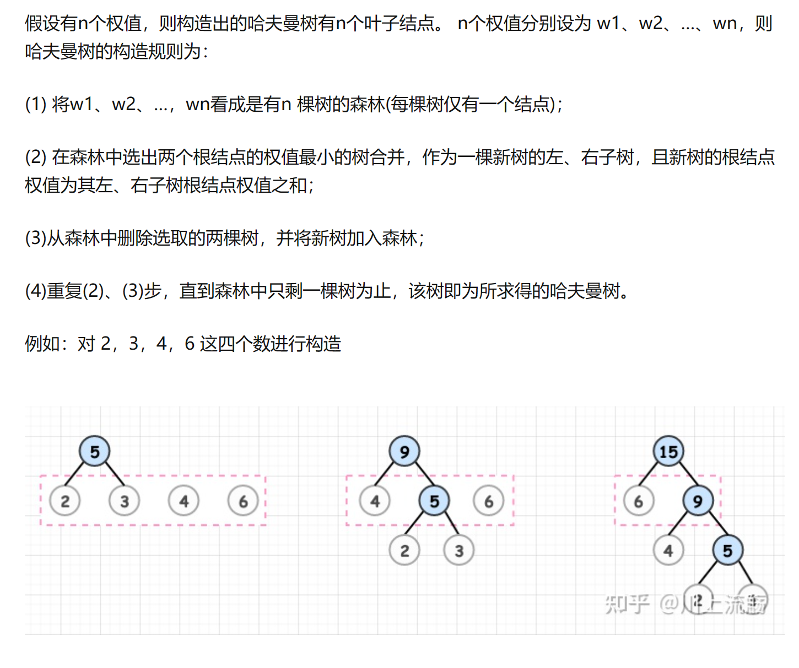
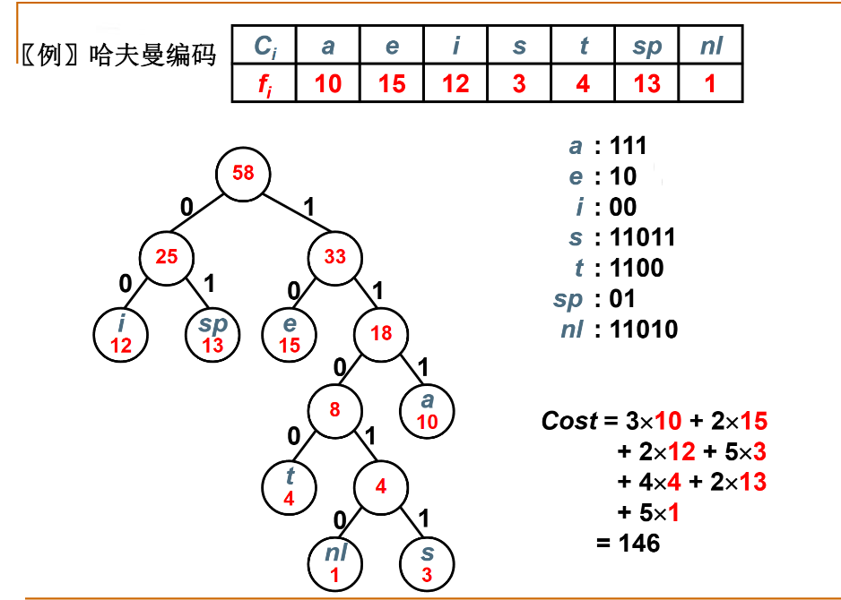

# 哈夫曼树

* 所有叶子结点的路程乘以权值的和


# 哈夫曼树的构造



```cpp
HuffmanTree Huffman(MinHeap H)
{
    HuffmanTree T;
    BuildMinHeap(H);//按权值建立最小堆
    for(int i = 1; i < H->Size; i++)//如果有N个结点，那么要合并N-1次
    {
        T=new TreeNode;//内部结点
        T->Left = DeleteMin(H), T->Right=DeleteMin(H);//每次拿最两个最小的就行
        T->Weight = T->Left->Weight + T->Right->Weight;
        Insert(H,T);//把新权值插进堆，用于下次比较
    }
    T = DeleteMin(H);//堆只剩一个元素，即哈夫曼树的根结点
    return T;
}
```

# 哈夫曼编码
* 给定一段字符串，如何对字符进行编码，可以使得该字符串的编码存储空间最少？

* 权值表示字符串出现的频率，路径长度表示字符串的编码长度

* 前缀码：**任何字符的编码都不是另一个字符编码的前缀**可以无二义地解码



