# 图的定义

* 有向图

    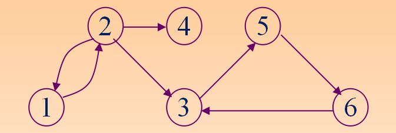

* 无向图

    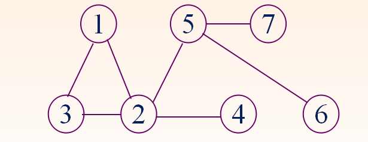

* 有向完全图

    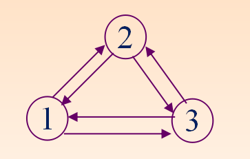

* 无向完全图

    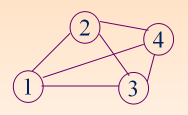

* 无向图和有向图的度

    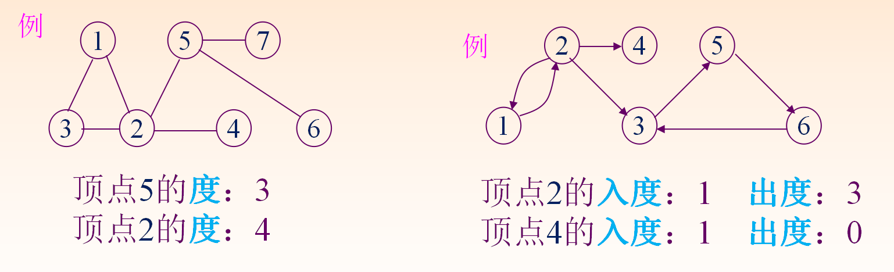

* 术语

    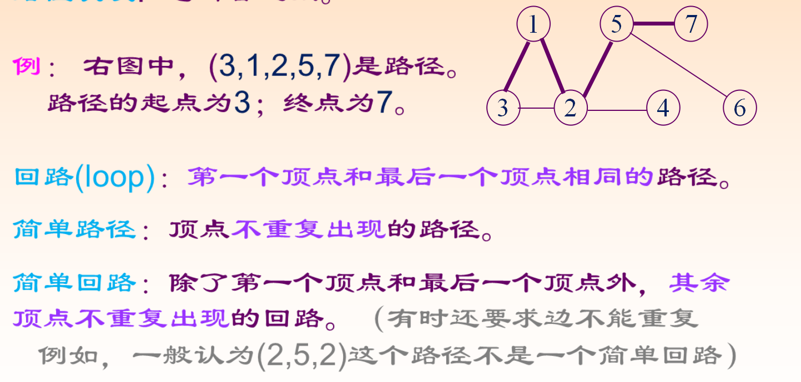

* 连通与连通分量

    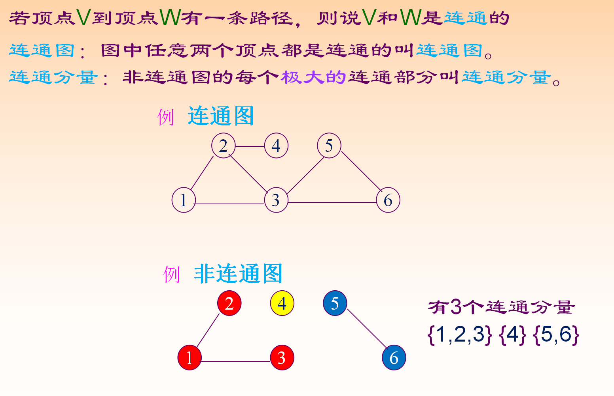

* 强连通图

    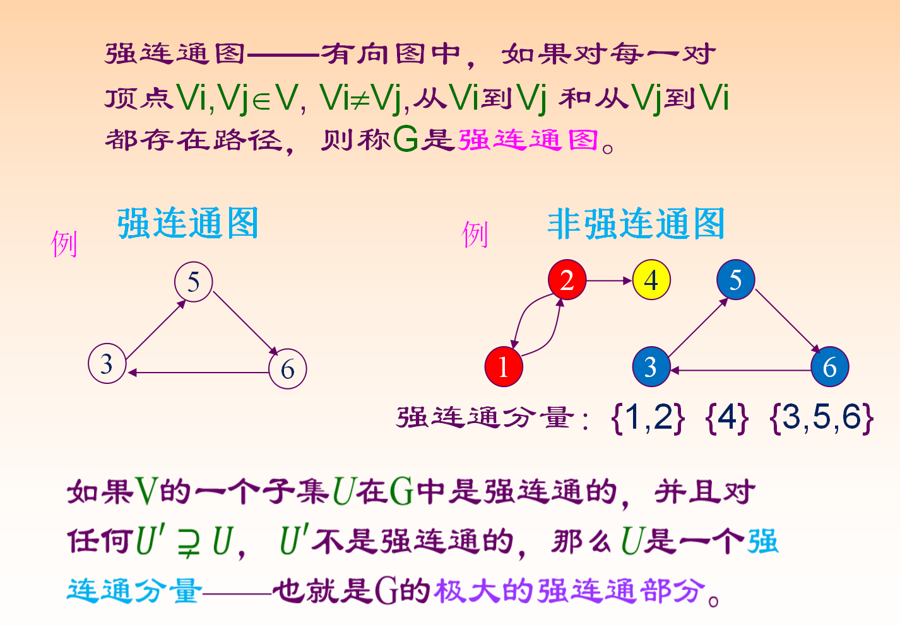

* 无向图生成树
    * 生成树：一个无向连通图的生成树是一个极小的、含有图中全部n个顶点的连通子图。它构成一棵树；有n-1条边。

* 无向图的生成森林
    * 生成森林: 各连通分量的一棵生成树构成G的生成森林。  注意，它的连通性与原图相同；但含有最少的边。

* 有向图的有向生成树

    

# 图的存储结构
* 邻接矩阵法

    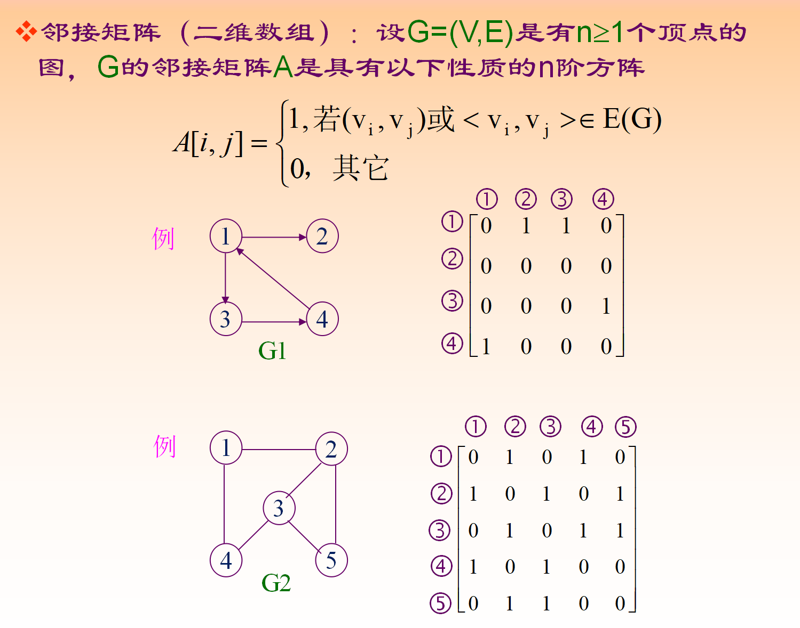

    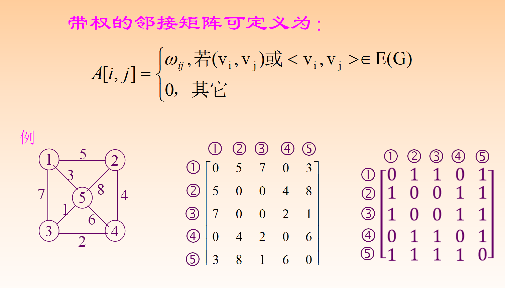
    
* 邻接表

    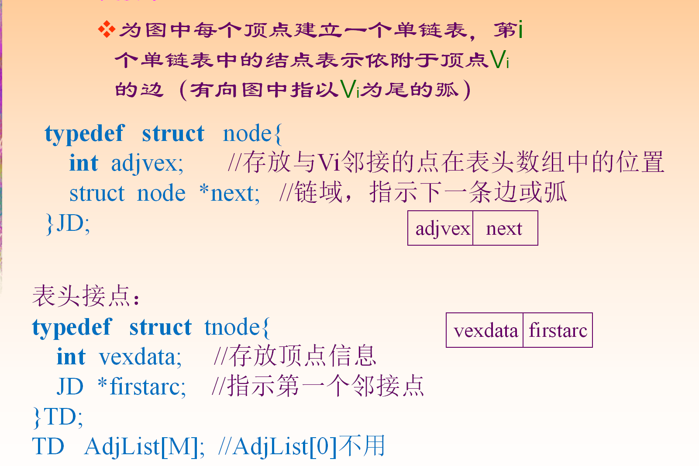

    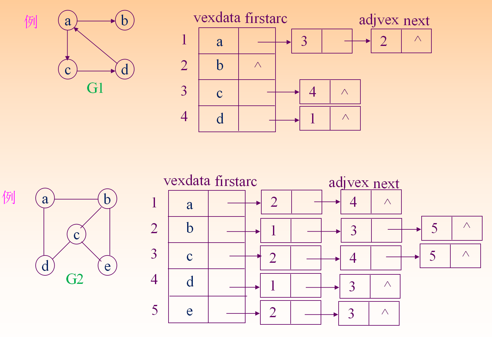
    