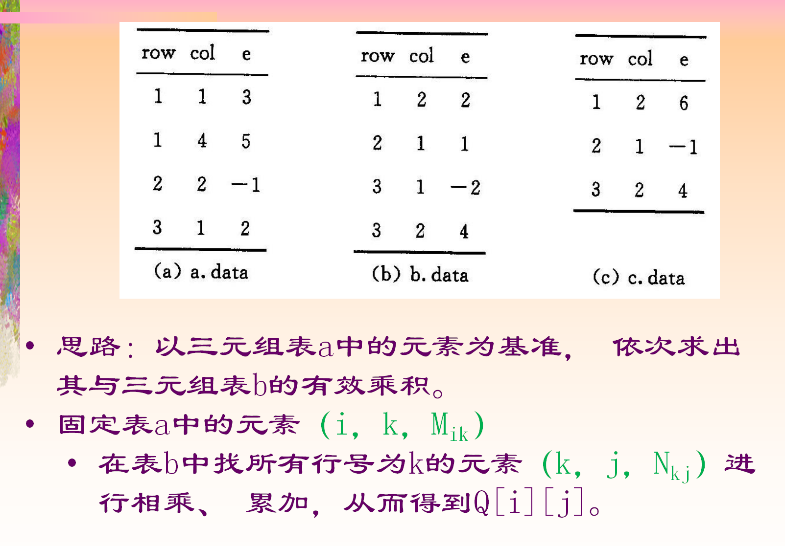

# 三元组的矩阵乘法



* 思路：以矩阵a为基准，遍历a的每行，用每一行乘以b矩阵，

```cpp
// newMatrix为上个md中带有首个非零元行位置的三元组

bool multiply(newMatrix a, newMatrix b, newMatrix &ret)
{
    if(a.data[0].j != b.data[0].i)
    {
        return false; // 无法相乘
    }

    // 矩阵信息
    ret.data[0].i = a.data[0].i;
    ret.data[0].j = b.data[0].j;
    ret.data[0].v = 0;

    for(int row = 1; row <= a.data[0].i; row++)
    {
        int temp[b.data[0].j] = {0}; // 存放a中向量和b矩阵对应位置的乘积
        ret.rpos[row] = ret.data[0].v + 1; // 记录当前行位置

        int last1 = a.rpos[row + 1]; // a下一行第一个元素的位置
        if(row == a.data[0].i)
        {
            last1 = a.data[0].v + 1; // 没有下一行
        }

        for(int k = a.rpos[row]; k < last1; k++) // 遍历该行
        {
            int q = a.data[k].j; // 利用当前a的列号找对应b的行号
            int last2 = b.rpos[q + 1]; // b下一行第一个元素的位置
            if(q == b.data[0].i)
            {
                last2 = a.data[0].v + 1;
            }
            for(int j = b.rpos[q]; j < last2; j++)
            {
                temp[b.data[j].j] += a.data[k].v * b.data[j].v;
            }
        }

       for(int col = 1; col <= ret.data[0].j; col++)
        {
            if(temp[col] != 0)
            {
                ++ret.data[0].v;
                int i = ret.data[0].v;
                ret.data[i].i = row;
                ret.data[i].j = col;
                ret.data[i].v = temp[col];
            }
        }
    } 
}
```