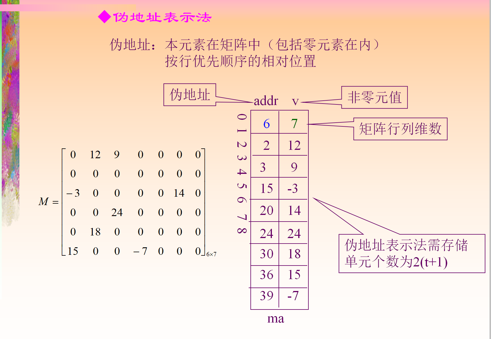

# 稀疏矩阵的顺序存储结构

```cpp
typedef struct node
{
    int i;
    int j;
    int v;
}matrix;
```



# 三元组表的转置

* 低级重复扫描，不断扫三元组的列从 1 到 n

```cpp
void trans(matrix a[], matrix b[])
{
    int m =  a[0].i;
    int n = a[0].j;
    int amt = a[0].v;
    int k = 1;

    b[0].i = n;
    b[0].j = m;
    b[0].v = amt;

    for(int col = 1; col <= n; col++)
    {
        for(int p = 1; p <= t; p++)
        {
            if(a[p].j == col)
            {
                b[k].i = col;
                b[k].j = a[p].i;
                b[k].v = a[p].v;
                k++;
            }
        }
    }
}
```

* 快速转置

```cpp
// 提前确定a中每一列第一个非零元素在b中的位置，这样读到a的哪个都知道填到b的哪里

int num[col]; // a中第col列中非零元个数
int cpot[col]; // a中的第col列第一个非零元b中的位置，还会更新

// num和cpot有如下关系

{{
    if(col == 1)
    {
        cpot[1] = 1;
    }
    else if(2 < col && col <= a[0].j)
    {
        cpot[col] = cpot[col - 1] + num[col - 1];
    }
}}


void trans(matrix a[], matrix b[])
{
    int m =  a[0].i;
    int n = a[0].j;
    int amt = a[0].v;

    b[0].i = n;
    b[0].j = m;
    b[0].v = amt;

    for(int col = 0; col <= n; col++)
    {
        num[col] = 0;
    }
    for(int p = 1; p<= amt; p++)
    {
        num[a[p].j]++;
    }

    cpot[1] = 1;
    for(int col = 2; col <= n; col++)
    {
        cpot[col] = cpot[col - 1] + num[col - 1];
    }

    for(int p = 1; p <= t; p++)
    {
        int col = a[p].j;
        int k = cpot[col];
        cpot[col]++;
        b[k].i = a[p].j;
        b[k].j = a[p].i;
        b[k].v = a[p].v;
    }
}
```