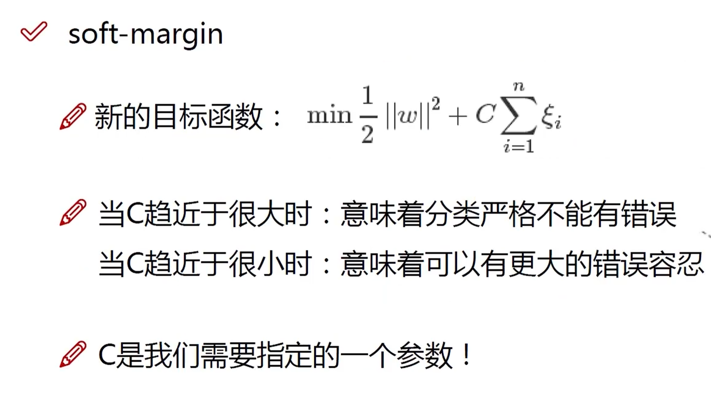
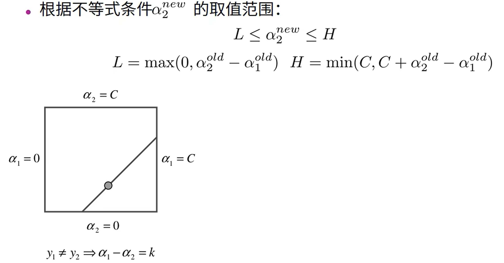
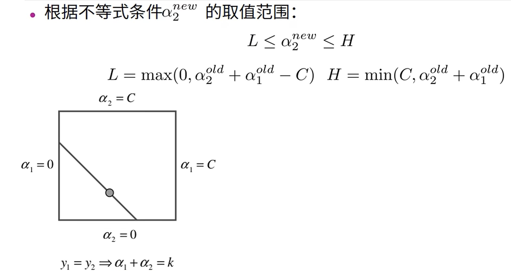

# 线性可分支持向量机与硬间隔最大化

# 线性可分支持向量机与软间隔最大化

# 非线性支持向量机与核函数

# 序列最小优化算法（SMO算法）

[参考连接](https://www.bilibili.com/video/BV1bK4y187hG/?spm_id_from=333.337.search-card.all.click&vd_source=c65196c22fdd3605640aeccf1b3b4a0e)

