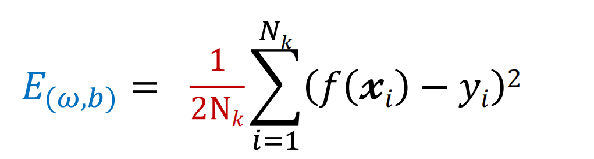
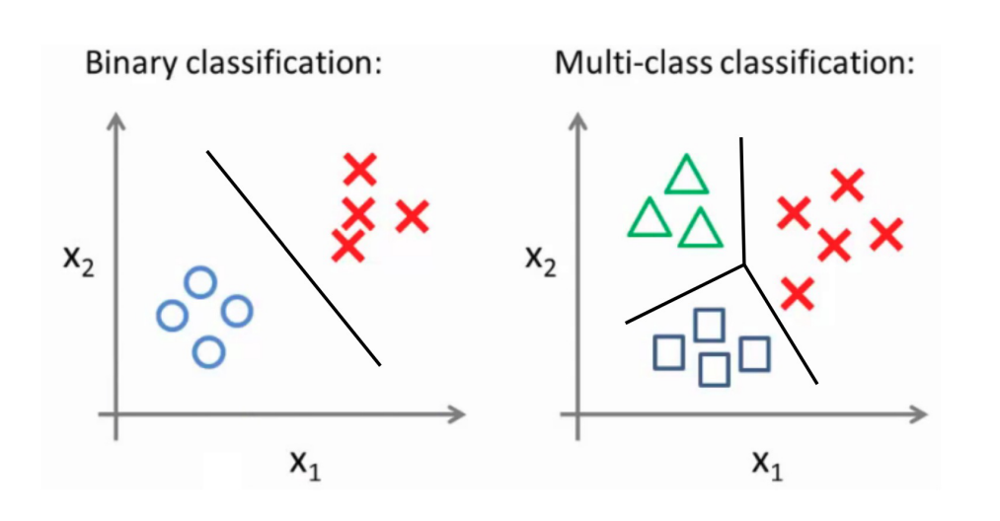

# 线性回归
* 一般形式
    * $f(x)=\omega_1 x_1+\omega_2 x_2+...+\omega_d x_d+b$

* 向量形式
    * $f(x)=\omega^T x+b$
        > $\omega =(\omega_1; \omega_2; ...; \omega_d)$
        
        > $x = (x_1; x_2; ...; x_d)$

> $f_{好瓜}(x)=0.2\cdot x_{色泽}+0.5\cdot x_{根蒂}+0.3\cdot x_{敲声}+1$

# 回归问题
* 线性回归：找到一条直线（或一个超平面）使得误差最小

    

* 均方误差：$E_{(\omega ,b)}=\frac 1m \sum_{i=1}^m (f(x_i)-y_i)^2$
    * 解决线性回归问题就是求得均方误差的最小值对应的$(\omega^*,b^*)$

* 平方损失：$L(f(x_i),y_i)=\frac 12(f(x_i)-y_i)^2$

    

## 线性回归问题求解
1. 单变量线性回归
    * 数据：$D=\{(x_i,y_i)\}^m_{i=1}$

    * 模型：$f(x_i)=\omega x_i+b$

    * 策略：平方损失$L(y_i,f(x_i))= (y_i-f(x_i))^2$
        * 最小二乘法（基于均方误差最小来对模型进行求解的方法）
            * $目标函数=\sum（观测值-理论值）^2$
        $$
        (\omega^*,b^*)=\mathop{argmin}\limits_{(\omega,b)}\sum_{i=1}^m(y_i-f(x_i))^2

        \\=\mathop{argmin}\limits_{(\omega,b)}\sum_{i=1}^m(y_i-\omega x_i-b)^2
        $$
    
    * 算法：求解$\omega$和$b$使$E_{(\omega,b)}=\sum_{i=1}^m(y_i-\omega x_i-b)^2$最小化的过程

        
        
        

2. 线性回归-矩阵形式
    * 线性回归问题：
        * 找$(\omega^*, b^*)$去满足$min~\{E_{(\omega, b)}\} = \sum^m_{i = 1} (f(x_i) - y_i) ^ 2$

    * 将问题转化为矩阵形式：
        > 范数：
        > $$
        \begin{Vmatrix}
            x
        \end{Vmatrix}_2
         = \sqrt{\sum ^ n _ {i = 1} {x_i} ^ 2}\\
         x^T x = \begin{Vmatrix} x \end{Vmatrix}^ 2 _ 2
          $$


        $$
        E_{(\omega, b)} = \sum^m_{i = 1} (f(x_i) - y_i) ^ 2
        \\
        = \sum ^ m _ {i = 1} (\omega ^ T x_i - y_i) ^ 2 
        \\
        = \sum ^ m _ {i = 1} (x_i ^ T \omega - y_i) ^ 2
        \\
        = \begin{Vmatrix}
            x_1^T\omega - y_1   \\
            x_2^T\omega - y_2   \\
            ...                 \\
            x_m^T\omega - y_m   \\
          \end{Vmatrix}_2^2
        \\
        = \begin{Vmatrix}
            \begin{pmatrix}
                x_1^T   \\
                x_2^T   \\
                ...     \\
                x_m^T   \\
            \end{pmatrix} w - 
            \begin{pmatrix}
                y_1 \\
                y_2 \\
                ... \\
                y_m \\
            \end{pmatrix}
          \end{Vmatrix}^2_2
          \\
          = \begin{Vmatrix}
                X \omega - Y
          \end{Vmatrix} ^2 _2
        $$

    

    * 矩阵问题求解：
        * 找$(\omega^*, b^*)$去满足$min~\{E_{(\omega, b)}\} = \begin{Vmatrix} X\omega - Y\end{Vmatrix} = (X \omega - Y)^T (X \omega - Y)$

        

        [点击查看推导过程](https://zhuanlan.zhihu.com/p/74157986)

        > 必须记忆的公式：
            >$$
            \frac{\partial \beta^T x}{\partial x}=\beta\\
            ~\\
            \frac{\partial x^T x}{\partial x}=2x\\
            ~\\
            \frac{\partial x^T Ax}{\partial x}=(A+A^T)x
            $$

    * 使用**正则化**解决过拟合问题
        
        
        
        * 矩阵形式

        

3. 梯度下降法
    * 在每一轮计算当前点的梯度，并沿着**与梯度相反的方向**按照**一定步长**移动
        ```python
            while 终止条件:
                w = w - η * 当前点的梯度
        ```

    1. 批量梯度下降法：
        * 特点：**所有样本**都有贡献，可以达到一个全局最优，样本多的情况下收敛速度慢

        

    2. 随机梯度下降法：
        * 特点：每次更新**用1个样本**，计算得到的并不是准确的一个梯度，整体的方向是全局最优解的方向，最终结果往往在全局最优解附近，方法更快，更快收敛
        
        

    3. mini-batch梯度下降法：
        * 特点：**使用一个以上而又不是全部的训练样本**，批量梯度下降法与随机梯度下降法的结合，将所有数据分割成k个mini-batches

        * 对每个mini-batch k，做一次批量梯度下降法

            

            

# 逻辑回归

## 什么是分类问题
* 分类问题：

    
    
* 线性回归输出：
    * $f(x)=\omega^Tx+b=z$
    * $g(z)\in \{0,1\}$

* 最理想的函数-**单位阶跃函数**，**但是在$z=0$处不连续**
    $$
    g(z)=\begin{cases}
        0,&z<0\\
        0.5,&z=0\\
        1,&z>0\\
    \end{cases}
    $$

* 替代函数-**对数几率函数**，**单调可微，任意阶可导**

    

    $$
    g'(z)=g(z)(1-g(z))\\
    $$

* 标签判别规则
    * 预测：$y=1~~~~~g(x)>=0.5~~~~~\omega^Tx+b>=0$

    * 预测：$y=0~~~~~g(x)<0.5~~~~~\omega^Tx+b<0$

    * 判别边界：$\omega^Tx+b=0$

## 对数几率回归模型建立
* $P(y_i)=y_i P(y=1)+(1-y_i) P(y=0)$

* 似然函数
    * $L(y|x;\omega)=\prod^m_{i=1}P(y_i|x_i;\omega)$

* 对数似然函数
    * $L(y|x;\omega)=\sum_{i=1}^m ln(y_i|x_i;\omega)$

* 最大化对数似然函数
    * $max~L(y|x;\omega)\to 习惯解决最小化问题\to min~L(y|x;\omega)=-\sum_{i=1}^m lnP(y_i|x_i;\omega)$

* 交叉熵损失

    

    

    

## 多分类学习



### 多分类学习：一对一


### 多分类学习：一对其余


