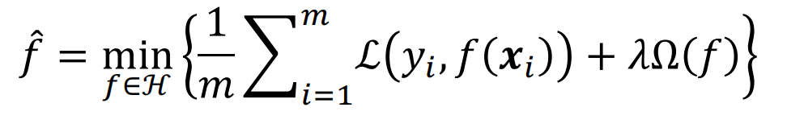

# 机器学习定义
* 假设用$P$来评估计算机程序在某任务类$T$上的性能，若一个程序通过利用自身经验$E$在$T$任务中获得性能改善，则我们就说关于$T$和$P$，该程序对$E$进行了学习

# 机器学习算法分类
1. 监督学习：输入数据带有标签

2. 无监督学习：输入数据没有标签

3. 强化学习：输入数据没有标签，**通过环境给出的奖惩进行学习**

# 机器学习关键要素（数据、模型、策略、算法）
1. 数据
    * 令$D = \{ x_1, x_2, ..., x_m\}$为有$m$个样本的数据集，每个样本有$d$个属性，每个样本是样本空间中的一个（列）向量，$d$成为样本的**维数**

    * 用$(x_i, y_i)$表示第$i$个样例，$y_i$为样本$x_i$的标签

2. 模型
    * 模型是需要学习的**条件概率分布**或**决策函数**，假设空间包含了所有可能的**条件概率分布**或**决策函数**的集合

    * 参数向量表示模型，决定了模型的具体形式，**参数取不同的值，从而得到不同的模型**

3. 策略：学习或选择**优秀的模型**所采用的方法
    * 损失函数：度量模型**一次**预测的好坏
        1. 0-1损失函数：
            $$
            L(y_i,f(x_i))=\begin{cases}

            1,y_i≠f(x_i); \\
            
            0,y_i=f(x_i).
            \end{cases}
            $$

        2. 平方损失函数：
            $L(y_i,f(x_i))=(y_i-f(x_i))^2$

    * 期望损失：度量**平均**意义下模型的好坏

    * 监督学习的两个基本策略：
        * 经验风险最小化（ERM）
            * ERM策略认为经验风险最小化的模型是最优模型

                

                > 当样本容量足够大时，经验风险最小化能够保证有很好的学习效果

        * 结构风险最小化（SRM）
            * SRM策略在经验风险的基础上加上**表示模型复杂度的正则化项形成结构风险**，认为结构风险最小的模型是最优的模型

                

                > $Ω(f)$为模型的复杂度，模型f越复杂`Ω(f)`越大

                > $λ≥0$是系数，用来权衡经验风险和模型复杂度

        * 当样本容量较小时，ERM的效果可能很差，会产生**过拟合**现象，SRM就是为了**防止过拟合**而产生的

4. 算法
    * 根据学习策略，从假设空间中选择最优模型，通过**算法**求解最优模型的**参数**
