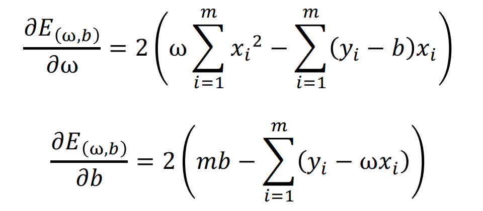

# 机器学习定义
* 假设用P来评估计算机程序在某任务类T上的性能，若一个程序通过利用自身经验E在T任务中获得性能改善，则我们就说关于T和P，该程序对E进行了学习

# 机器学习一般分类

    

1. 监督学习：从**标注数据**中学习预测模型的机器学习问题
    * 标注数据表示输入输出的对应关系，预测模型对给定的输入产生相应的输出

2. 无监督学习：从**无标注数据**中学习分析模型的机器学习问题
    * 无标注数据是"自然"得到的数据，分析模型表示数据的类别/转换等

3. 强化学习:智能系统在与**环境的连续互动中**学习最优行为策略的机器学习问题
    * 智能系统观测到的是与环境互动得到的数据序列，主要目的是学习得到与环境互动的最优策略    

        

    * 系统以长期奖励的最大化为目的，不断试错，从所有可能策略中**学得最优策略**

# 机器学习关键要素
* 数据

        

        

* 模型
    * 从数据中学得模型（学习/训练）

    * 学得模型对应了关于数据的某种潜在规律，即**假设**

    * 假设空间:模型属于由输入空间到输出空间的映射的集合
        * 假设空间可定义为（非概率）函数的集合，或条件概率的集合

* 策略
    * 按照什么样的准则学习或选择最好的模型
        * 损失函数：度量模型**一次**预测的好坏

        * 期望损失：度量**平均**意义下模型的好坏

* 算法
    * 算法指学习模型的具体计算方法

    * 统计学习基于训练数据集，根据学习策略，从假设空间中选择最优（的）模型，最后需要考虑用什么样的算法求解最优（的）模型
