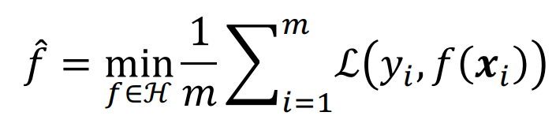

# 机器学习定义
* 假设用P来评估计算机程序在某任务类T上的性能，若一个程序通过利用自身经验E在T任务中获得性能改善，则我们就说关于T和P，该程序对E进行了学习

# 机器学习一般分类
1. 监督学习：从**标注数据**中学习预测模型的机器学习问题
    * 标注数据表示输入输出的对应关系，预测模型对给定的输入产生相应的输出

2. 无监督学习：从**无标注数据**中学习分析模型的机器学习问题
    * 无标注数据是"自然"得到的数据，分析模型表示数据的类别/转换等

3. 强化学习：智能系统在与**环境的连续互动中**学习最优行为策略的机器学习问题
    * 智能系统观测到的是与环境互动得到的数据序列，主要目的是学习得到与环境互动的最优策略    

        

    * 系统以长期奖励的最大化为目的，不断试错，从所有可能策略中**学得最优策略**

# 机器学习关键要素
1. 数据

        

        

2. 模型
    * 假设空间：属于由输入空间到输出空间的映射的集合，实现特定功能（映射）的函数
        * 假设空间可定义为非概率函数（`y=f(x)`）的集合，或条件概率（`p(y|x)`）的集合

3. 策略
    * 按照什么样的准则学习或选择最好的模型
        * 损失函数：度量模型**一次**预测的好坏
            * 常用的损失函数
                1. 0-1损失函数：`ℒ(yi,f(xi))={1,yi≠f(xi);0,yi=f(xi)}`

                2. 平方损失函数：`ℒ(yi,f(xi))=(yi-f(xi))^2`

                3. 对数似然函数 ：`ℒ(yi,p(yi|xi))=-log(p(yi|xi))`

        * 期望损失：度量**平均**意义下模型的好坏

    * 当考虑模型输入和输出的随机变量X和Y遵循联合概率分布`p(x,y)`，损失函数的期望（即期望损失）可表示为

            

    * 学习的目标就是选择**期望损失最小的模型**，但是在实际中`p(x,y)`是未知的，在模型训练中采用**数据集上的经验损失或经验风险**来对期望损失近似

            

    * 监督学习的两个基本策略：
        * 经验风险最小化（ERM）
        * 结构风险最小化（SRM）
        * 在数据集、假设空间、损失函数都确定的情况下，ERM策略认为经验风险最小化的模型是最优模型

            

            * 当样本容量足够大时，经验风险最小化能够保证有很好的学习效果

        * 在数据集、假设空间、损失函数都确定的情况下，SRM策略在经验风险的基础上加上表示模型复杂度的正则化项形成结构风险，并认为结构风险最小的模型是最优的模型

            

            * `Ω(f)`为模型的复杂度，模型f越复杂`Ω(f)`越大

            * `λ≥0`是系数，用来权衡经验风险和模型复杂度

        * 当样本容量较小时，ERM的效果可能很差，会产生“过拟合”现象，SRM就是为了**防止过拟合**而产生的

4. 算法
    * 算法指学习模型的具体计算方法

    * 统计学习基于训练数据集，根据学习策略，从假设空间中选择最优模型，最后需要考虑用什么样的算法求解最优模型（通过优化算法，有限次迭代优化模型参数，以尽可能降低损失函数的值，得到**较优的参数值**）
