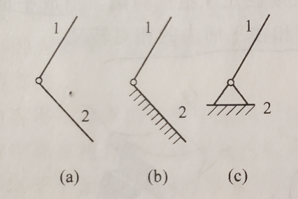

# 平面机构的自由度和速度分析

## 运动副和分类
* 自由度：
    * 平面运动有三个自由度：x轴、y轴、转动

* 运动副：两构件**直接接触**并能产生**一定相对运动**的连接
    1. 低副：两构件通过**面**接触组成的运动副。平面机构中的低副有转动副和移动副
        1. 转动副（也称铰链）：组成运动副的两构件只能在**平面**内相对转动

        2. 移动副：组成运动副的两构件只能沿**某一轴线**相对移动

    2. 高副：两构件通过**点**或**线**接触组成的运动副

## 平面机构运动简图
* 圆圈表示转动副，其圆心代表相对转动的轴线。
    * 如果两构件都是活动件，则用a表示

    * 如果其中一个为机架，则在代表机架的构件上加上阴影线，如b和c

    

* 移动副的导路必须和**相对移动方向**一致，并在代表机架的构件加上阴影线

    

* 两构件组成**高副**时，应当画出两构件接触处的曲线轮廓

    

* 机构中的构件可分为三类：
    1. 固定构件（机架）：用来**支撑**活动构件（运动构件）的构件

    2. 原动件（主动件）：**运动规律已知**的活动构件。它的运动是由外界输入的，故又称**输入构件**

    3. 从动件：机构中**随原动件运动而运动**的其余活动构件。其中输出**预期运动**的从动件称**输出构件**，其他从动件则起传递运动的作用
    
## 平面机构的自由度
* 平面机构自由度计算公式
    * 平面内的**转动副**剩下**一个自由度**（转动）

    * 平面内的**移动副**剩下**一个自由度**（沿一轴方向的移动）

    * 平面内的**高副**只约束沿接触处公法线方向移动的自由度，保留**绕接触处转动**和**沿接触处公切线方向移动两个自由度**

    * **低副**减少两个自由度，**高副**减少一个自由度。若机构中活动构件数为$n$，低副数为$P_L$，高副数为$P_H$，则机构自由度为$F=3n-2P_L-P_H$

    * 通常每个原动件具有一个独立运动（如电动机转子具有一个独立转动，内燃机活塞具有一个独立移动），因此机构的自由度应当与原动件相等（**也有可能不相等，总之机构具有确定的运动条件是：机构自由度$F>0$，且$F$等于原动件数**）

* 计算平面机构自由度的注意事项
    1. 复合铰链
        * **两个以上**构件同时在一处用**转动副**相连接就构成复合铰链

        * $K$个构件汇交而成的复合铰链具有$K-1$个转动副

    2. 局部自由度
        * 机构中出现一种与输出运动无关的自由度，称为局部自由度（或称多余自由度），在计算机构自由度**应排除**

        

        * 从动件2是输出构件，而滚子3绕轴线C是否转动或转动快慢都不影响输出构件2的运动，故滚子绕轴C的运动是一个**局部自由度**。计算时可想象滚子与从动件成为一体，即a转化为b，$F=3n-2P_L-P_H-1=3*2-2*2-1-1=1$

        * 局部自由度不影响整个机构的运动，但滚子可使高副接触处的滑动摩擦变成滚动摩擦

    3. 虚约束
        * 有些约束对机构自由度的影响是重复的，对机构运动不起**任何作用**，这种约束称为虚约束或消极约束，在计算中**应除去不计**

        1. 两构件之间组成多个导路**平行**的**移动副**时，只有**一个**移动副起作用，其余为虚约束

        2. 两构件之间组成多个轴线重合的转动副时，只有**一个**转动副起作用，其余为虚约束。如两个轴承支持一根轴只能看作一个转动副

        3. 机构中传递运动不起独立作用的对称部分。如图，其中有一个小齿轮对传递运动不起独立作用，但使机构增加了一个虚约束（加入一个构件增加三个自由度，组成一个转动副和**两个高副**，共引入四个约束）

            

## 速度瞬心及其在机构速度分析上的应用
* 速度瞬心及其求法
    * 瞬心：两刚体上绝对速度相同的重合点（简称同速点）
    
    * 相对瞬心：两个刚体都是运动的，其瞬心称为相对瞬心

    * 绝对瞬心：两刚体之一是静止的，其瞬心称为绝对瞬心

    * 发生相对运动的任意两构件件都有一个瞬心，如机构由K个构件组成，则瞬心数为$C^2_K=\frac{K(K-1)}{2}$
    
* 瞬心在速度分析上的应用

# 平面连杆机构