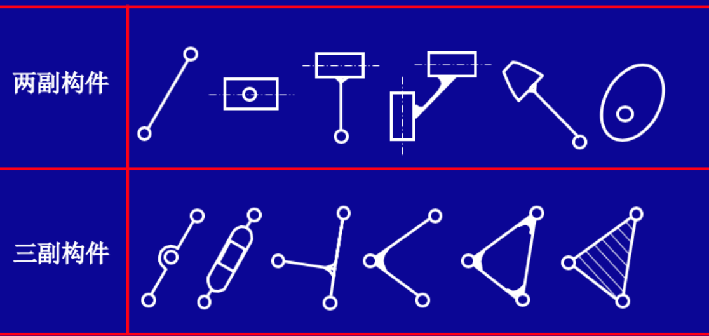
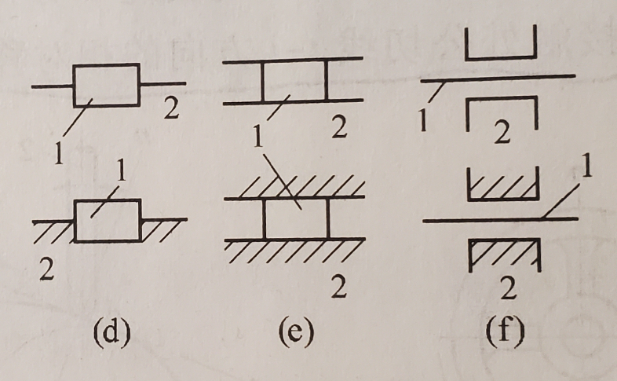
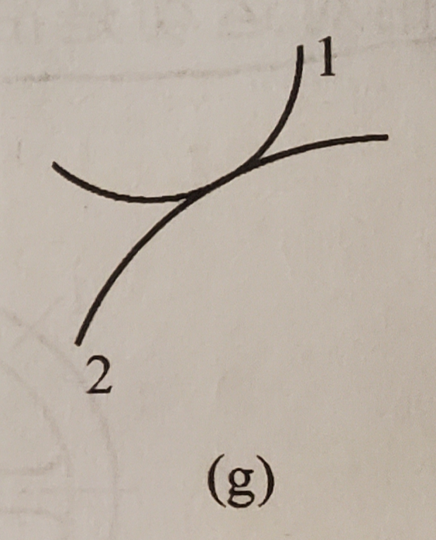
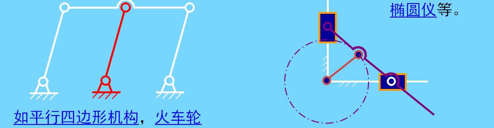
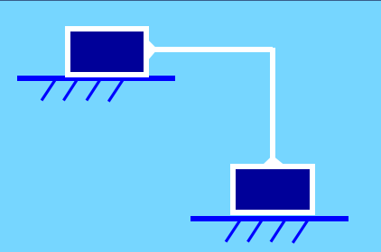
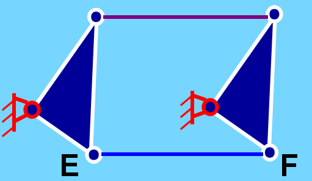

# 运动副和分类
* 自由度：
    * 平面运动有三个自由度：x轴、y轴、转动

* 运动副：两构件**直接接触**并能产生**一定相对运动**的连接
    1. 低副：两构件通过**面**接触组成的运动副
        1. 转动副（也称铰链）：组成运动副的两构件只能在**平面**内相对转动

        2. 移动副：组成运动副的两构件只能沿**某一轴线**相对移动

    2. 高副：两构件通过**点**或**线**接触组成的运动副

# 平面机构运动简图
* 一般构件的表示方法

    

    

    

    

    

* 圆圈表示转动副，其圆心代表相对转动的轴线。
    * 如果两构件都是活动件，则用a表示

    * 如果其中一个为机架，则在代表机架的构件上加上阴影线，如b和c

    

* 移动副的导路必须和**相对移动方向**一致，并在代表机架的构件加上阴影线

    

* 两构件组成**高副**时，应当画出两构件接触处的曲线轮廓

    

* 机构中的构件可分为三类：
    1. 固定构件（机架）：用来**支撑**活动构件（运动构件）的构件

    2. 原动件（主动件）：按给定运动规律运动的构件

    3. 从动件：机构中**随原动件运动而运动**的其余活动构件
    
# 平面机构的自由度
* **机构**：具有确定运动的运动链

* **机构的自由度**：保证机构具有确定运动时所必须给定的独立运动参数
    * 机构具有确定运动的条件为：**自由度=原动件数**，平面单个自由构件的**自由度为3**

* 平面机构自由度计算公式
    > 平面内的**转动副**剩下**一个自由度**（转动）

    > 平面内的**移动副**剩下**一个自由度**（沿一轴方向的移动）

    > 平面内的**高副**只约束沿接触处公法线方向移动的自由度，保留**绕接触处转动**和**沿接触处公切线方向移动**的**两个自由度**

    * **低副**减少**两个**自由度，**高副**减少**一个**自由度，若机构中活动构件数为$n$，低副数为$P_L$，高副数为$P_H$，则机构自由度为$F=3n-2P_L-P_H$

* 三个注意事项
    1. 复合铰链
        * **两个以上**构件同时在一处用**转动副**相连接

        * $K$个构件的复合铰链具有$K-1$个转动副

    2. 局部自由度
        * 机构中出现一种与输出运动无关的自由度，称为局部自由度（或称多余自由度），在计算机构自由度**应排除**

        

        * 从动件2是输出构件，而滚子3不影响输出构件2的运动，故滚子绕轴C的运动是一个**局部自由度**$F_p = 1$。计算时把滚子与从动件成为一体，$F=3n-2P_L-P_H-F_p=3*2-2*2-1-1=1$

    3. 虚约束
        * 对机构的运动实际不起**任何限制作用**的约束

        1. 两构件联接前后，联接点的轨迹重合，联接点不会发生移动或变化，保持在同一个位置上

            

        2. 两构件构成多个移动副，且道路平行

            

        3. 两构件构成多个转动副且同轴

            

        4. 运动时，两构件上的两点距离始终不变

            

        5. 对运动不起作用的对称部分

            

# 速度瞬心及其应用
* 速度瞬心
    * 相对瞬心：重合点**绝对速度不为零**

    * 绝对瞬心：重合点**绝对速度为零**

    * 若机构由$K$个构件组成，则瞬心数为$C^2_K=\frac{K(K-1)}{2}$
    
* 速度瞬心求法：
    1. 直接观察法：**直接相联的两构件**

        

    2. 三心定理：作相对平面运动的三个构件共有三个瞬心，**这三个瞬心位于同一直线上**
        > 证明：设构件1为固定构件，则$P_{12}$和$P_{13}$分别为构件1、2和构件1、3之间的绝对瞬心。**假定**$P_{23}$不在直线$P_{12}P_{13}$上，而在其他任一点C，重合点$C_2$和$C_3$的绝对速度$v_{C_2}$和$v_{C_3}$各垂直于$CP_{12}$和$CP_{13}$，显然这时的$v_{C_2}$和$v_{C_3}$的方向不一致。**瞬心应是绝对速度相同的重合点**，故C点不可能是瞬心。只有位于$P_{12}P_{13}$直线上的重合点**速度方向才可能一致**，所以瞬心$P_{23}$必在$P_{12}$和$P_{13}$的连线上

        
