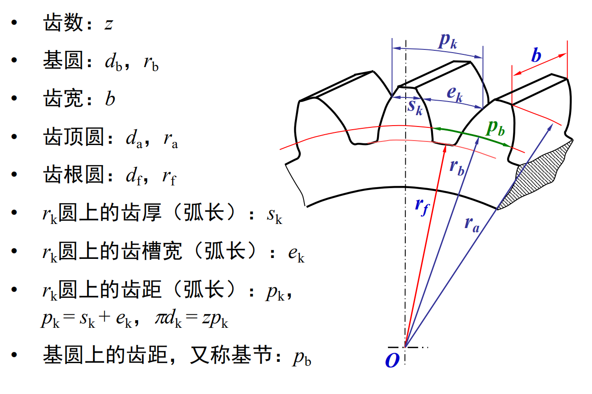

# 齿廓实现定角速比传动的条件

# 渐开线齿廓

* 渐开线特性
    
    

    

    

* 渐开线齿廓满足定角速比要求

    

    

    

    

# 齿轮各部分名称及渐开线标准齿轮的基本尺寸

* 标准参数

    

    
    
# 计算
* 已知一对外啮合正常齿制标准直齿圆柱齿轮$𝑚 = 3mm$，$z_1 = 19$，$z_2 = 41$，试
计算这对齿轮的分度圆直径、齿顶高、齿根高、顶隙、中心距、齿顶圆直径、
齿根圆直径、基圆直径、齿距、齿厚和齿槽宽。

$$

分度圆直径（𝑑）: [𝑑 = 𝑚 × 𝑧]\\

齿顶高（h1）: [h1 = 𝑚]\\

齿根高（h2）: [h2 = 1.25 × 𝑚]\\

顶隙（c）: [c = 0.25 × 𝑚]\\

中心距（𝑐）: [𝑐 = \frac{{𝑚 × (𝑧1 + 𝑧2)}}{2}]\\

齿顶圆直径（𝑑1）: [𝑑1 = 𝑑 + 2𝑚]\\

齿根圆直径（𝑑2）: [𝑑2 = 𝑑 - 2.5𝑚]\\

基圆直径（𝑑0）: [𝑑0 = 𝑑 × \cos(\phi)] 其中，(\phi) 为压力角，对于一般的直齿圆柱齿轮，(\phi = 20^\circ)\\

齿距（p）: [p = \pi × 𝑑]\\

齿厚（s）: [s = \frac{{\pi × 𝑑}}{{2𝑧}}]\\

齿槽宽（f）: [f = \frac{{𝑚 × \pi}}{2}]\\

分度圆上的渐开线齿廓的压力角（αt）可以通过以下公式计算：\\

[ \tan(\alpha_t) = \tan(\alpha) \cdot \cos(\phi) ]\\

其中，α是标准压力角，对于一般的直齿圆柱齿轮，α = 20°，m是模数，z是齿数，φ是实际压力角。\\

基圆上的渐开线齿廓的压力角（αn）可以通过以下公式计算：\\

[ \tan(\alpha_n) = \tan(\alpha) / \cos(\phi) ]\\

现在我们可以使用这些公式来计算分度圆和基圆上的渐开线齿廓的压力角。
$$