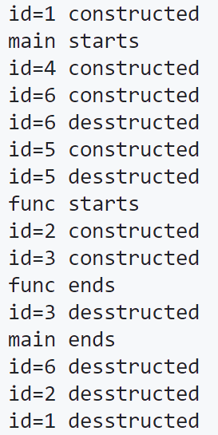

# 构造函数析构函数调用时机
```cpp
class Demo
{
        int id;
    public:
        Demo(int i)
        {
            id=i;
            cout<<"id="<<id<<" constructed"<<endl;
        }
        ~Demo()
        {
            cout<<"id="<<id<<" desstructed"<<endl;
        }
};
void Func()
{
    cout<<"func starts"<<endl;
    static Demo d2(2);
    Demo d3(3);
    cout<<"func ends"<<endl;
}
Demo d1(1);
int main()
{
    cout<<"main starts"<<endl;
    Demo d4(4);
    d4=6;
    {
        Demo d5(5);
    }
    Func();
    cout<<"main ends"<<endl;
}
```



```c
int main()
{
    A *p=new A[2];
    A *p2=new A;
    A a;
    delete []p;
}
```

* 类A的析构函数将调用3次：new出的对象只有用delete删去才会调用析构函数
