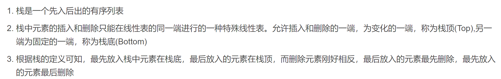

# 栈

# 队列

# 表达式
1. 前缀表达式：运算符位于操作数之前
    * 从**右至左**扫描，遇到数字时压入堆栈，遇到运算符时弹出栈顶的两个数，用运算符进行运算，并将结果入栈，直到表达式最左端，输出结果

        |未读取的输入|栈|
        |:-|:-|
        |$- ~* ~+ ~3 ~4 ~5~ 6 $||
        |$-~ *~ +~ 3 ~4 ~5 $|$6 $|
        |$- ~* ~+~ 3 ~4 $|$6~ 5 $|
        |$-~ *~ +~ 3 $|$6~ 5~ 4 $|
        |$- ~* ~+ $|$6~ 5~ 4 ~3 $|
        |$-~ * $|$6 ~5 ~7$|
        |$- $|$6~ 35$|
        ||$29 $|

2. 中缀表达式：运算符位于操作数之间

3. 后缀表达式：运算符位于操作数之后
    * 从**左至右**扫描表达式，遇到数字时压入堆栈，遇到运算符时，弹出栈顶的两个数，用运算符进行运算,并将结果入栈，直到表达式的最右端，输出结果

        |未读取的输入|栈|
        |-:|:-|
        |2 3 8 + 4 * * ||
        |3 8 + 4 * * |2 |
        |8 + 4 * * |2 3 |
        |+ 4 * * |2 3 8 |
        |4 * * |2 11 |
        |* * |2 11 4 |
        |* |2 44 |
        ||88 |

# 中缀表达式转换为后缀表达式
* 优先级：乘$=$除$>$加$=$减

* 对象是数字：直接输出

* 对象是高优先级：直接入栈

* 对象是低或同优先级：栈顶出栈并输出，再同新栈顶比较

* 对象是左括号：左括号在**栈外**为**最高优先级**，在**栈内**为**最低优先级**

* 对象是右括号：持续将栈顶出栈并输出，直到遇到左括号为止，**括号始终不输出**

* 无新对象时，持续将栈顶出栈并输出

    |未读取的输入|栈|输出|
    |-:|:-|:-|
    |$2*(6/3+4)-5$|||
    |$*(6/3+4)-5$||$2 ~$|
    |$(6/3+4)-5$|$*$|$2 $|
    |$6/3+4)-5$|$*($|$2$|
    |$/3+4)-5$|$*($|$2 ~6 $|
    |$3+4)-5$|$*(/$|$2 ~6 $|
    |$+4)-5$|$*(/$|$2 ~6 ~3 $|
    |$4)-5$|$*(+$|$2 ~6 ~3 ~/ $|
    |$)-5$|$*(+$|$2 ~6 ~3 ~/ ~4$| 
    |$-5$|$*$|$2 ~6 ~3 ~/ ~4 ~+ ~$|
    |$5$|$-$|$2 ~6 ~3 ~/ ~4 ~+ ~* $|
    ||$-$|$2 ~6 ~3 ~/ ~4 ~+ ~* ~5 $|
    |||$2 ~6 ~3 ~/ ~4  ~+ ~* ~5 ~- $|
