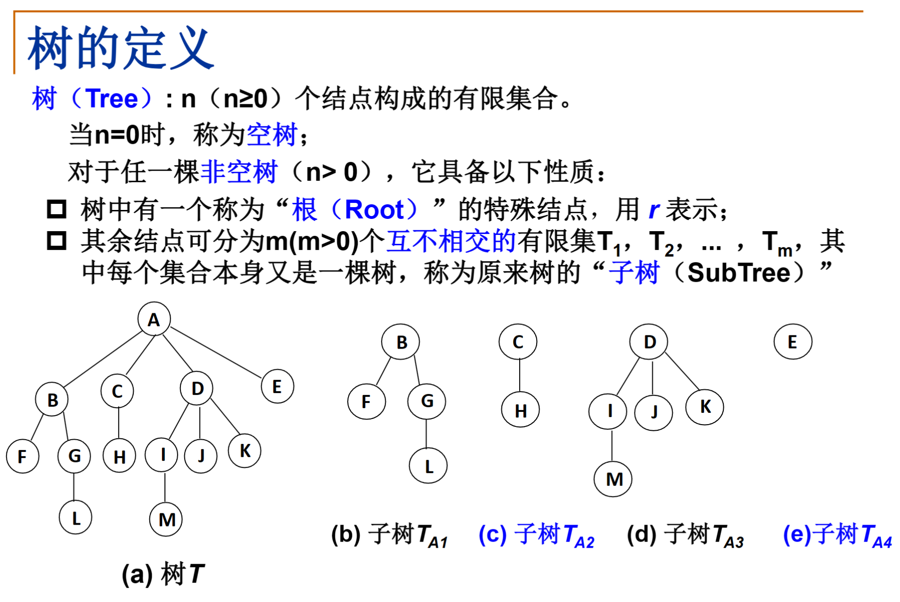

# 1. 什么是树

* 子树是不相交的，除了根结点外，每个结点**有且仅有**一个父结点

* 一棵**N**个结点的树有**N-1**条边

* 树的基本用语
    * 结点的度：结点的子树个数（左子树和右子树等，可能不止两个）
    
    * 树的度：树的所有结点中最大的度数
    
    * 叶结点：度为**0**的结点
    
    * 父结点：一个有子树的结点，是它子树的根结点的父结点
    
    * 子结点：若A结点是B结点的父结点，则B结点是A结点的子结点
    
    * 兄弟结点：具有同一父结点的结点相互是兄弟结点
    
    * 路径和路径长度：从结点n1到nk的路径为一个结点序列n1,n2,...,nk,其中ni是ni+1的父结点.路径所包含边的个数为路径的长度
    
    * 祖先结点：沿树根到某一结点路径上的所有结点都是这个结点的祖先结点
    
    * 子孙结点：某一结点的子树中的所有结点是这个结点的子孙
    
    * 结点的层次：根结点在1层，其他结点的层数是它父结点的层数加1（从上往下数）
    
    * 树的深度：树中所有结点中的最大层次是这棵树的深度

    * 结点的高度：叶结点的高度为1，往上累加，有冲突取最大值