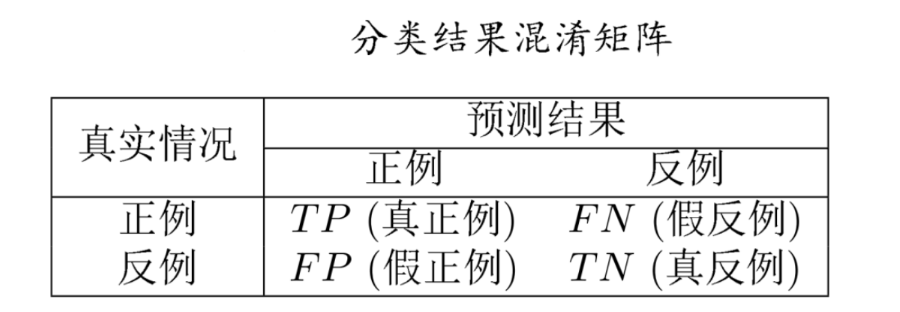
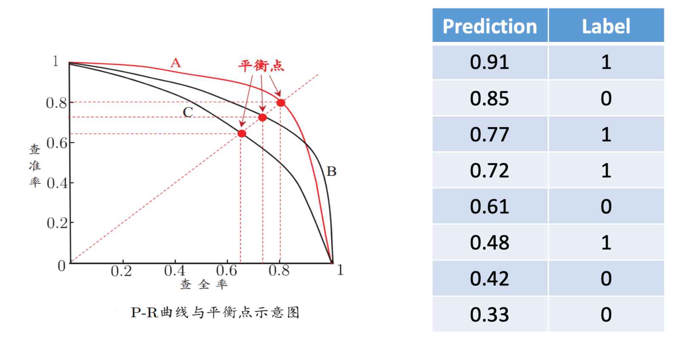
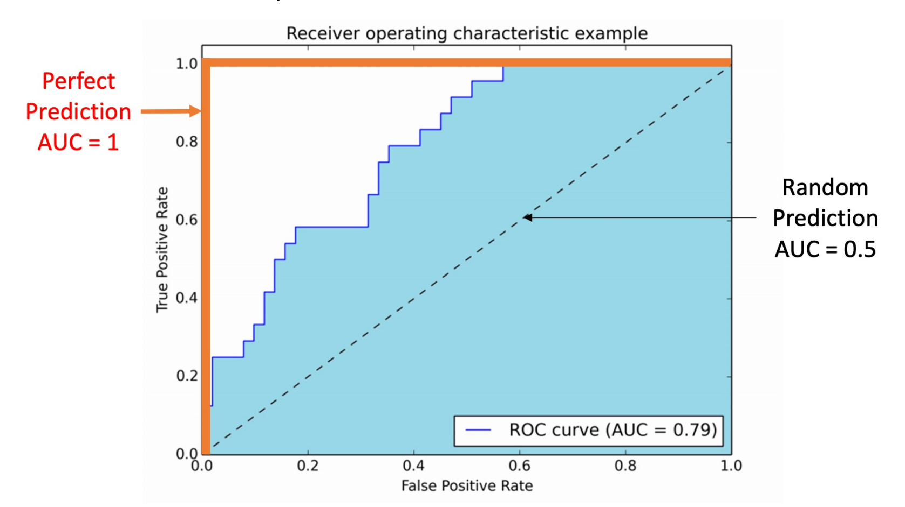

# 训练误差和测试误差
* 训练误差：**对于训练集的平均损失**，过大则没法很好学习到训练集中的规律，存在**欠拟合**

* 测试误差：**对于训练集的平均损失**，反映了模型对未知的测试数据集的预测能力，测试误差小的方法有着更好的预测能力（也叫**泛化能力**）

# 过拟合与模型选择
* 模型选择的典型方法是**正则化**。正则化是**损失结构风险最小**策略的实现，是在经验分析上加一个正则化项和罚项
    * 正则化项一般是模型复杂度的单调递增函数，**模型越杂正则化值越大**

    

       

* 模型验证方法（**评估模型性能**）
    1. 留出法
        * 直接将数据集划分为两个互斥集合，如70%为训练集30%为测试集，进行若干次随机划分，重复实验取平均值
        
    2. 交叉验证法
        * k折交叉验证：将数据集分层采样划分为k个大小相似的互斥子集，每次用k-1个子集的并集作为训练集，余下子集作为测试集，最终返回k个测试结果的均值，k常用的取值是10

            

        * 假设数据集D包含m个样本，若令k=m，则得到留一法
            > 不受随机样本划分方式的影响，结果往往比较准确

            > 当数据集较大时，计算开销难以忍受
    
    3. 自助法
        * 设样本全集容量为m，对样本全集有放回采样m次得到自主抽样样本集D'

            * 有的样本可能被多次重复抽到，而也有的样本一次也没被抽到（概率约为1/3），这些没被抽到的样本可被用来当作测试集

                

            * 优势：可以获取更多的、超出原样本容量的样本，在针对小样本集或难以有效划分训练集和样本集非常有用

            * 缺点：自助法产生的训练集改变了初始数据集的分布，会引入估计偏差

# 性能度量

## 查准率和查全率

* 查准率：$P=TP/(TP+FP)$
    > 分类为**正**的**正样本**占**分类为正的样本**的比例

* 查全率：$P=TP/(TP+FN)$
    > 分类为**正**的**正样本**占**所有正样本**的比例

## P-R曲线
* 根据学习器的预测结果对样例按**正例可能性大小**排序，设置一个阈值，大于这个阈值的值分类为1，小于这个阈值的值分类为0，对每个阈值进行预测，则可以得到**查准率-查全率曲线（P-R曲线）**

* 平衡点是曲线上“查准率=查全率”时的取值，可用于度量P-R曲线有交叉的分类器的性能高低

## F1度量

* 比F1度量更一般的形式Fβ：

    

## ROC曲线和AUC值
* 根据学习器预测结果对样例排序，并逐个作为正例进行预测（和上面阈值一样），以“假正例率”（对负例把负例预测为正例概率）为横轴，“真正例率”（查全率）为纵轴可得ROC曲线

* 若某个学习器的ROC曲线被另一个学习器的曲线包住，则后者性能优于前者；若曲线交叉，可根据ROC曲线下的面积大小比较，即**AUC值**

# 偏差和方差
* 泛化误差可以分解为**偏差**、**方差**和**噪声**之和
    * 偏差：预测与真实的偏离程度
    
    * 方差：训练集变化导致的性能变化

    * 噪声：学习问题本身的难度
    