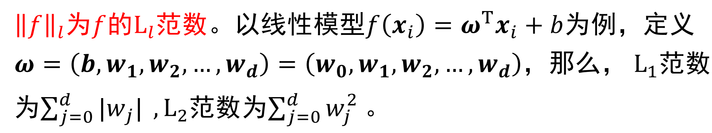

# 训练误差和测试误差
* 机器学习的目的是使学得的模型不仅对**已知数据**还对**未知数据**都有很好的预测能力

* 训练集：相当于课后练习题，用来日常知识巩固**即训练模型**，对应**训练误差**

* 验证集：相当于小测，用来纠正和强化所学知识**即选择模型**，对应**测试误差**

* 测试集：相当于期末考试，用来最终评估学习效果，对应**泛化误差的近似**

* 当损失函数给定时，基于损失函数模型的训练误差（也叫经验误差）和测试误差，可用于评价学习方法
    * 训练误差（训练集上）：若训练误差过大，则没法很好学习到训练集中的规律，存在**欠拟合**

    * 测试误差（测试集上）：测试误差的大小反映了学习方法对未知的测试数据集的预测能力，测试误差小的方法有着更好的预测能力（也叫泛化能力）

    * 泛化误差（未知数据上）：指模型在未知记录上的期望误差，即在训练集上没见过的数据的错分样本比率；样本集划分时如训练集和测试集的数据没有交集，此时训练误差基本等于泛化误差

# 过拟合与模型选择
* 过拟合：不知道新样本特征，仅追求经验误差最小化，导致将训练样本自身的特点当作所有样本的一般性质，从而造成泛化性能下降

        

* 模型选择的典型方法是**正则化**。正则化是**损失结构风险最小**策略的实现，是在经验分析上加一个正则化项和罚项
    * 正则化项一般是模型复杂度的单调递增函数，**模型越杂正则化值越大**

    

       

* 模型验证方法
    1. 留出法
        * 直接将数据集划分为两个互斥集合，训练集和测试集划分尽可能保持数据分布一致性
        
        * 一般进行若干次随机划分，重复实验取平均值
        
        * 训练/测试样本比例通常为2:1~4:1

    2. 交叉验证法
        * k折交叉验证：将数据集分层采样划分为k个大小相似的互斥子集，每次用k-1个子集的并集作为训练集，余下子集作为测试集，最终返回k个测试结果的均值，k常用的取值是10

            

        * 假设数据集D包含m个样本，若令k=m，则得到留一法：
            * 不受随机样本划分方式的影响，结果往往比较准确

            * 当数据集较大时，计算开销难以忍受
    
    3. 自助法
        * 设样本全集容量为m，对样本全集有放回采样m次得到自主抽样样本集D'

            * 有的样本可能被多次重复抽到，而也有的样本一次也没被抽到（概率约为1/3），这些没被抽到的样本可被用来当作测试集

                

            * 优势：可以获取更多的、超出原样本容量的样本，在针对小样本集或难以有效划分训练集和样本集非常有用

            * 缺点：自助法产生的训练集改变了初始数据集的分布，会引入估计偏差

# 性能度量

## 均方误差
* 性能度量是衡量模型泛化能力的评价标准，反映的任务需求，不同的性能度量往往导致不同的评判结果

## 错误率和精度
* 对于分类任务，错误率和精度是最常用的两种性能度量：

* Ⅱ(a=b)是指如果a=b则等于1，否则为0

## 查准率和查全率

* 查准率：`P=TP/(TP+FP)`被预测为真例中为真正例概率

* 查全率：`P=TP/(TP+FN)`被预测成功的真例概率

## P-R曲线

## F1度量

## ROC曲线和AUC值

# 偏差和方差