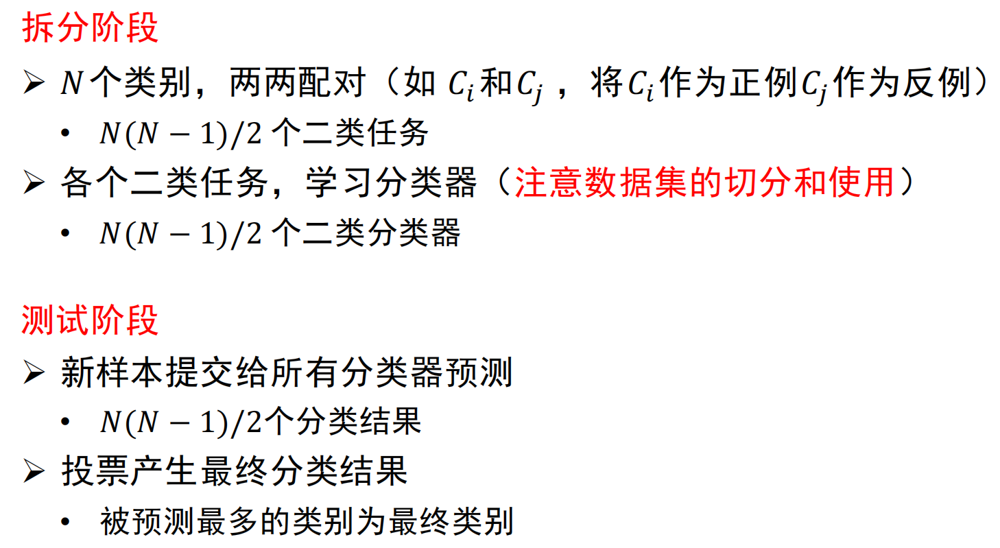

# 训练误差和测试误差
* 机器学习的目的是使学得的模型不仅对**已知数据**还对**未知数据**都有很好的预测能力

* 当损失函数给定时，基于损失函数的模型的训练误差（也叫经验误差）和测试误差，可用于评价学习方法

* 训练误差过大，没法很好学习到训练集中的规律，则存在**欠拟合**

* 测试误差的大小，反映了学习方法对未知的测试数据集的预测能力，测试误差小的方法有更好的预测能力（也叫泛化能力）

* 训练误差（训练集上），测试误差（测试集上），泛化误差（除训练集外全部样本）

# 过拟合与模型选择
* 过拟合：不知道新样本特征，追求经验误差最小化，导致将训练样本自身的特点当作所有样本的一般性质，从而造成泛化性能下降

        

* 模型选择的典型方法是**正则化**。正则化是损失结构风险最小策略的实现，是在经验分析上加一个正则化项和罚项
    * 正则化项一般是模型复杂度的单调递增函数，模型越杂正则化值越大

    

       

* 训练集：用来训练模型，对应**训练误差**

* 验证集：用来选择模型，对应**测试误差**

* 测试集：用来最终对学习方法进行评估，对应泛化误差的近似

* 为了选择好的模型，可采用
    1. 留出法
        * 直接将数据集划分为两个互斥集合

        * 训练/测试集划分尽可能保持数据分布一致性
        
        * 一般若干次随机划分，重复实验取平均值
        
        * 训练/测试样本比例通常为2:1~4:1

    2. 交叉验证法
        * k折交叉验证：将数据集分层采样划分为k个大小相似的互斥子集，每次用k-1个子集的并集作为训练集，余下子集作为测试集，最终返回k个测试结果的均值，k常用的取值是10

            

        * 假设数据集D包含m个样本，若令k=m，则得到留一法：
            * 不受随机样本划分方式的影响

            * 结果往往比较准确

            * 当数据集较大时，计算开销难以忍受
    
    3. 自助法
        * 以自助采样法为基础，对数据集D有放回采样n次得到训练集D'，用D-D'做测试集
            * 实际模型与预期模型都使用m个训练样本

            * 约有1/3样本没在训练集中出现

                

            * 从初始训练集中产生多个不同的训练集
        
        优缺点：

            数据集小、难以划分训练\测试集
            自助法能从初始数据集中产生多个不同的训练集，可以用于集成学习
            自助法产生的训练集改变了初始数据集的分布，会引入估计偏差
# 性能度量

# 偏差和方差

