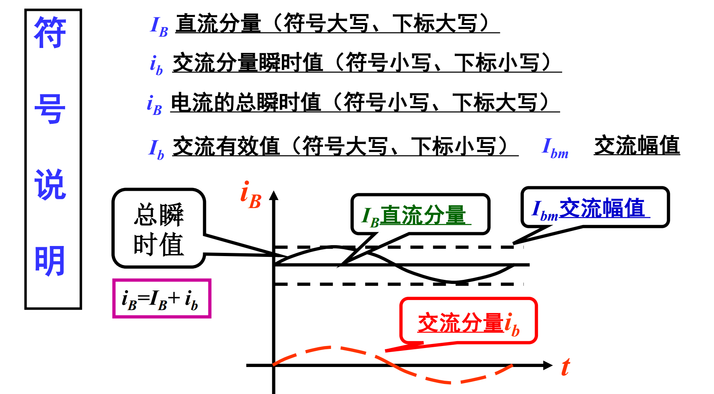

# 双极型三极管（BJT）

## 三极管的结构
* NPN型

    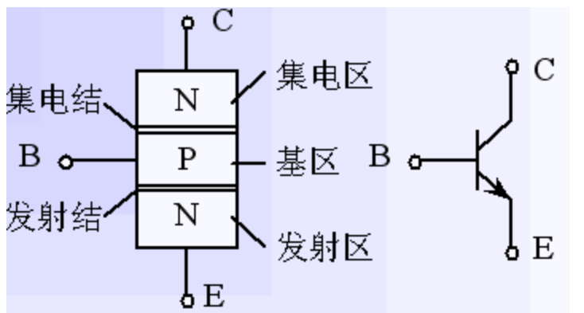

* PNP型

    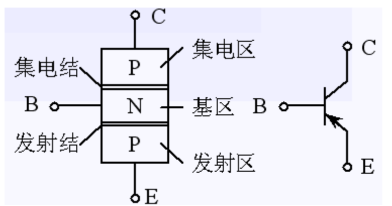

## 三极管的放大作用和载流子的运动
1. 内部结构
    1. 发射区掺杂浓度**最高**，故其中的多数载流子浓度很高（作用：**发射载流子**）

    2. 基区做得很薄，而且掺杂浓度**最低**，即基区中多子 浓度很低（作用：**传送和控制载流子**）

    3. 集电结结面积**比较大**，且集电区多子浓度远比发射区多子浓度低（作用：**收集载流子**）

2. 外部条件
    1. 发射结正偏：由$V_{BB}$保证：$U_{BE}=U_B-U_E>0.7V$

    2. 集电结反偏：由$V_{CC}$、$V_{BB}$保证：$U_{CB}=U_C-U_B>0$

    * BJT内部的载流子传输过程
        1. 因为发射结正偏，所以发射区向基区注入电子，形成**扩散电流$I_{EN}$**。同时从基区向发射区也有空穴的扩散运动，形成的电流为$I_{EP}$，但其数量小，**可忽略**。所以**发射极电流**$I_E=I_{EP}+I_{EN}≈I_{EN}$

            

        2. 发射区的电子注入基区后，变成了少数载流子，**少部分电子**遇到空穴被复合掉，发射结正偏使得基区产生空穴用以复合**上述的少部分电子**，形成**基区复合电流$I_{BN}$**。所以**基极电流**$I_B=I_{BP}+I_{BN}≈I_{BN}$。**大部分电子**到达了集电极的边缘

            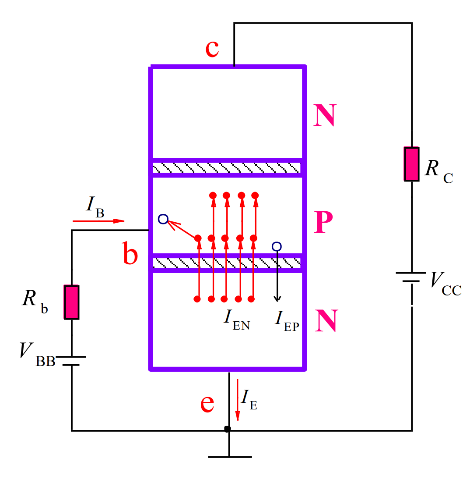

        3. 由于集电极反偏，促进少子扩散（基区少子电子，集电区少子空穴），集电区收集从基区漂移到集电区的电子，形成**收集电流$I_{CN}$**。集电区的少子空穴和少子电子的漂移形成**集电结方向饱和电流$I_{CBO}$**（CBO表示反向截止状态时从C集电区到B基区的微小电流），$I_C=I_{CN}+I_{CBO}$

            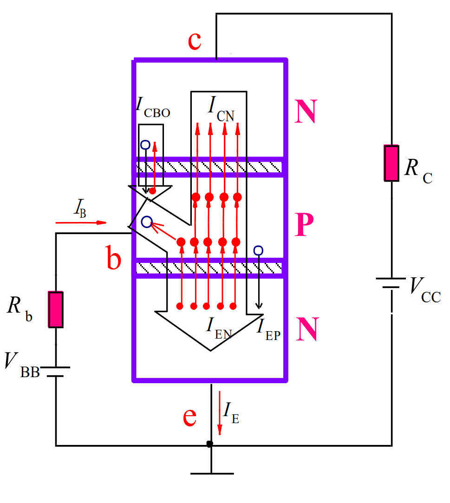

    * BJT三个电极上电流分配关系
        1. 三电流之间的关系
            * $I_E=I_{EN}+I_{EP}=I_{CN}+I_{BN}+I_{EP}$：$I_{EN}$（发射区的电子）分散为$I_{CN}$（反向截止促进偏移的基区的电子）和$I_{BN}$（发射区的电子与基区的空穴复合）
            
            * $I_C=I_{CN}+I_{CBO}$
            
            * $I_B=I_{EN}-I_{CN}+I_{EP}-I_{CBO}=I_{BN}+I_{EP}-I_{CBO}$

            * 由上面三式可得：$I_E=I_B+I_C$

            * 当忽略$I_{EP}$时可得到：$I_E≈I_{CN}+I_{BN}$，$I_E$在B极和C极之间的分配比例主要**取决于基区宽度、基区多子浓度**

            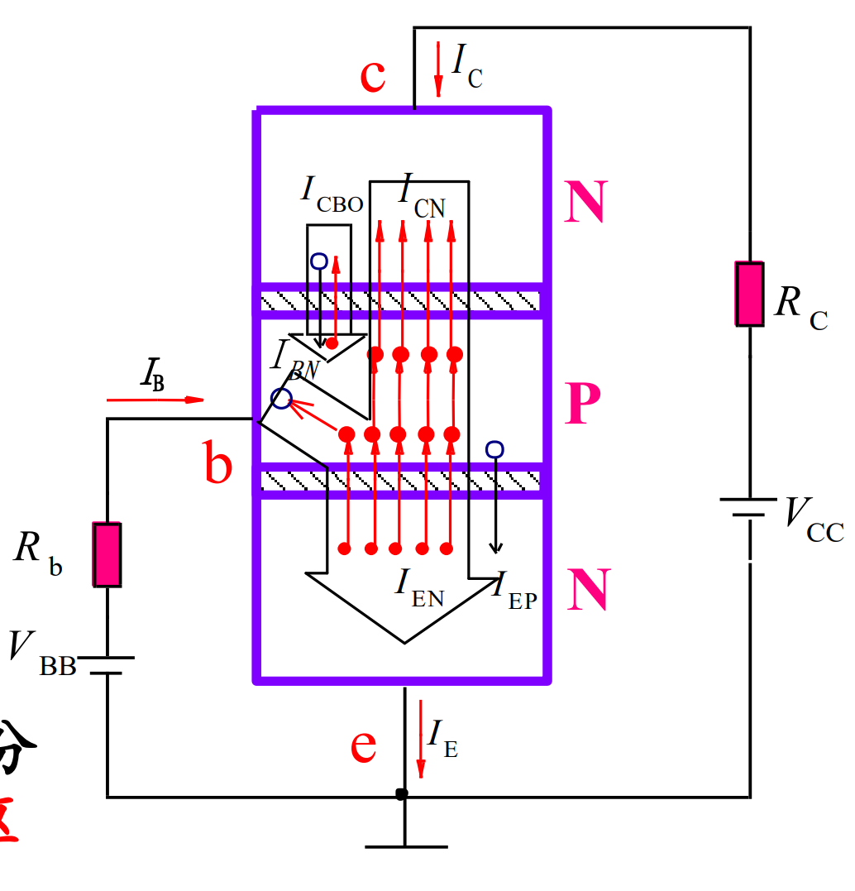

    * 电流分配关系（忽略各区少子产生的电流（$I_{EP}$、$I_{CBO}$）
        * $\bar{\alpha}=\frac{I_C}{I_E}$，称为**共基极**直流电流放大系数,显然$\bar α$小于小于1而接近1

        * $\bar \beta=\frac{I_C}{I_B}=\frac{\bar\alpha}{1-\bar{\alpha}}$，称为共**发射极**直流电流放大倍数

# BJT的伏安特性曲线（共发射极接法）
1. 输入特性曲线（$i_B$与$u_{BE}$之间的关系）
    1. $u_{CE}=0V$时，**相当于两个PN结并联**，从中间P向两侧正向导通
        
    2. $u_{CE}=1V$时，集电结反偏，开始收集电子，所以**基区复合减少**，在同一$u_{BE}$电压下，**$i_B$减小**。特性曲线将向右稍微移动一些

        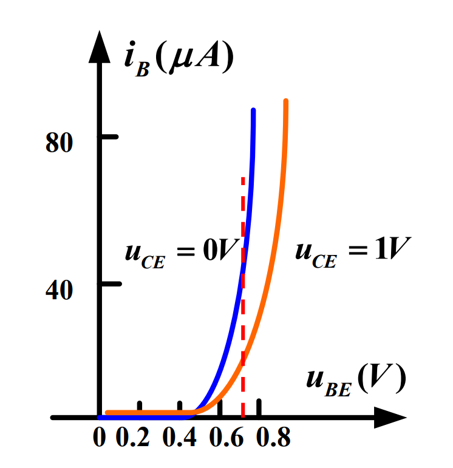

    3. $u_{CE}≥1V$再增加时，曲线右移很不明显

2. 输出特性曲线（$i_C$与电压$u_{CE}$之间的关系）
    * 以$I_B=60μA$为例

    

    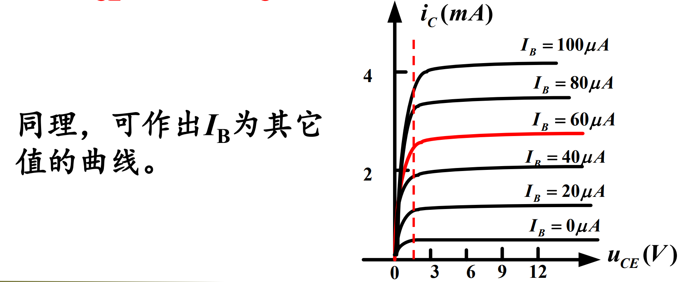

    1. 当$u_{CE}=0V$时，因集电极无收集作用，故$i_C=0$

    2. 当$u_CE$上升时，$i_C$也随值增大

    3. 当$u_{CE}>1V$后，收集电子的能力足够强。此时发射到基区的电子**都被集电极收集**，形成$i_C$。**故$u_{CE}$再增加，$i_C$基本保持不变**

    * 输出特性曲线可以分为三个区域：
        1. 饱和区：$I_C$受$U_{CE}$显著控制的区域，该区域内$U_{CE}<0.7V$。此时**发射结正偏，集电结也正偏或零偏**

        2. 截止区：$I_C$接近零的区域，即$I_B=0$的曲线的下方，此时**发射结反偏或零偏，集电结反偏**

        3. 放大区：曲线基本平行等距，此时，**发射结正偏，集电结反偏**，该区中有：

            

# 杂项
* 温度对输出特性的影响

    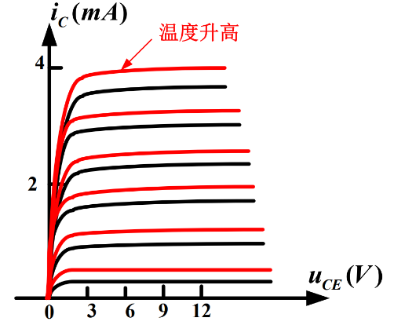

1. 三极管结偏置判定法

    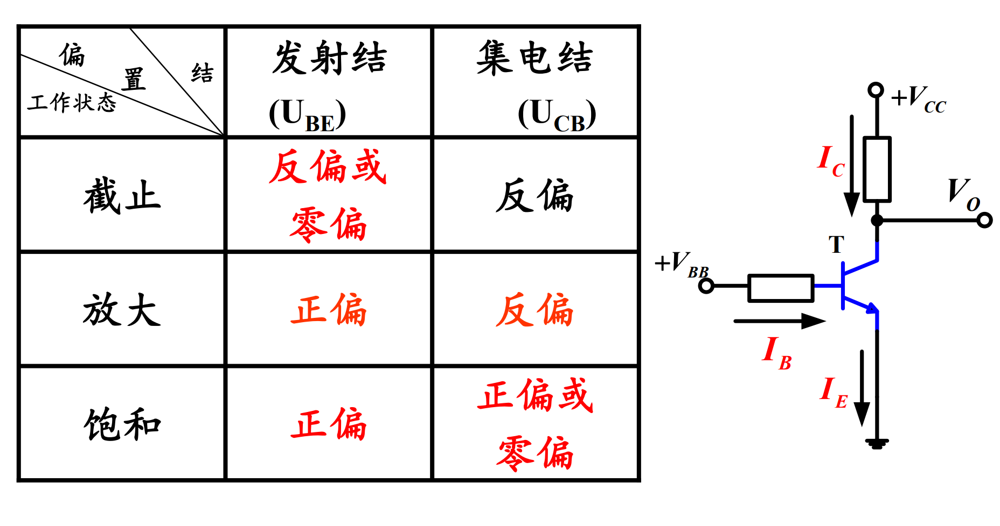

2. 三极管电流关系判定法

工作状态|$I_B$|$I_C$|$I_E$
-|-|-|-
截止|0|0|0|
|放大|>0|$\beta I_B$|$I_B+I_C=(1+\beta)I_B$|
|饱和|$I_B\geqslant I_{BS}$|$<\beta I_B$|$<(1+\beta)I_B$|

* $I_{BS}$称为三极管临界饱和时基极应该注入的电流

* 用电流关系判断三极管的工作状态时，可先假设三极管处于放大状态，求出$I_B$。然后根据$U_{CES}$电压求出临界饱和时的$I_{BS}$，若$I_B>I_{BS}$，则三极管处于饱和状态；若$I_B<I_{BS}$，则是放大状态

# BJT的主要参数
1. 电流放大系数
    1. 共发射极放大系数：
        * 直流：$\bar{\beta}=\frac{I_C}{I_B}$，交流：$\beta=\frac{\Delta i_C}{\Delta i_B}$

    2. 共基极电流放大系数：
        * 直流：$\bar{\alpha}=\frac{I_C}{I_E}$，交流：$\alpha=\frac{\Delta i_C}{\Delta i_E}$

3. 极限参数
    1. 集电极最大允许电流$I_{CM}$
        * $I_C$过大时，$β$要下降。当$β$下降到线性放大区$β$值的$70\%$时，所对应的集电极电流称为集电极最大允许电流$I_{CM}$

    2. 集电极最大允许功率损耗$P_{CM}$
        * 集电极电流通过集电结时所产生的损耗：$P_C=I_CU_{CE}<P_{CM}$

        

# 静态、动态电路
1. 静态
    * 在没有加输入信号（$u_i=0$）时，放大电路的工作状态称为**静态**，又称为**直流工作状态**

2. 动态
    * 在电路的输入端加上输入信号后，电路的工作状态称为**动态**，**各电极的电流和各级间的电压都在静态值的基础上叠加了随输入信号变化的交流量**

# 放大电路的分析
1. 图解法
    * 图解法分析**静态**
        * 静态工作点
            * 当$I_C=0$时，$U_{CE}=V_{CC}$，与横坐标的交点为$(V_{CC},0)$
            
            * 当$UCE=0$时，$I_C=V_{CC}/R_C$，与纵坐标的交点为$(0,V_{CC}/R_C)$

            * 连接两点所得到的直线与**输出特性曲线**的交点$Q(U_{CEQ},I_{CQ})$就是静态工作点

                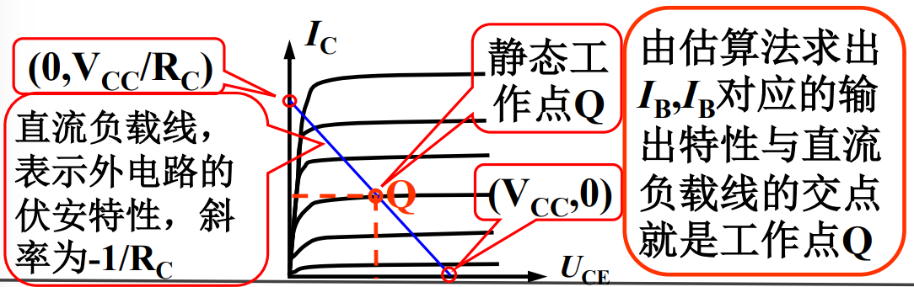
                
    * 图解法分析**动态**
        
        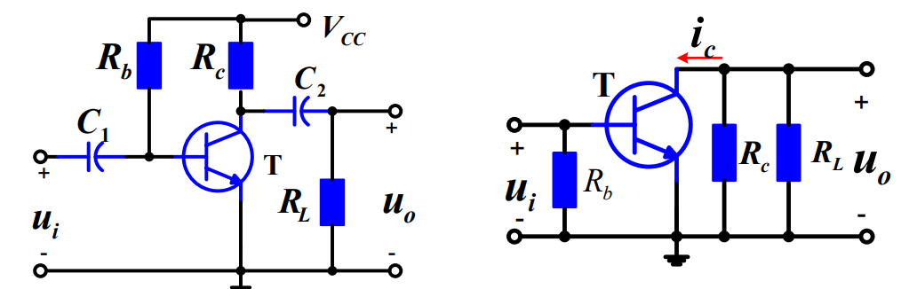

        * 交流负载线

            

        2. 交流放大工作情况（设输出空载）

            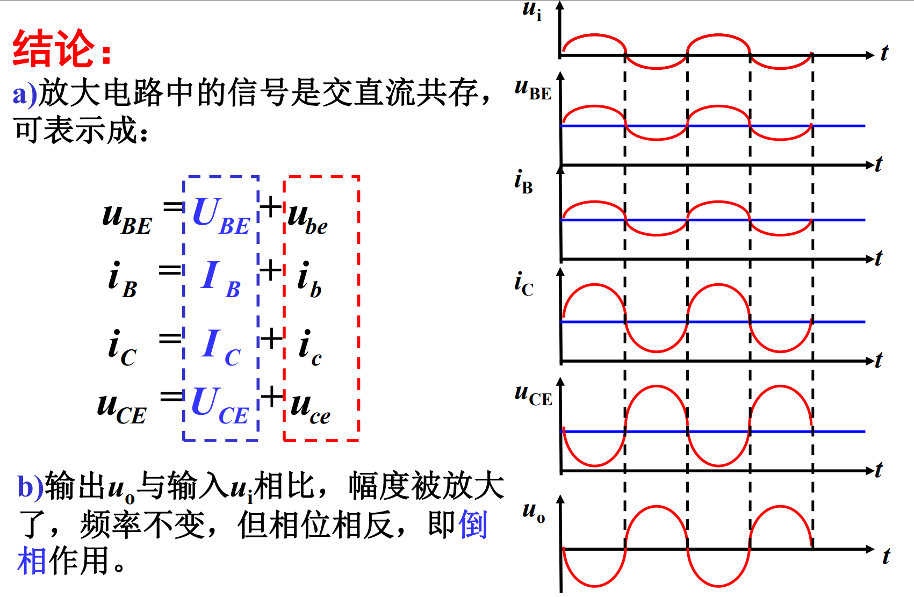

        3. 非线性失真与Q的关系

            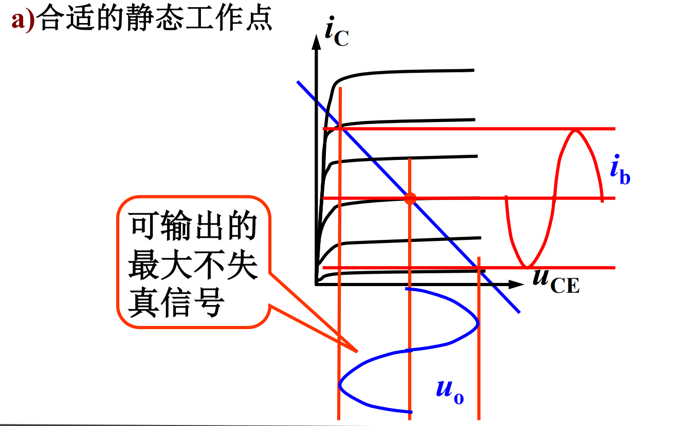

            * 小信号$u_{ce}$使得$u_{CE}$增大但不能超过$v_{CC}$，否则会截断

                

            * 小信号$u_{ce}$使得$u_{CE}$减小，导致$u_{CB}$反偏电压增大使电流$i_C$增大，但$u_{CB}$大到一定程度时$i{_B}$饱和几乎不变，使$u_{BE}$几乎不变

                

2. 微变等效电路法（条件：交流**低频小信号**）
    1. 简化的H参数等效电路

    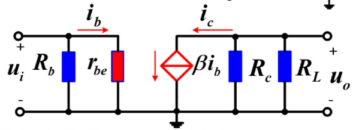

    2. $r_{be}$的计算

        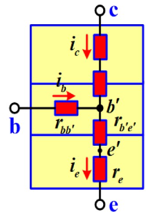

        * 由PN结的电流公式$I_E=I_S(e^{\frac{u_{b'e'}}{U_T}}-1)$

        
        

# 三种放大电路的比较

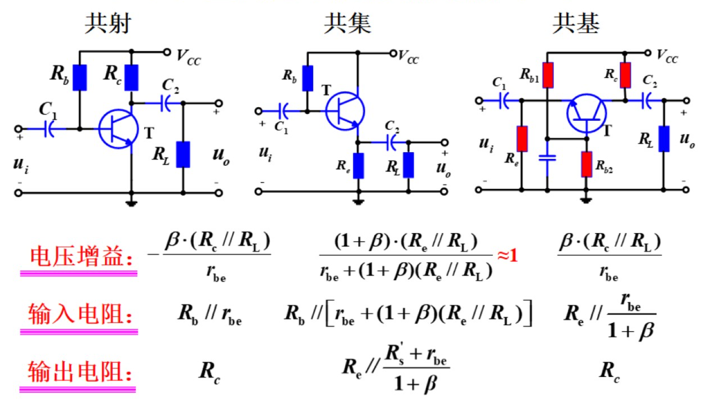

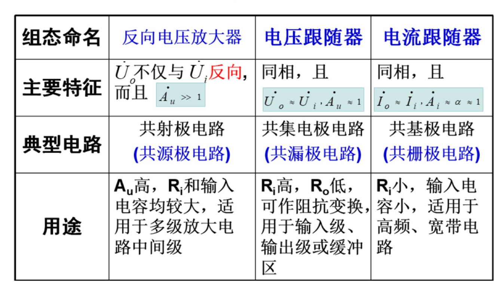
