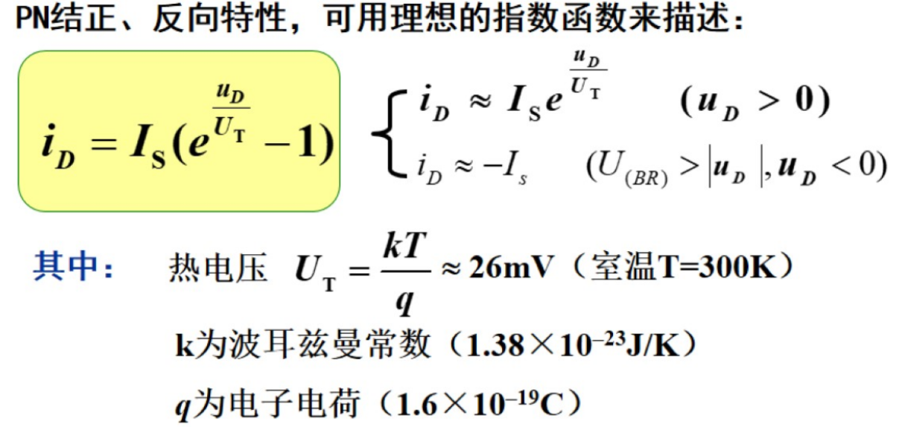
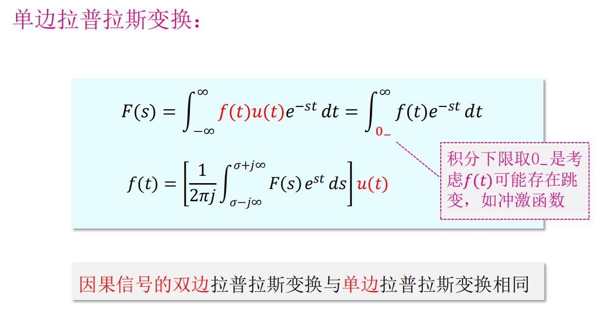

模拟电路：处理模拟信号的电路
--

# 电子电路中信号的分类
1. 模拟信号：
    * 在时间上或幅值上是连续的,**取任意值**

        

2. 数字信号：
    * 在时间上和幅值上都是离散的，数字信号**只存在高低两种电平的相互转化**

        

3. 几种特殊的模拟信号：
    1. 时间离散，幅度连续：

            
        
    2. 时间离散，幅度离散：

            

    3. 时间连续，幅度离散：

            

# 信号的频谱
* 信号**在频域中**表示的图形或曲线称为信号的频谱

1. 把一个信号分解为正弦信号的集合，得到其正弦信号**幅值**随角频率变化的分布，称为该信号的**幅值频谱（幅度谱）**

        

2. 把一个信号分解为正弦信号的集合，得到信号各频率分量的**相位**随角频率变化的分布，称为该信号的**相位频谱（相位谱）**

        
