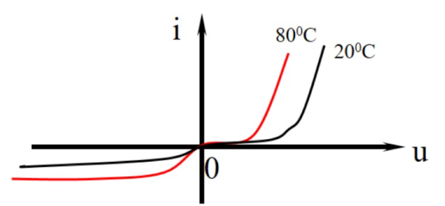
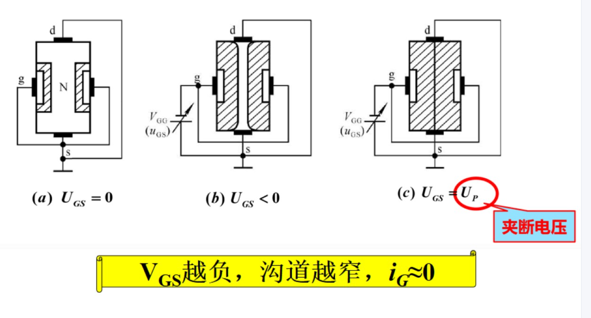

* 模拟电路:处理模拟信号的电路
# 电子电路
* 电子系统:通常是指若干相互连接/相互作用的基本电路组成的具有特定功能的电路载体
* 信号:一般是信息的载体
# 电子电路中信号的分类
1. 模拟信号:
    * 在时间上和幅值上均是连续的,在一定动态范围内可能取任意值
        
2. 数字信号:
    * 在时间上和幅值上都是离散的信号,数字信号**只存在高低两种电平的相互转化**
        
3. 几种特殊的模拟信号:
    1. 时间离散,幅度连续:
            
    2. 时间离散,幅度离散:
            
    3. 时间连续,幅度离散:
            
# 信号的频谱
* 信号在频域中表示的图形或曲线称为信号的频谱
    * 时频转换可通过傅里叶变换实现
* 任意周期函数只要满足狄利克雷条件都可以展开成傅里叶级数
1. 把一个信号分解为正弦信号的集合,得到其正弦信号**幅值**随角频率变化的分布,称为该信号的幅值频谱(幅度谱)
        
2. 把一个信号分解为正弦信号的集合,得到信号各频率分量的**相位**随角频率变化的分布,称为该信号的相位频谱(相位谱)
        
# 放大电路的基本知识
* 放大电路是最基本的模拟信号处理功能,它是通过放大电路实现的
* 放大电路至少满足:
    * 能将微弱的电信号增强到人们需要的值
    * 放大后的信号波形与放大前的波形的形状相同或基本相同
        
* 放大电路模型:根据输入信号和输出信号的不同,放大电路可分为四种
    1. 电压放大
            
    2. 电流放大
            
    3. 互阻放大
        
    4. 互导放大
        
## 放大电路的性能指标概述
* 放大电路的主要性能指标有:
    * 输入电阻Ri(交流电阻)
    * 输出电阻Ro(交流电阻)
    * 增益
    * 频率响应
    * 非线性失真
    * 最大输出功率/效率/信号噪声比/抗干扰能力
    