* 模拟电路:处理模拟信号的电路
# 电子电路
* 电子系统:通常是指若干相互连接/相互作用的基本电路组成的具有特定功能的电路载体
* 信号:一般是信息的载体
# 电子电路中信号的分类
1. 模拟信号:
    * 在时间上和幅值上均是连续的,在一定动态范围内可能取任意值
    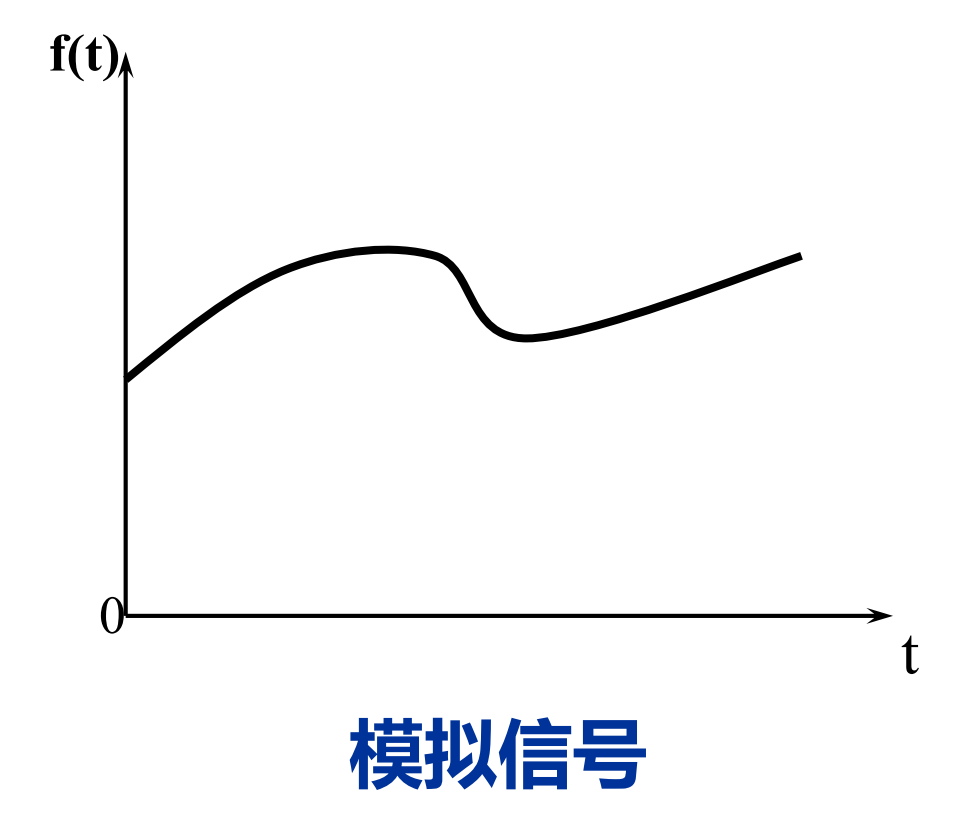    
2. 数字信号:
    * 在时间上和幅值上都是离散的信号,数字信号**只存在高低两种电平的相互转化**
    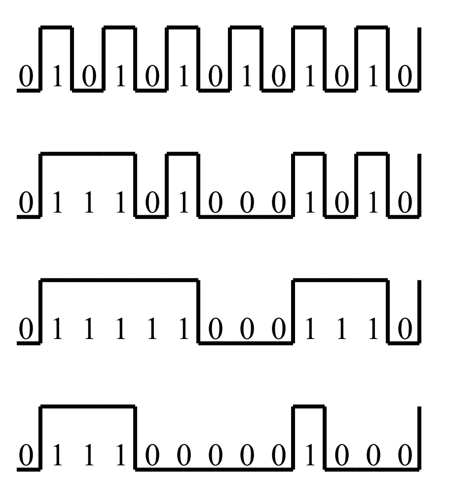    
3. 几种特殊的模拟信号:
    1. 时间离散,幅度连续:
        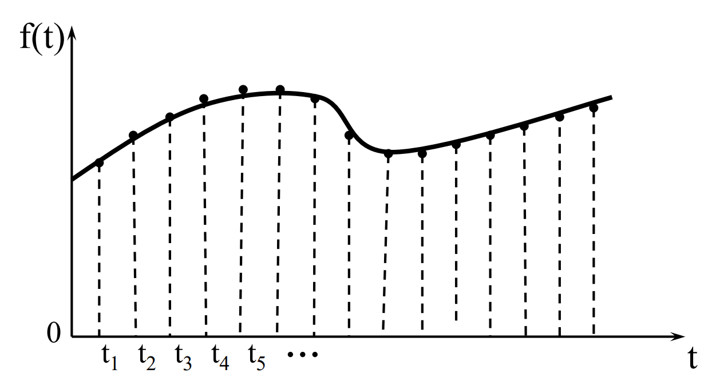    
    2. 时间离散,幅度离散:
        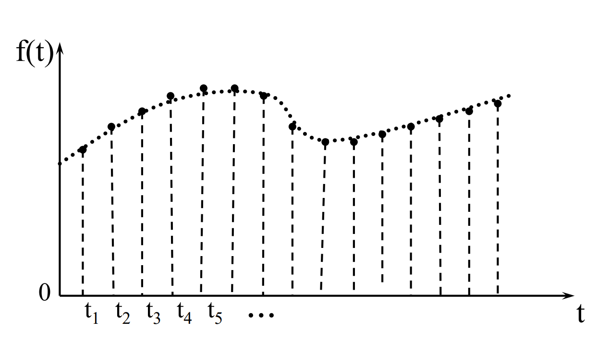    
    3. 时间连续,幅度离散:
        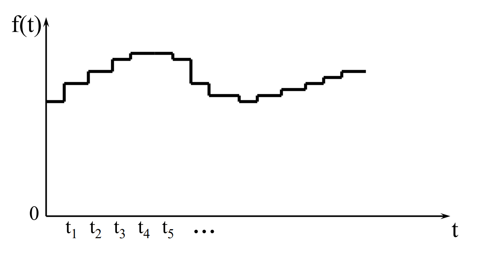    
# 信号的频谱
* 信号在频域中表示的图形或曲线称为信号的频谱
    * 时频转换可通过傅里叶变换实现
* 任意周期函数只要满足狄利克雷条件都可以展开成傅里叶级数
1. 把一个信号分解为正弦信号的集合,得到其正弦信号**幅值**随角频率变化的分布,称为该信号的幅值频谱(幅度谱)
    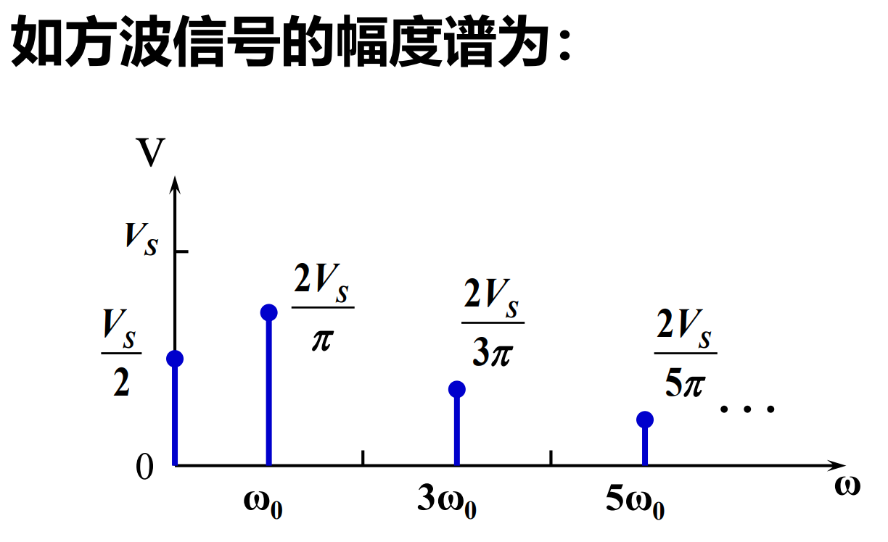    
2. 把一个信号分解为正弦信号的集合,得到信号各频率分量的**相位**随角频率变化的分布,称为该信号的相位频谱(相位谱)
    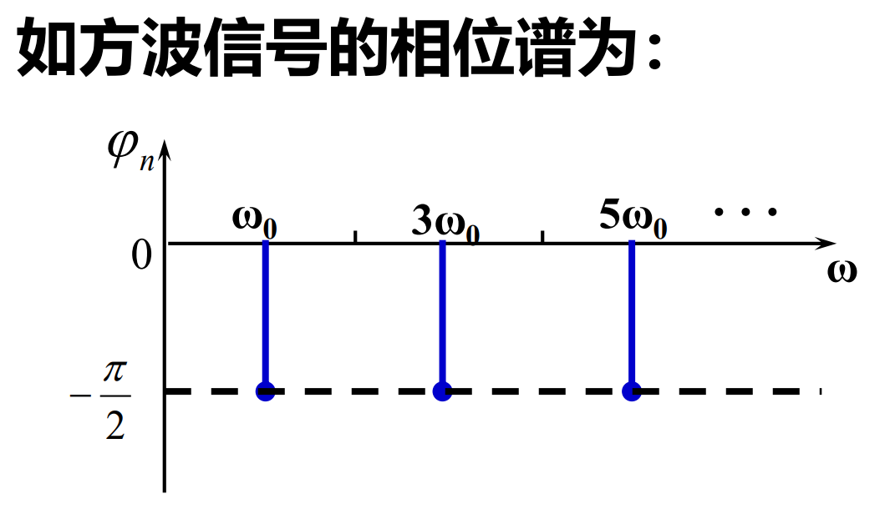    
# 放大电路的基本知识
* 放大电路是最基本的模拟信号处理功能,它是通过放大电路实现的
* 放大电路至少满足:
    * 能将微弱的电信号增强到人们需要的值
    * 放大后的信号波形与放大前的波形的形状相同或基本相同
    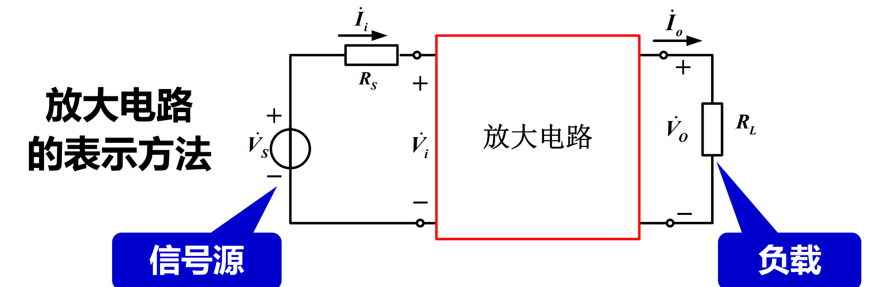    
* 放大电路模型:根据输入信号和输出信号的不同,放大电路可分为四种
    1. 电压放大
        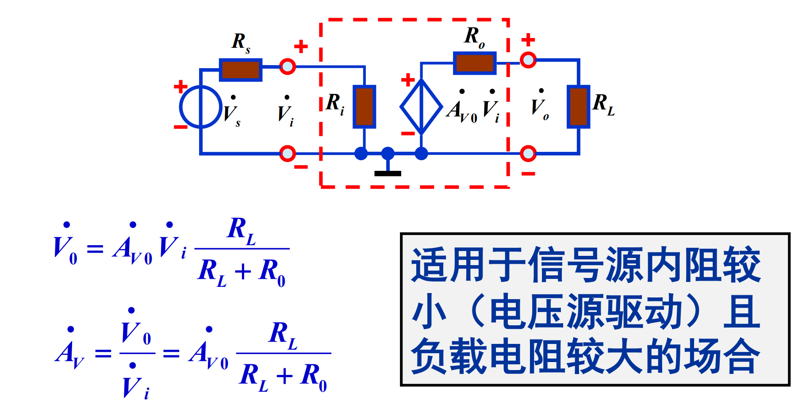    
    2. 电流放大
        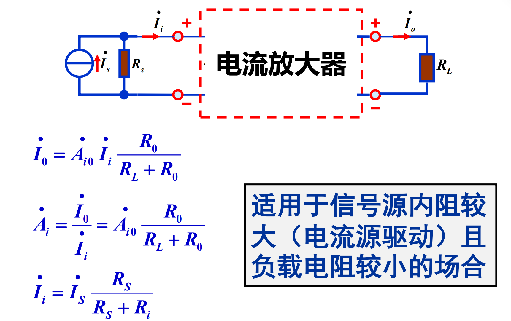    
    3. 互阻放大
        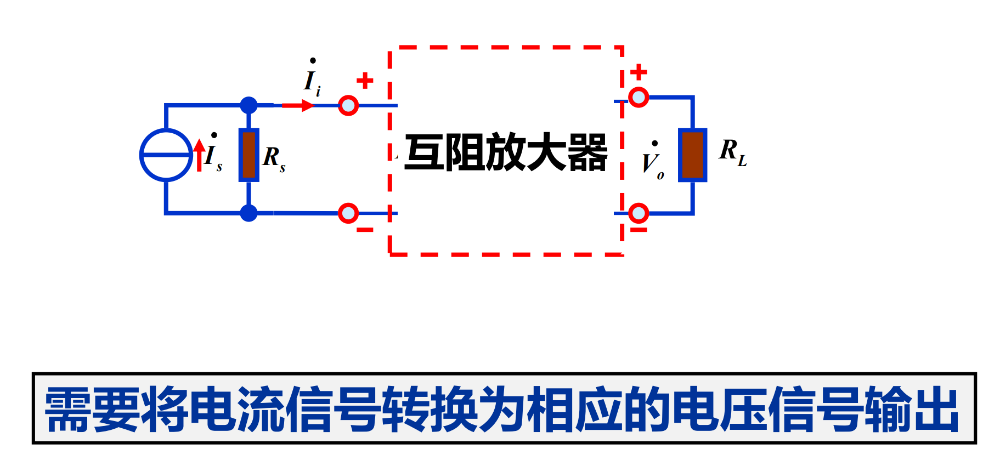
    4. 互导放大
        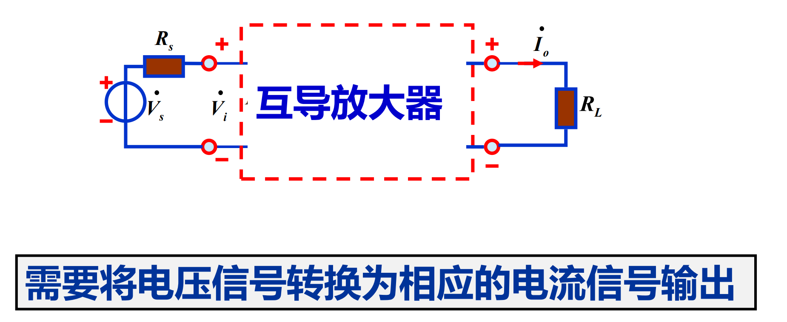
## 放大电路的性能指标概述
* 放大电路的主要性能指标有:
    1. 输入电阻Ri(交流电阻):
        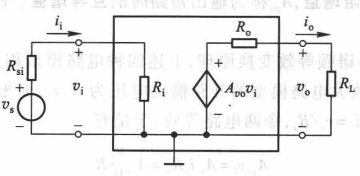    
        * 由图可得,输入电阻等于输入电压vi和输入电流ii的比值,即Ri=vi/ii
        * 输入电阻Ri的大小决定了放大电路能从信号源获取多大的信号
            1. 对于输入为电压信号的放大电路,即电压放大和互导放大电路,Ri越大,则放大电路输入端的vi越大
            2. 对于输入为电流信号的放大电路,即电流放大和互阻放大电路,Ri越小,则放大电路输入端的ii越大
    2. 输出电阻Ro(交流电阻):
            
        * 放大电路输出电阻Ro的大小将影响它带负载的能力
            * 带负载能力是指放大电路输出量随负载变化的程度
            * 当负载变化时,输出量变化很小或基本不变表示带负载能力强,即输出量与负载大小的关联度越弱,放大电路的带负载能力越强
        * 电压放大和互阻放大电路,输出量为电压信号
            * 对于这类放大电路,Ro越小,负载电阻RL的变化对输出电压vo的影响越小
                    
        * 电流放大和互导放大电路,输出量为电流信号
            * 对于这类放大电路,输出电阻Ro越大,负载电阻RL的变化对输出电流io的影响越小
                    
    3. 增益
        * 四种放大电路分别具有不同的增益,如电压增益Av/电流增益Ai/互阻增益Ar和互导增益Ag,反映了放大电路在输入信号的控制下,将供电电源能量转换为信号能量的能力
    4. 频率响应
        * 放大信号的频率响应是指,在输入正弦信号情况下,输出随信号频率连续变化的稳态响应
        * 若考虑电抗性元件的作用和信号角频率变量,则放大电路的电压增益可表达为
                
            * ω为信号的角频率
            * Av(ω)表示电压增益的模与角频率之间的关系,称为幅频响应
            * φ(ω)表示放大电路输出与输入正弦信号的相位差与角频率之间的关系,称为相频响应
    * 还有其它指标,如最大输出功率/效率/信号噪声比/抗干扰能力等
# 运算放大器