# 直流偏置电路

* 模拟集成电路中普遍采用**直流源**做直流偏置

* 为各级放大电路提供偏流以**稳定静态工作点**

* 作为**有源负载**取代不易集成的大电阻

* 晶体管和场效应管等有源器件，在放大区其输出电流几乎不受输出电压的影响，具有恒流特性，因而可以用来设计各种性能良好的**恒流源**

## 镜像电流源
1. BJT镜像电流源
    

    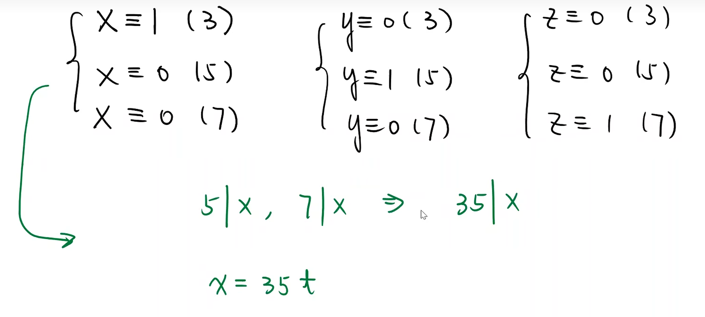

    

2. MOSFET镜像电流源
    

    

    

    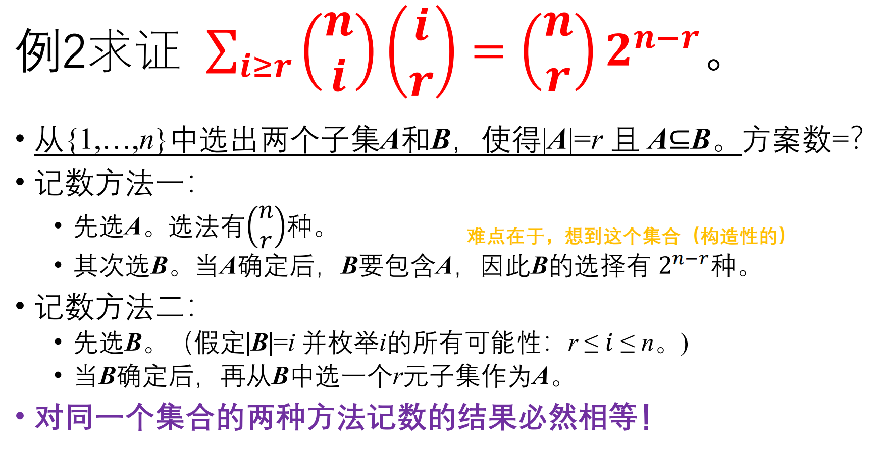

    

## 比例电流源

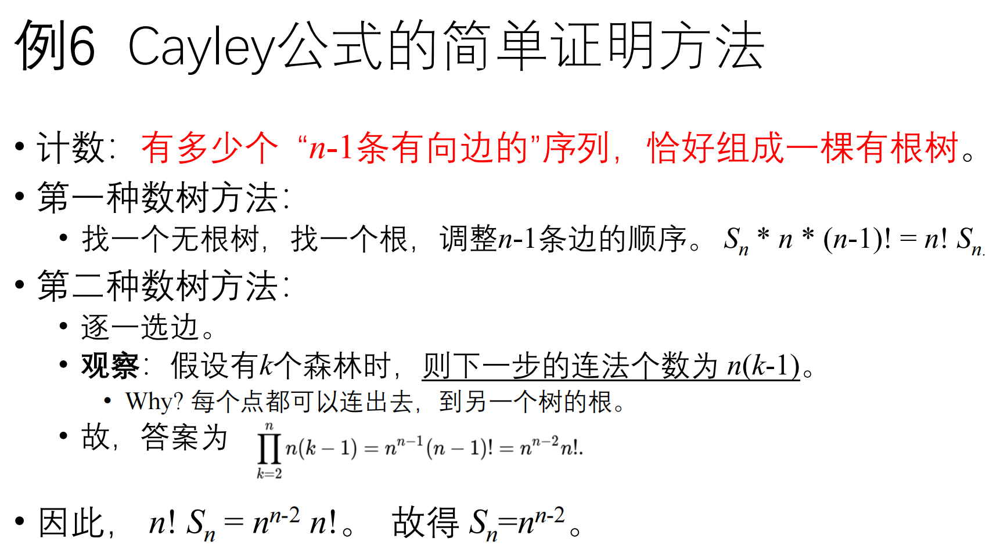

## 微电流源

## 精密镜像恒流电路
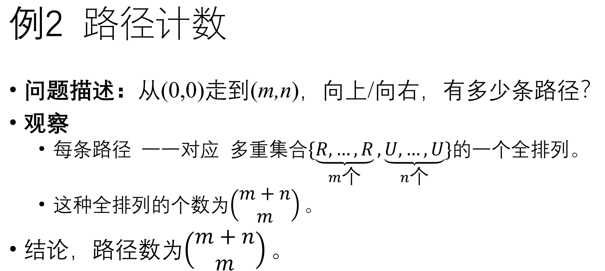

## 威尔逊（高输出阻抗）电流源电流
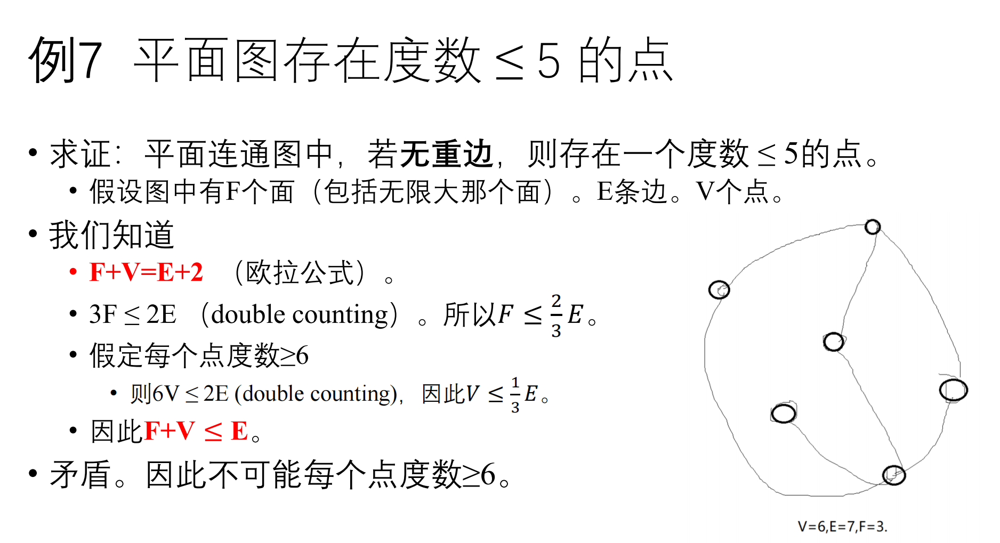

## 电流源的应用

## 模拟集成电路-直流偏置技术小结
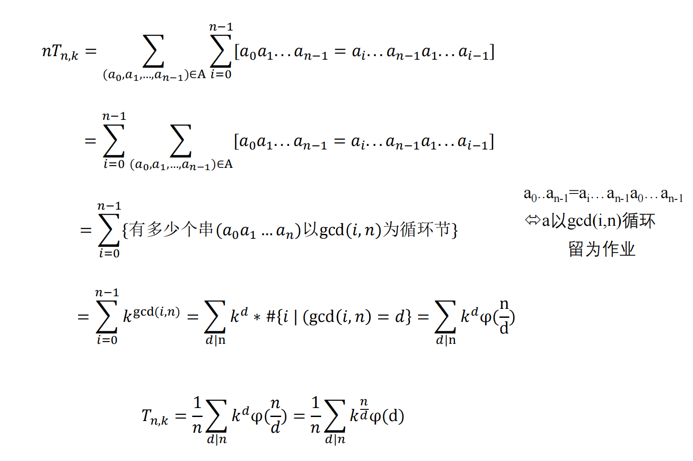

# 差分式放大电路
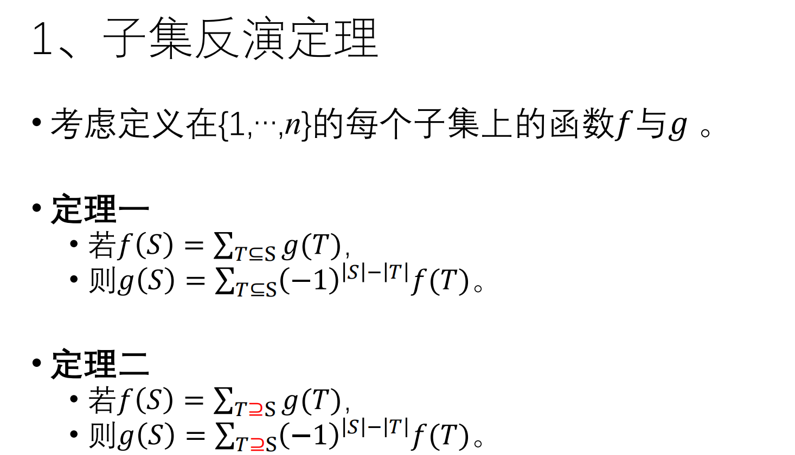

## 差分式放大电路基本概念

## BJT差动放大电路的静态分析
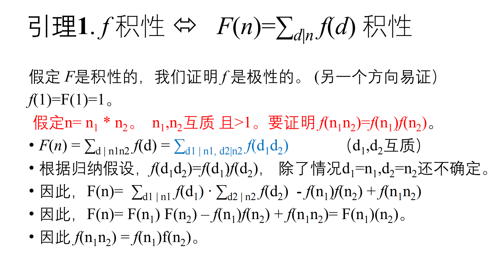

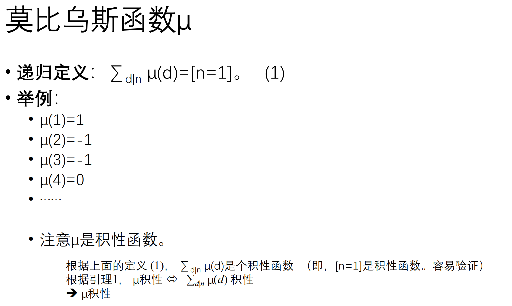

## BJT差动放大电路对差模信号的放大作用
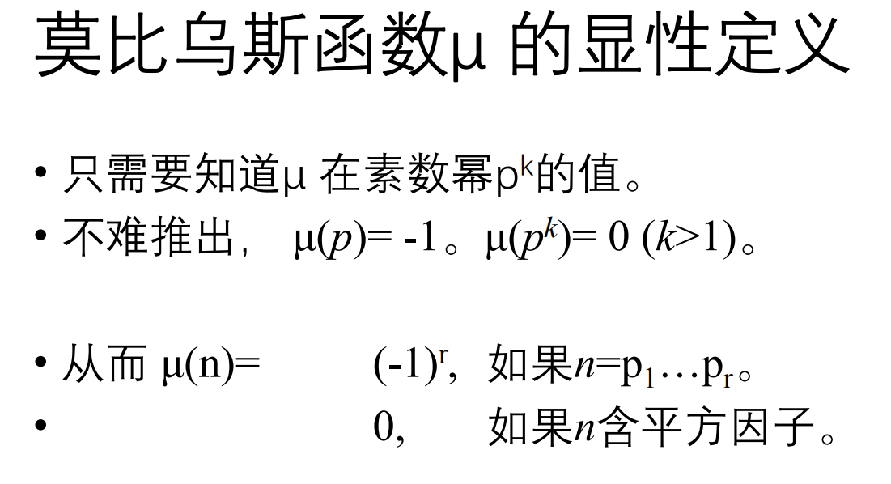

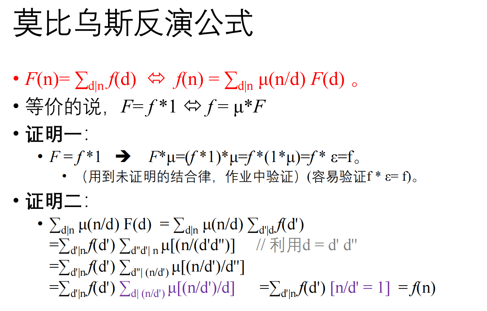

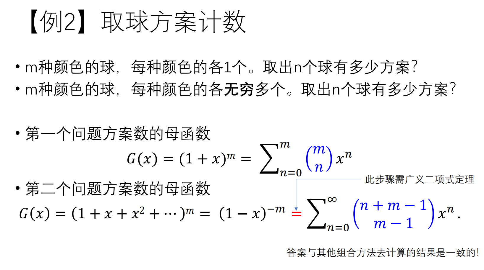

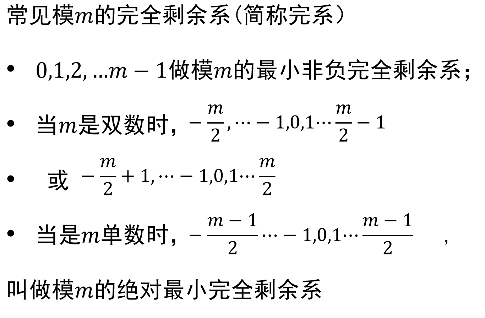

## FET差分式放大电路

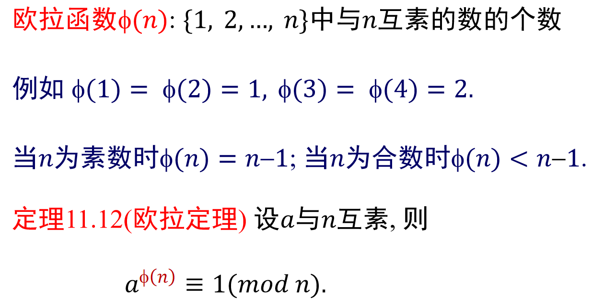

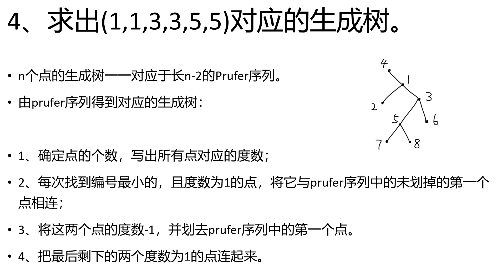

## 具有恒流源的差动电路

## 差分式放大电路的传输特性

## 集成运算放大器简介

## 模拟集成电路-差分式放大电路小结
