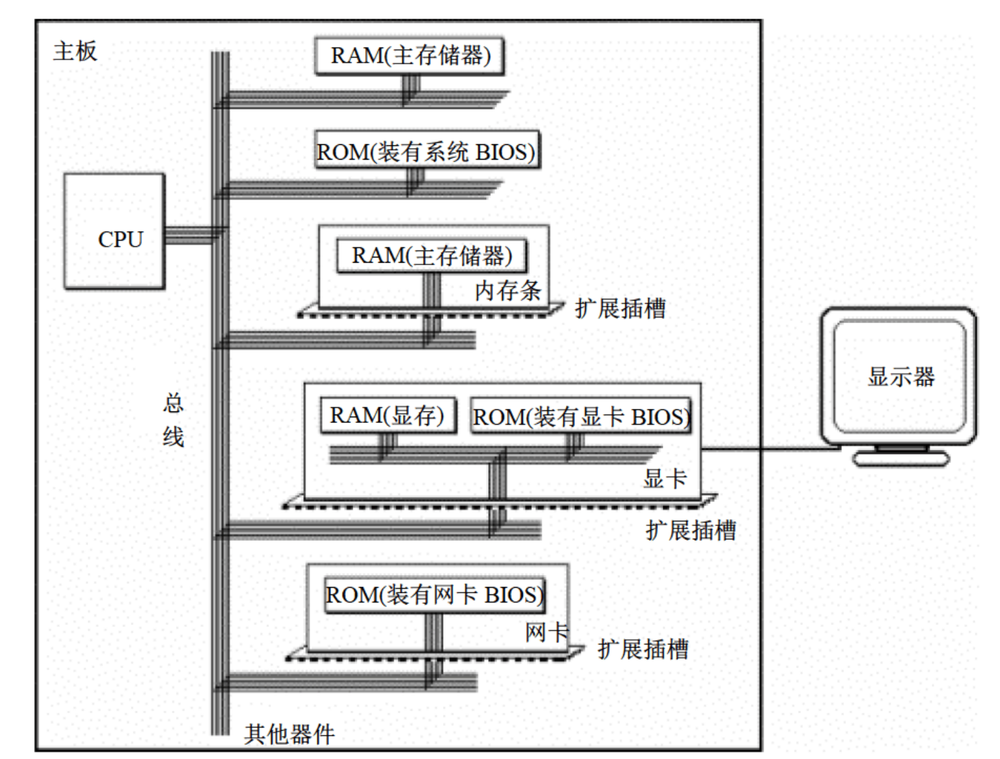
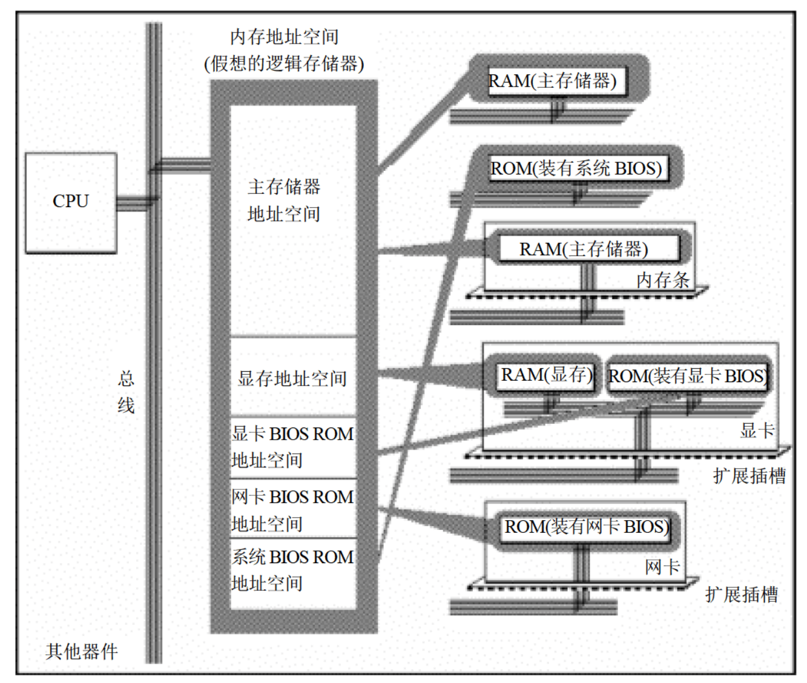

# 基础知识
1. 汇编指令是机器指令的助记符,同机器指令一一对应

2. 每一种CPU都有自己的汇编指令集

3. CPU可以直接使用的在存储器中存放

4. 在存储器中指令和数据没有任何的区别，都是二进制信息

5. 存储单元从零开始顺序编号

6. 一个存储单元可以存储8个bit，即8个二进制数

7. 1Byte=8bit 1KB=1024B 1MB=1024KB 1GB=1024MB

8. 每一个CPU芯片都有许多管脚，这些管脚和总线相连。也可以说，这些管脚引出总线。一个CPU可以引出3种总线，总线的宽度标志了这个CPU的不同方面的性能：
    * 地址总线的宽度决定了CPU的**寻址能力**（一个CPU有N根地址线，则可以说这个CPU的地址总线的宽度是N，这样的CPU最多可以寻找2的N次方个内存单元）
    
    * 数据总线的宽度决定了CPU与其它器件进行数据传送时的一次数据传送量（8根数据总线一次可传送一个8位二进制数据）

    * 控制总线的宽度决定了CPU对系统种其它器件的控制能力 

9. 每一台PC机上都有一个主板，主板上有一些核心器件和一些主要器件，这些器件通过总线（地址总线、数据总线、控制总线）相连。这些器件有CPU、存储器、外围芯片组、扩展插槽等。扩展插槽上一般插有RAM内存条和各类接口卡

10. CPU对外部设备都不能直接控制，如显示器、音箱、打印机等。直接控制这些设备进行工作是插在扩展插槽上的接口卡。扩展插槽通过总线和CPU相连，所以接口卡也通过总线和CPU相连。即**CPU通过总线向接口卡发送命令，接口卡根据CPU的命令控制外设进行工作**

11. 各类存储芯片
    * 随机存储器
        * 用于存放供CPU使用的绝大多数程序和数据，主随机存储器一般由两个位置上的RAM组成，装在主板上的RAM和插在扩展插槽上的RAM

    * 装有BIOS（Basic Input/Output System，基本输入/输出系统）的ROM
        * BIOS是由主板和各类接口卡（如显卡、网卡）厂商提供的软件系统，可以通过它控制该设备最基本的输入输出。在主板和某些接口卡上插有存储相应BIOS的ROM。如主板上的ROM种存储着主板的BIOS（通常称为系统BIOS）；显卡上的ROM种存储着显卡的BIOS

    * 接口卡上的RAM
        * 某些接口卡需要对大批量输入、输出数据进行暂时存储，在其上装有RAM。最典型的是显示卡上的RAM，一般称为显存。显示卡随时将显存中的数据在显示器上输出。即**将需要显示的内容写入显存，就会出现在显示器上

    

12. 内存地址空间
    * 存储器都和CPU的总线相连

    * CPU对存储器进行读和写的时候都通过控制线发出内存读写命令

    

