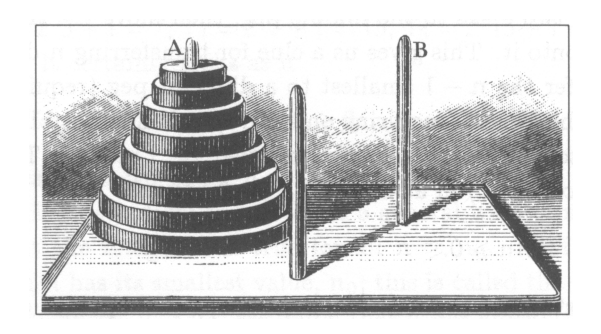

* 河内塔



*  目的:将整个塔从A柱移动到B柱,每次移动一个圆盘,且较大的圆盘不能放在较小的圆盘上面

* 假设有n个圆盘,`Tn`是将n个圆盘从A柱移动到B柱所需要的最小次数,很容易得出
    * T0=0
    * T1=1
    * T2=3

* 移动圆盘:当`n=3`时,思路是将上面`2`个圆盘设法移动到中间柱上,然后把第`3`个圆盘移动到B柱上,再把其余`2`个放在它上面.
    * 移动n个圆盘的思路:先把 `n-1` 个小的圆盘移动到一个不同的柱上(需要`T(n-1)`次移动),然后移动最大的圆盘(需要`1`次移动),最后再把`n-1`个小的圆盘移回最大圆盘的上面(需要`T(n-1)`次移动),这样,至多需要`2*T(n-1)+1`次移动就能移动`n(n>0)`个圆盘d了,也就是 `Tn<=2*T(n-1)+1(n>0)`

        * 特别注意!!!这里使用的是 `<=` 而不是 `=` ,因为我们仅仅算出移动 `2*T(n-1)+1` 次就成功,但不代表着这是移动所需的最小次数,或许有一个更好的方法

    * 事实上没有更好的方法.迟早必须移动最大的那个圆盘,而`n-1`个小的圆盘就必须移到某根柱上,这至少需要`T(n-1)`次移动才能把它们移动到那根柱上.如果用不好的方法,移动最大圆盘可能会大于`1`次,且在最后移动`1`次移动最大圆盘后,必须把那`n-1`小圆盘(必须全在一个柱)移回最大圆盘上,需要`T(n-1)`次移动,那么`Tn>=2*T(n-1)+1(n>0)`
    
    * 两个式子结合起来,再加上`n=0`的特殊情况得出`T0=0;Tn=2*T(n-1)+1(n>0)`

        * 这一组等式称为递归式,它给出一个边界值,以及一个用前面的值给出一般值的方程
    
```
Tn=2*T(n-1)+1,(n>0)
Tn+1=2(T(n-1)+1),(n>0)
Tn+1是首项为1,公比为2的等比数列
Tn=2^n-1,(n>0)
当n=0时也满足上式
则Tn=2^n-1
```
