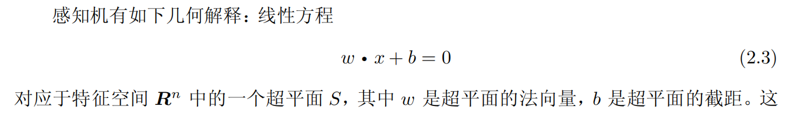
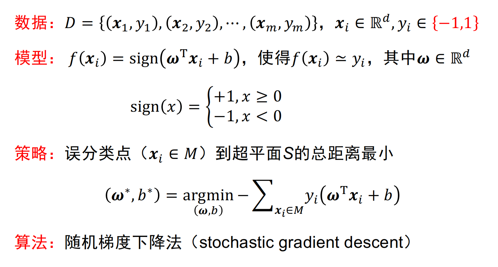
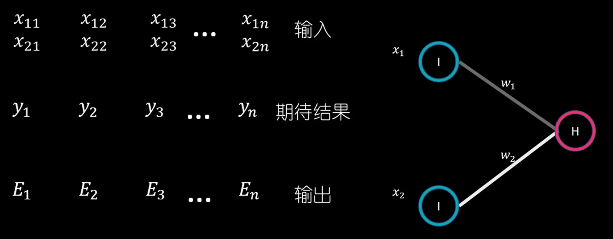

# 神经元模型
* 神经元模型

    

    * 输入：来自其它$n$个神经元传递过来的输入信号

    * 处理：输入信号通过带**权重**的连接进行传递，神经元接受到总输入值将其与神经元的阈值进行比较

    * 输出：通过**激活函数**的处理得到输出
        > Q：`Z2 = A1.dot(w2) + b2;  A2 = Z2`，为什么不是`A2 = sigmoid(Z2)`？其中`A2`为输出结果，表示红酒的品质，为**连续值**
        
        > A:在回归问题中，目标是预测一个**连续的值**，而不是将输入样本分为不同的类别，因此**不需要**使用激活函数来进行类别的划分，**而是直接将线性变换的结果作为输出**

    * Sigmoid激活函数

        

    * ReLU激活函数

        

* 神经网络模型
    * 将若干**神经元**按一定**层次结构**连接起来，得到神经网络模型

        

# 感知机与多层网络
* 感知机是**二类分类**的线性分类模型，输入为实例的特征向量，输出为实例的类别，感知机学习旨在求出将训练数据进行线性划分的分离超平面

* 感知机求解**与、或、非问题**，但是不能求解异或问题

# 误差逆传播算法
* 多层前馈神经网络

    

<https://www.bilibili.com/video/BV12b4y1X7Wv/?spm_id_from=333.788&vd_source=c65196c22fdd3605640aeccf1b3b4a0e>

> 此处$x$为隐含层的输出值

