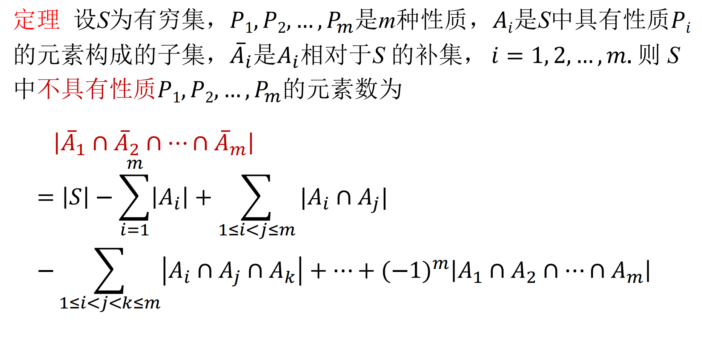
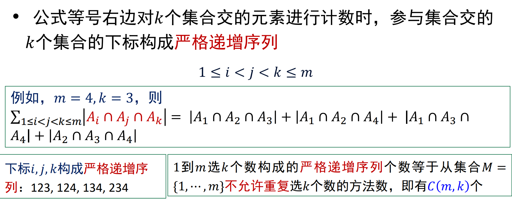

# 容斥定理

# 例子
* 不定方程$x_1+x_2+x_3=6$有多少满足$x1<=3,x_2<=2,x_3<=4$的非负整数解
    * 记性质$P_1$为$x_1>=4$，$P_2$为$x_2>=3$，$P_3$为$x_3>=5$
        * 则是求有多少同时不满足$P_1$和$P_2$和$P_3$的解个数

        * 即答案等于非负整数解个数减去满足$P_1$或$P_2$或$P_3$的解个数

    1. 满足$P_1$或$P_2$或$P_3$的解个数：使用容斥定理
        1. 满足$P_1$的解个数：$\Sigma_{i=4}^{6}(^{(6-i)+(2-1)}_{2-1})=3+2+1=6$

        2. 满足$P_2$的解个数：$\Sigma_{i=3}^{6}(^{(6-i)+(2-1)}_{2-1})=4+3+2+1=10$

        3. 满足$P_3$的解个数：$\Sigma_{i=5}^{6}(^{(6-i)+(2-1)}_{2-1})=2+1=3$

        4. 同时满足$P_1$和$P_2$的解个数：$0$

        5. 同时满足$P_1$和$P_3$的解个数：$0$

        6. 同时满足$P_2$和$P_3$的解个数：$0$

        7. 同时满足$P_1$和$P_2$和$P_3$的解个数：$0$

        8. 满足$P_1$或$P_2$或$P_3$的解个数：$6+10+3=19$

    2. 非负整数解个数：$(^{6+(3-1)}_{3-1})=(^8_2)=28$

    3. 答案：$28-19=9$
