# 算法
* STL中的算法大致可以分为以下七类：
    1. 不变序列算法
    2. 变值算法
    3. 删除算法
    4. 变序算法
    5. 排序算法
    6. 有序区间算法
    7. 数值算法
* 大多重载的算法都是有两个版本的，其中一个是用“==”判断元素是否相等，或者用“<”来比较大小的；而另一个版本多出来一个类型参数Pred，以及函数形参Pred op，该版本通过表达式“op(x,y)”的返回值是true还是false，来判断x是否“等于”y，或者x是否“小于”y
# 不变序列算法
* 此类算法不会修改算法所作用的容器或对象，适用于所有容器
     
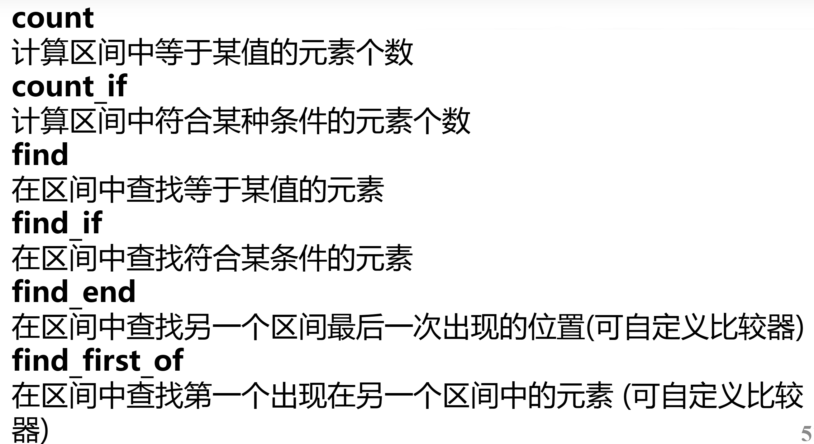    
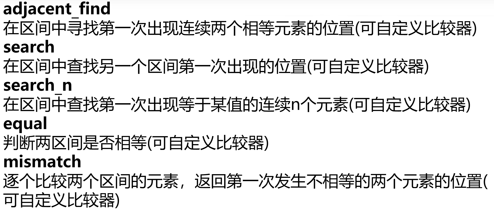    
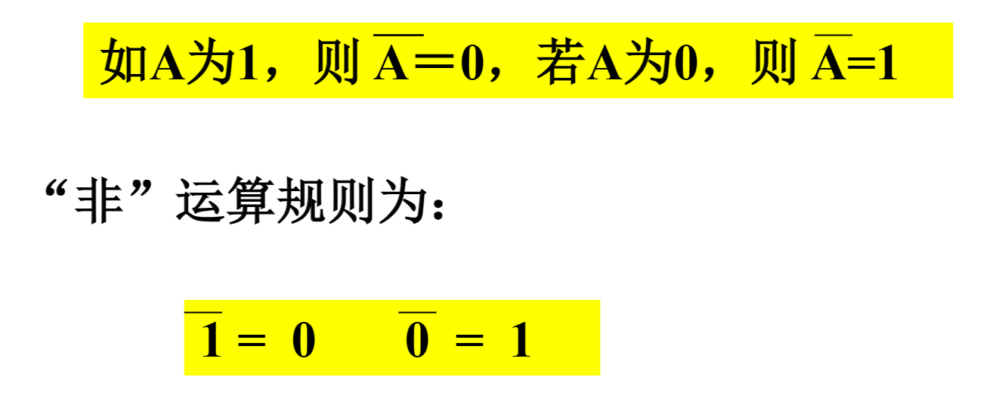    
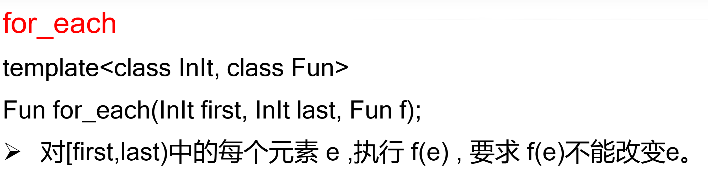    
# 变值算法
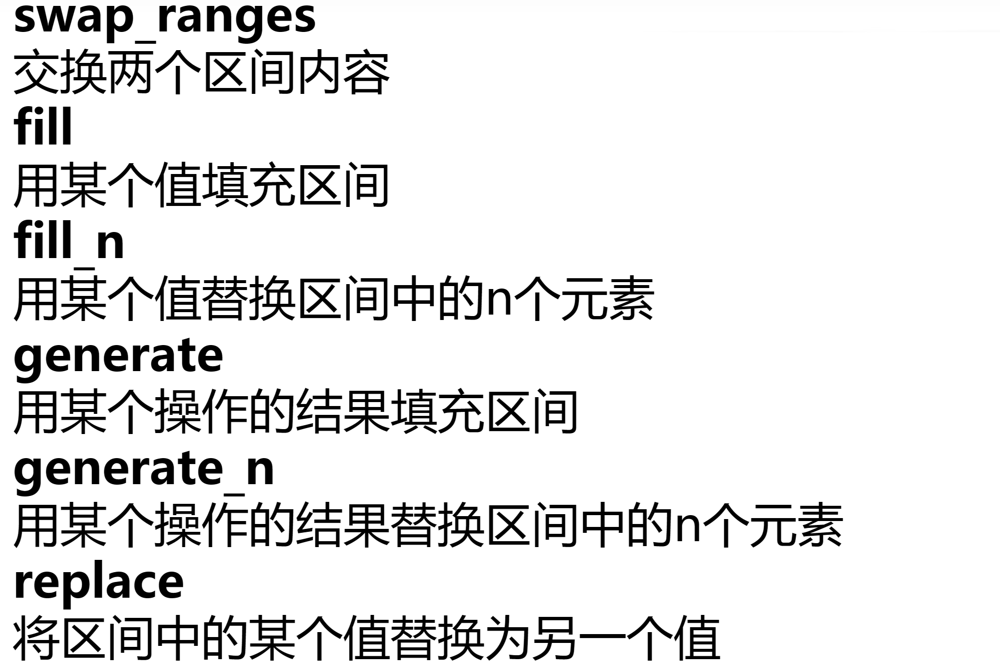    
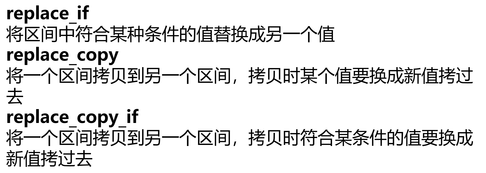    
# 删除算法
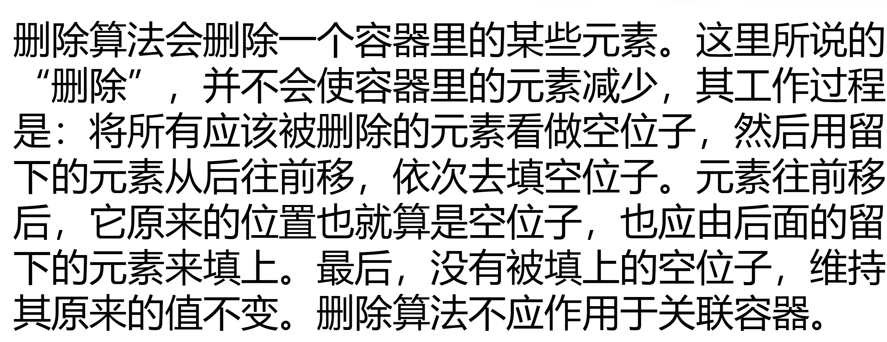    
    
# 变序算法
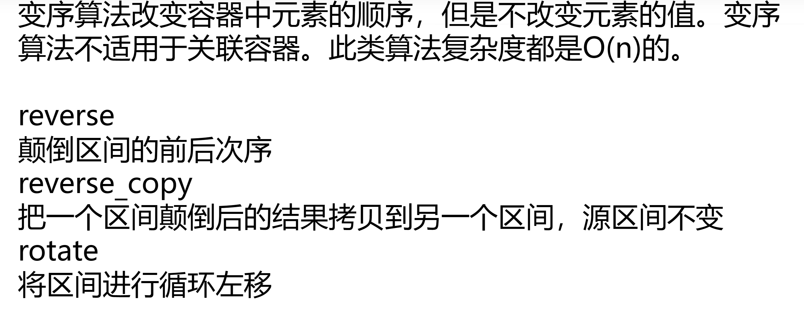    
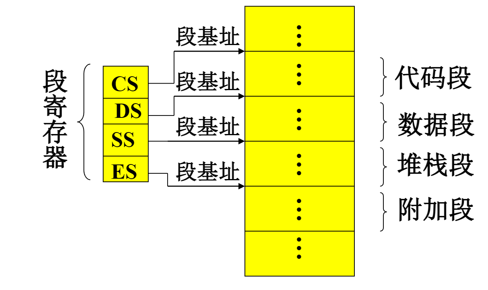    
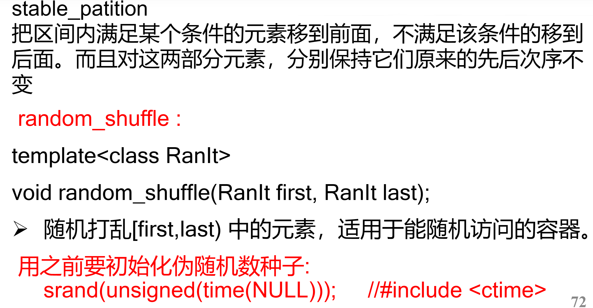    
# 排序算法
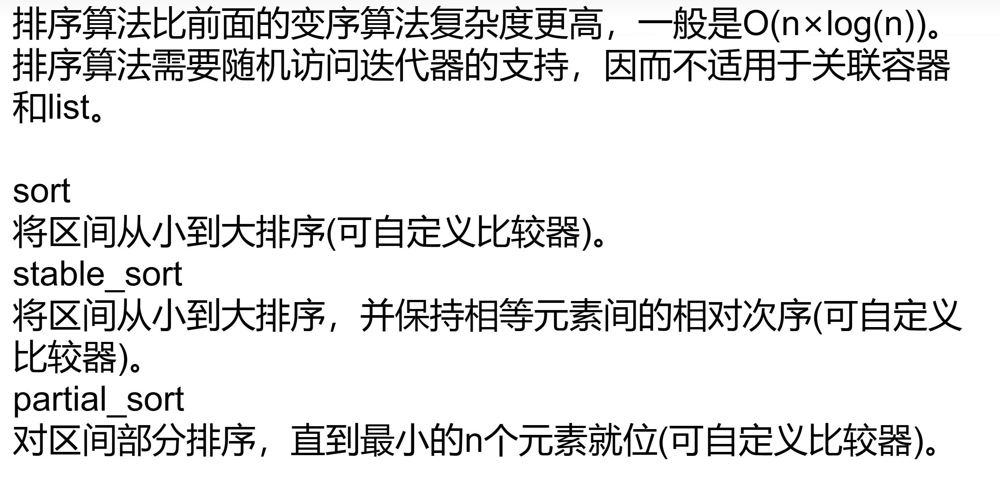    
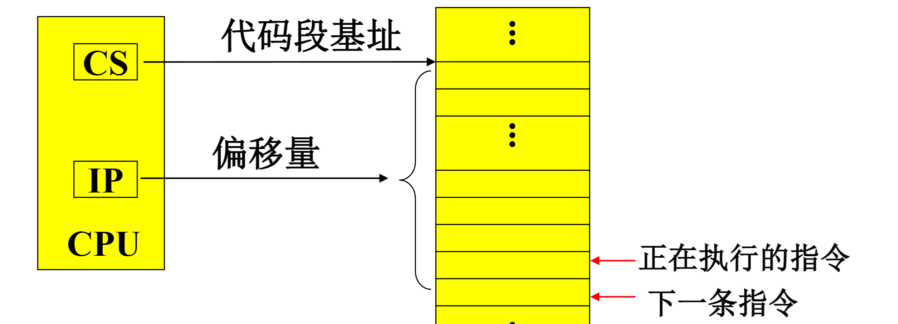    
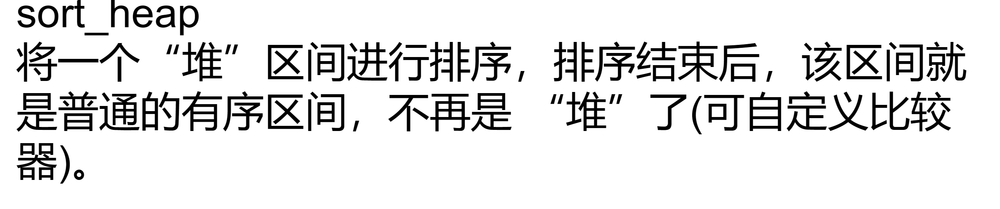    
# 有序区间算法
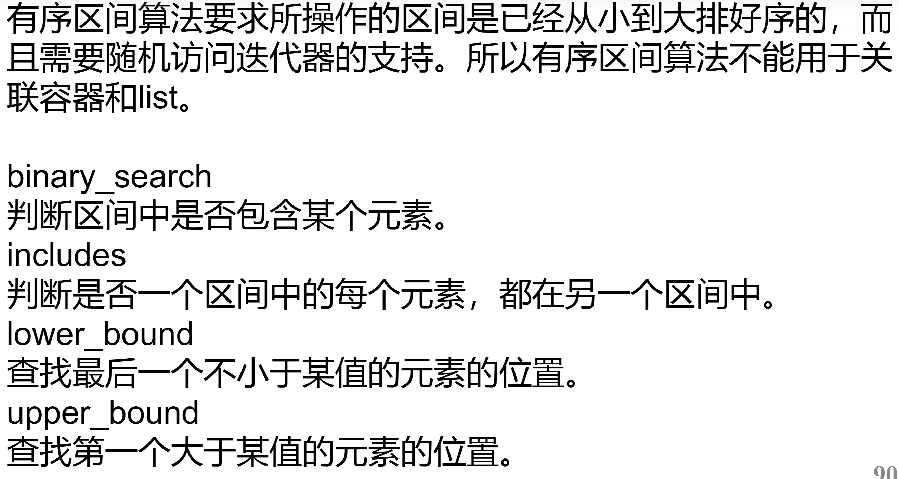    
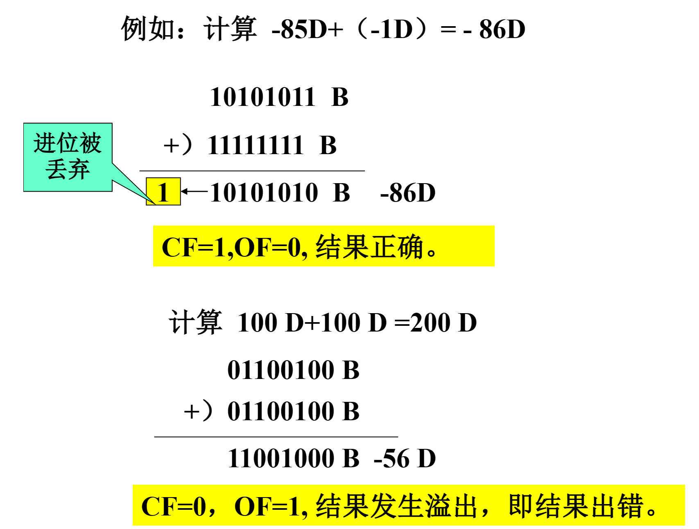    
