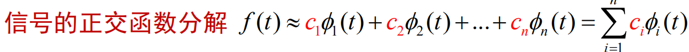

    
# 信号的时域运算（基本元件）
* 加法器

    

* 乘法器

    

* 标量乘法器（数乘器，比例器）

    

* 微分器

    

* 积分器

    

* 延时器

    

# 系统的概念
* 系统：相互联系的事物组成特定功能的整体

* 由电路图写成**微分方程**

    

    * 电阻：$i_R(t)=\frac{v(t)}{R}$

    * 电感：$i_L(t)=\frac {\int_{-\infty}^t v(\tau)d\tau}{L}$

    * 电容：$i_C(t)=C\frac{dv(t)}{dt}$

    * 根据KCL：
        $$
        i_s(t)=i_R(t)+i_L(t)+i_C(t)\\
        ~\\
        i_s(t)=\frac{v(t)}{R}+\frac{\int_{-\infty}^{t}v(\tau)d\tau}{L}+C\frac{dv(t)}{dt}\\
        ~\\
        \frac{di_s(t)}{dt}=\frac 1R\cdot\frac{v(t)}{dt}+\frac{v(t)}{L}+C\frac{d^2v(t)}{dt^2}
        $$

* 由系统框图写成**微分方程**

    

    

* 由系统框图写成**差分方程**

    

    

* n阶线性时不变系统的描述
    > 一个线性系统，其激励信号$e(t)$与响应信号$r(t)$之间的关系，可以用下列形式的微分方程式描述

    $$
    C_0\frac{d^nr(t)}{dt^n}+C_1\frac{d^{n-1}r(t)}{dt^{n-1}}+...+C_{n-1}\frac{dr(t)}{dt}+C_nr(t)\\
    ~\\
    =E_0\frac{d^me(t)}{dt^m}+E_1\frac{d^{m-1}e(t)}{dt^{m-1}}+...+E_{m-1}\frac{de(t)}{dt}+E_me(t)
    $$

    > 若系统为时不变的，则C、E为常数，此方程为常系数的n阶线性**常微分**方程

## 求解系统微分方程的经典法

* 齐次解：由特征方程得出特征根，写出齐次解形式
    > 求微分方程$\frac{d^3}{dt^3}r(t)+7\frac{d^2}r(t)+16\frac{d}{dt}r(t)+12r(t)=e(t)$
    
    > 系统的特征方程为：$\alpha^3+7\alpha^2+16\alpha+12=0$
    
    > 特征根：$\alpha_1=-2$（重根），$\alpha_2=-3$

    > 对应的齐次解：$r_h(t)=(A_1t+A_2)e^{-2t}+A_3e^{-3t}$

* 特解：根据微分方程右端函数式的形式，设含待定系数的特解函数式（由下图可得），代入原方程，比较系数得出特解

    

# 系统的分类
* 系统：具有特定功能的总体，可以看作信号的变换器、处理器
* 连续与离散时间系统：
    * 连续时间系统：输入和输出都是连续时间信号的系统

    * 离散时间系统：输出和输出都是离散时间信号的系统

    * 混合系统：输入和输出一个是连续时间信号，另一个为离散时间信号

    * 描述连续时间系统的数学模型是**微分方程**，描述离散时间系统的数学模型是**差分方程**

    * 连续时间系统可表示为$y(t)=T[x(t)]$，离散时间系统可表示为$y(n)=T[x(n)]$

* 无记忆和记忆系统
    * 无记忆系统：若一个系统的输出**只与同时刻的输入有关**，而与它过去的工作状态无关，则系统是无记忆的

    * 记忆系统：若一个系统的输出不仅与同时刻的输入有关，而且**与它过去的工作状态有关**，则系统是由记忆的

    

* 因果与非因果系统
    * 系统的输出**只与同时刻或之前时刻的输入有关**，与该时刻之后的输入无关，则该系统是**因果的**，否则是**非因果**系统

    

* 稳定与不稳定系统
    * 稳定性：如果一个系统当**输入有界**时，产生的**输出也是有界**的

    

* 可逆与不可逆系统
    * 若系统在**不同激励**信号作用下产生**不同的响应**，则称此系统为**可逆系统**。对于每个可逆系统都存在一个“逆系统”，当原系统与此逆系统**级联组合**后，输出信号与输入信号**相同**

    

* 时不变与时变系统
    * **在零初始状态条件下**。若时不变系统的激励延时，则响应作同样的延时且波形不变

    

* 线性与非线性系统
    * 线性系统：（**在零初始状态条件下**）满足**齐次性**和**叠加性**的系统

    

    * 增量线性系统：这类系统的**输出响应**增量与**输入信号**增量之间满足线性特性

    

    * 增量线性系统的等效：$y(t)=T[\textcolor{red}{s(0)},x(t)]=\textcolor{red}{y_0(t)}+y_1(t)$

        
        