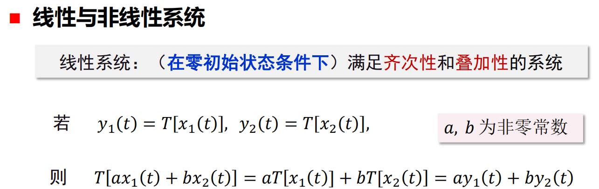
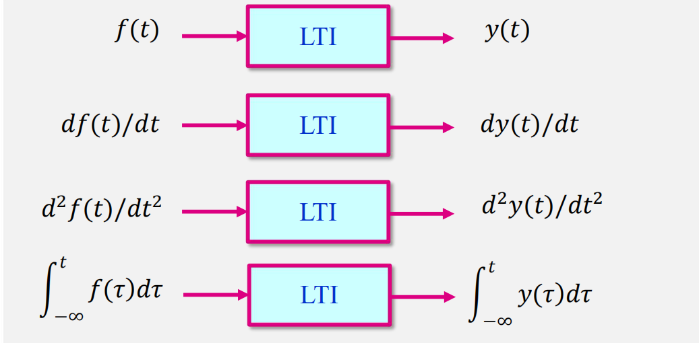
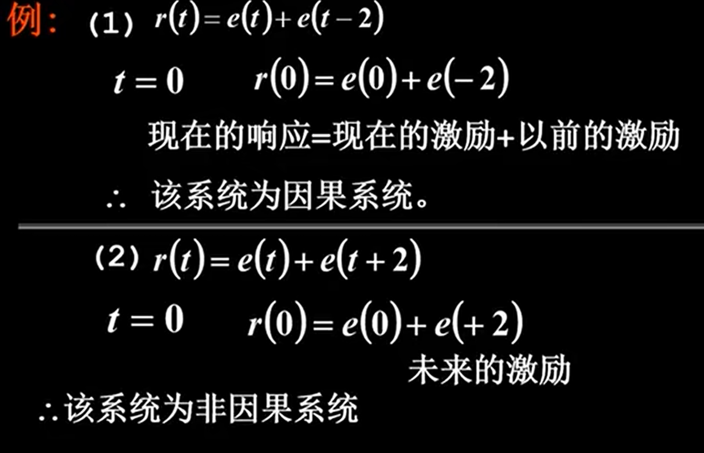
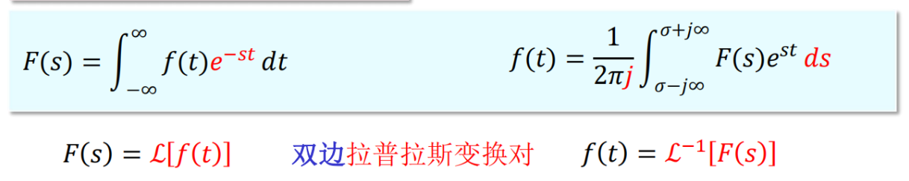

    
# 信号的时域运算（基本元件）
* 加法器

    

* 乘法器

    

* 标量乘法器（数乘器，比例器）

    

* 微分器

    

* 积分器

    

* 延时器

    

# 系统的概念
* 系统：相互联系的事物组成特定功能的整体

* 由系统框图写成微分方程

    

    

* 由系统框图写成差分方程

    

    

# 系统的分类
* 系统：具有特定功能的总体，可以看作信号的变换器、处理器
* 连续与离散时间系统：
    * 连续时间系统：输入和输出都是连续时间信号的系统

    * 离散时间系统：输出和输出都是离散时间信号的系统

    * 混合系统：输入和输出一个是连续时间信号，另一个为离散时间信号

    

* 无记忆和记忆系统
    * 无记忆系统：若一个系统的输出**只与同时刻的输入有关**，而与它过去的工作状态无关，则系统是无记忆的

    * 记忆系统：若一个系统的输出不仅与同时刻的输入有关，而且**与它过去的工作状态有关**，则系统是由记忆的

    

* 因果与非因果系统
    * 系统的输出**只与同时刻或之前时刻的输入有关**，与该时刻之后的输入无关，则该系统是**因果的**，否则是**非因果**系统

    

* 稳定与不稳定系统
    * 稳定性：如果一个系统当**输入有界**时，产生的**输出也是有界**的

    

* 可逆与不可逆系统
    * 若系统在**不同激励**信号作用下产生**不同的响应**，则称此系统为**可逆系统**。对于每个可逆系统都存在一个“逆系统”，当原系统与此逆系统**级联组合**后，输出信号与输入信号**相同**

    

* 时不变与时变系统
    * **在零初始状态条件下**。若时不变系统的激励延时，则响应作同样的延时且波形不变

    

* 线性与非线性系统
    * 线性系统：（**在零初始状态条件下**）满足**齐次性**和**叠加性**的系统

    

    * 增量线性系统：这类系统的**输出响应**增量与**输入信号**增量之间满足线性特性

    

    * 增量线性系统的等效：$y(t)=T[\textcolor{red}{s(0)},x(t)]=\textcolor{red}{y_0(t)}+y_1(t)$

        
        