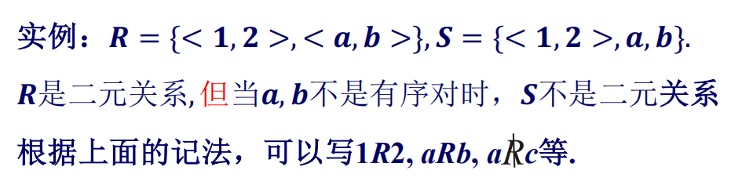

* 问题：从围成标有记号1到n的圆圈的n个人开始，每隔一个删去一个人，直到只有一个人幸存下来，确定幸存者的号码J(n)
    * J(n)总是奇数，因为绕圆走第一圈就消除了所有的偶数号码

1. 偶数情况
    * 假设一开始有2n个人，经过第一轮剩下的是：    
    * 3号就是下一个要离开的人，此时的情况就像是n个人但数字乘以2减1的情况，则有`J(2n)=2J(n)-1,n>=1`


2. 奇数情况
    * 假设一开始有2n+1个人，经过第一轮后，1号是下一个离开的人    
    * 1号离开后，此时的情况就像是n个人但数字乘以2加1的情况，则有`J(2n+1)=2J(n)+1,n>=1`

3. 两种情况结合起来得出递归式
    ```
    J(1)=1J(2n)=2J(n)-1,n>=1J(2n+1)=2J(n)+1,n>=1
    ```
    * 对小值做出一张表，得出规律`J(2^m+l)=2l+1,m>=0,0<=l<2^m`，其中2^m是不超过n的2的最大幂，l是n-2^m
        