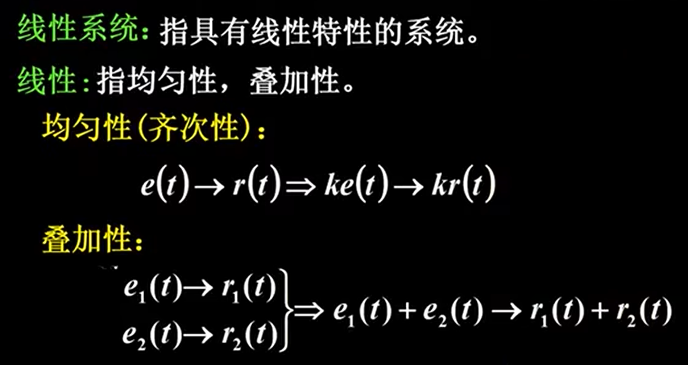
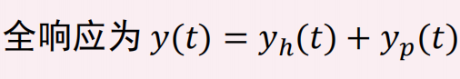
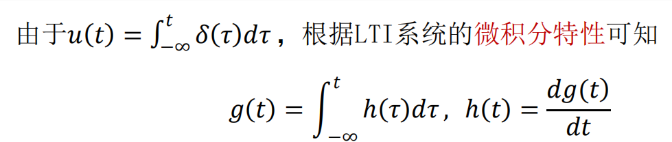

# 线性系统与非线性系统
1. 定义

    

    

2. 判断方法

    

# 时变系统与时不变系统
1. 定义

    

    

2. 判断方法

    

# 线性时不变系统的微、积分特性

# 因果系统与非因果系统
1. 定义

    

2. 判断方法：输出不超前于输入

    

3. 因果信号：$t = 0$接入系统的信号称为因果信号

    

