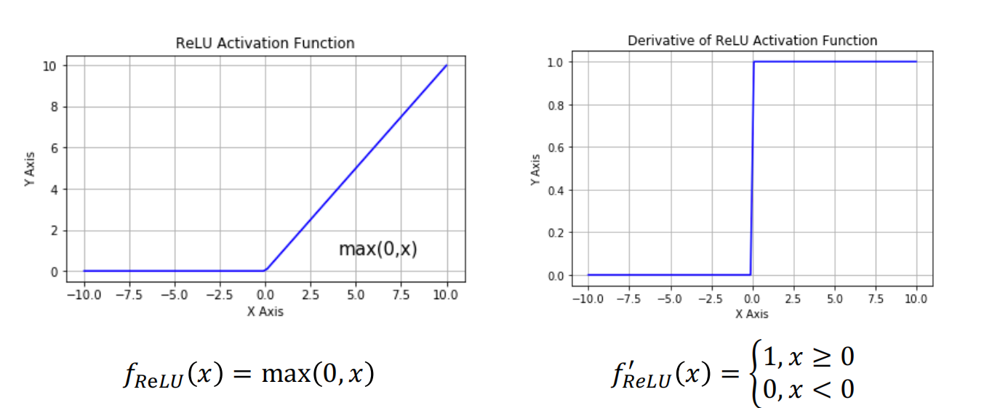
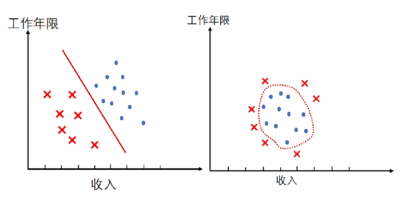

# 基本形式
* 线性模型一般形式：$f(x)=\omega_1 x_1+\omega_2 x_2+...+\omega_d x_d+b$
    * $x=(x_1;x_2;...;x_d)是由d个属性描述的示例，其中$x_i$是x在第i个属性上的取值

* 向量形式：$f(x)=\omega^T x+b$，其中$\omega =(\omega_1;\omega_2;...;\omega_d)$

* 一个简单的例子：$f_{好瓜}(x)=0.2\cdot x_{色泽}+0.5\cdot x_{根蒂}+0.3\cdot x_{敲声}+1$

* 线性回归的目的是学得一个线性模型以尽可能准确地预测真实结果：$f(x_i)=\omega^T x_i+b$，使得$f(x_i)\simeq y_i$

# 回归问题
* 线性回归：找到一条直线（或一个超平面）使得误差最小

    

* 均方误差：$E_{(\omega ,b)}=\frac 1m \Sigma_{i=1}^m (f(x_i)-y_i)^2$
    * 解决线性回归问题就是求得均方误差的最小值对应的$(\omega^*,b^*)$

* 平方损失：$L(f(x_i),y_i)=\frac 12(f(x_i)-y_i)^2$

    

## 线性回归问题求解
1. 方法1：统计学方法（单变量）
    * 数据：$D=\{(x_i,y_i)\}^m_{i=1},其中x_i,y_i\in R$

    * 模型：$f(x_i)=\omega x_i+b,使得f(x_i)\simeq y_i$

    * 策略：平方损失$\mathcal{L}(y_i,f(x_i))=(y_i-f(x_i))^2$，ERM（Empirical Risk Minimization）
        $$
        (\omega^*,b^*)=\mathop{argmin}\limits_{(\omega,b)}\sum_{i=1}^m(y_i-f(x_i))^2
        \\=\mathop{argmin}\limits_{(\omega,b)}\sum_{i=1}^m(y_i-\omega x_i-b)^2
        $$

        * 最小二乘法：基于均方误差最小来对模型进行求解的方法：$目标函数=\sum（观测值-理论值）^2$
    
    * 算法：求解$\omega$和$b$使$E_{(\omega,b)}=\sum_{i=1}^m(y_i-\omega x_i-b)^2$最小化的过程，线性回归模型的最小二乘“参数估计$E_{(\omega,b)}$是关于$\omega$和$b$的凸函数，当关于两参数的导数均为零时得到参数的最优解
        $$
        \frac{\partial E_{(\omega,b)}}{\partial \omega}=2(\omega \sum_{i=1}^m x_i^2-\sum_{i=1}^m(y_i-b)x_i)
        \\\frac{\partial E_{(\omega,b)}}{\partial \omega}=2(\omega \sum_{i=1}^m x_i^2-\sum_{i=1}^m(y_i-b)x_i)
        $$

        

2. 方法2：统计学方法（多变量）

    

    

    * 必须记忆的公式：
        $$
        \frac{\partial \beta^T x}{\partial x}=\beta\\
        ~\\
        \frac{\partial x^T x}{\partial x}=2x\\
        ~\\
        \frac{\partial x^T Ax}{\partial x}=(A+A^T)x
        $$

    

    [点击查看公式推导过程](https://zhuanlan.zhihu.com/p/74157986)

    * 解决过拟合问题
        1. 正则化：
            > 模型越简单越好

            > 保持所有参数 $\omega_0,\omega_1,...,\omega_d$，但减少相应参数的贡献

            > 当特征较多时表现较好，每一参数贡献一点到预测y

            
            
            

3. 方法3：梯度下降法
    * 梯度下降法的思路：界定目标函数可微，梯度下降算法从空间任一给定初始点开始进行指定轮次的搜索。在每一轮搜索中都计算目标函数在当前点的梯度，并沿着**与梯度相反的方向**按照一定步长移动到下一可行点

    

    * 梯度下降算法过程：
        * 输入：目标函数$E(\omega)$，梯度函数$\nabla E(\omega)$

        * 输出：$E(\omega)$的极小点$\omega^*$

        

    1. 批量梯度下降法：
        * 所有的样本都有贡献

        * 可以达到一个全局最优

        * 样本多的情况下收敛速度慢

        

    2. 随机梯度下降法：
        * 每次更新时用1个样本

        * 计算得到的并不是准确的一个梯度

        * 整体的方向是全局最优解的方向，最终结果往往在全局最优解附近

        * 方法更快，更快收敛

        

    3. mini-batch梯度下降法：
        * 批量梯度下降法与随机梯度下降法的结合

        * 将所有数据分割成k个mini-batches

        * for each mini-batch k，做一次批量梯度下降法

            

        * 为每个mini-batch更新参数

            

# 分类问题

## 什么是分类问题
* 分类问题：

    

    * 已知：
        * 训练集$X$，$x\in X$

        * 分类$C=\{c_1,c_2,...,c_n\}$

    * 决定：
        * $X$到$C$的一个映射关系

        * 二分类：$C=\{0,1\}$或$C=\{-1,+1\}$

        * 概率：$P_\omega(y|x)$或$P(y|x;\omega)$

            

* 如何转化为$\{0,1\}$
    * 线性回归输出：
        * $f(x)=\omega^Tx+b=z~~~~~~g(z)\in \{0,1\}$

    * 最理想的函数-单位阶跃函数，但是在$z=0$处不连续
        $$
        g(z)=\begin{cases}
        0,&z<0\\
        0.5,&z=0\\
        1,&z>0\\
        \end{cases}
        $$

* 替代函数-对数几率函数

    

    * 优点：单调可微，任意阶可导

    $$
    g(z)=\frac{1}{1+e^{-z}}\\
    ~\\
    g'(z)=g(z)(1-g(z))\\
    $$
    
    * 假设函数：$h_\omega(x)=f(x)=g(\omega^Tx+b)$

* 判别规则：
    * 预测：$y=1~~~~~h_\omega(x)>=0.5~~~~~\omega^Tx+b>=0$

    * 预测：$y=0~~~~~h_\omega(x)<0.5~~~~~\omega^Tx+b<0$

    * 判别边界：$\omega^Tx+b=0$

## 对数几率回归模型建立
* $P(y_i|x_i;\omega)=y_iP(y=1|x;\omega)+(1-y_i)P(y=0|x;\omega)$

* 似然：$L(y|x;\omega)=\prod^m_{i=1}P(y_i|x_i;\omega)$

* 找到一个合适的$h_\omega(x)$使得$max~L(y|x;\omega)$

* 对数似然：$\mathcal{L}(y|x;\omega)=\sum_{i=1}^m ln(y_i|x_i;\omega)$

* 最大化对数似然：$max~\mathcal{L}(y|x;\omega)\to 习惯解决最小化问题\to min~\mathcal{L}(y|x;\omega)=-\sum_{i=1}^m lnP(y_i|x_i;\omega)$

## 多分类学习

* 数据：$D=\{(x_1,y_1),(x_2,y_2),...,(x_m,y_m)\},y_i\in\{C_i,...,C_N\}$

* 多分类学习方法：
    * 二分类学习方法推广到多类（如多项对数几率回归）

    * 利用二分类学习器解决多分类问题
        * 对问题进行拆分，为拆出的每个二分类任务训练一个分类器

        * 对于每个分类器的预测结果进行集成以获得最终的多分类结果

* 拆分策略
    * 一对一

    * 一对其余

    * 多对多

### 多分类学习：一对一
* 数据：$D=\{(x_1,y_1),(x_2,y_2),...,(x_m,y_m)\},y_i\in \{C_i,...,C_N\}$

* 拆分阶段
    * N个类别，两两配对（如$C_i$和$C_j$，将$C_i$作为正例$C_j$作为反例）
        * $N(N-1)/2$个二分类器

* 测试阶段
    * 新样本提交给所有分类器预测
        * $N(N-1)/2$个分类结果

    * 投票产生最终分类结果
        * 被预测最多的类别为最终类别

### 多分类学习：一对其余
* 数据：$D=\{(x_1,y_1),(x_2,y_2),...,(x_m,y_m)\},y_i\in \{C_i,...,C_N\}$

* 拆分阶段
    * N个类别，某一类作为正例，所有其它类作为反例
        * N个二分类任务

    * 各个二类任务，学习分类器（**注意数据集的使用**）
        * N个二类分类器

* 测试阶段
    * 新样本提交给所有分类器预测
        * N个分类结果

    * 比较各分类器预测置信度
        * 置信度最大类别作为最终类别

### 多分类学习：两种策略比较
* 一对一
    * 训练$N(N-1)/2$个分类器，存储开销大

    * 训练只用两个类的样例，训练时间短

    * 测试时间长

* 一对其余
    * 训练N个分类器，存储开销小

    * 训练用到全部训练样例，测试时间长

    * 测试时间短

* 预测性能取决于具体数据分布，多数情况下两者差不多
