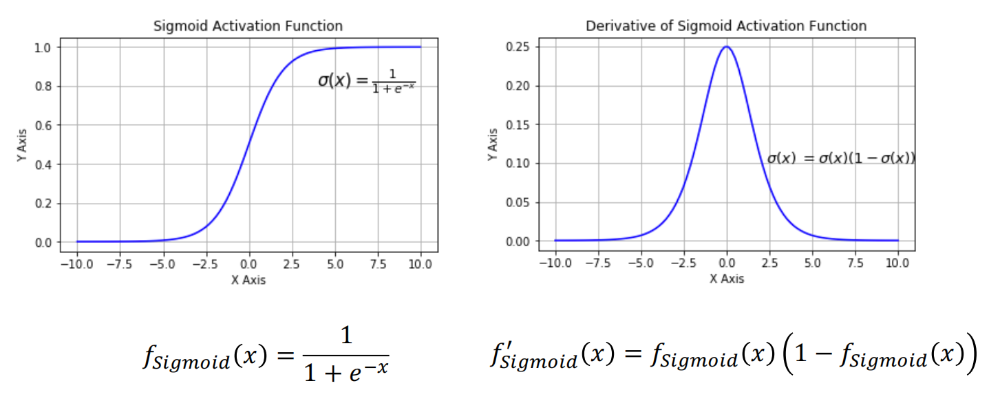

# 基本形式
* 线性模型一般形式：$f(x)=\omega_1 x_1+\omega_2 x_2+...+\omega_d x_d+b$
    * $x=(x_1;x_2;...;x_d)是由d个属性描述的示例，其中$x_i$是x在第i个属性上的取值

* 向量形式：$f(x)=\omega^T x+b$，其中$\omega =(\omega_1;\omega_2;...;\omega_d)$

* 一个简单的例子：$f_{好瓜}(x)=0.2\cdot x_{色泽}+0.5\cdot x_{根蒂}+0.3\cdot x_{敲声}+1$

* 线性回归的目的是学得一个线性模型以尽可能准确地预测真实结果：$f(x_i)=\omega^T x_i+b$，使得$f(x_i)\simeq y_i$

# 回归问题
* 线性回归：找到一条直线（或一个超平面）使得误差最小

    

* 均方误差：$E_{(\omega ,b)}=\frac 1m \Sigma_{i=1}^m (f(x_i)-y_i)^2$
    * 解决线性回归问题就是求得均方误差的最小值对应的$(\omega^*,b^*)$

* 平方损失：$L(f(x_i),y_i)=\frac 12(f(x_i)-y_i)^2$

    

## 线性回归问题求解
1. 方法1：统计学方法（单变量）
    * 数据：$D=\{(x_i,y_i)\}^m_{i=1},其中x_i,y_i\in R$

    * 模型：$f(x_i)=\omega x_i+b,使得f(x_i)\simeq y_i$

    * 策略：平方损失$\mathcal{L}(y_i,f(x_i))=(y_i-f(x_i))^2$，ERM（Empirical Risk Minimization）
        $$
        (\omega^*,b^*)=\mathop{argmin}\limits_{(\omega,b)}\sum_{i=1}^m(y_i-f(x_i))^2
        \\=\mathop{argmin}\limits_{(\omega,b)}\sum_{i=1}^m(y_i-\omega x_i-b)^2
        $$

        * 最小二乘法：基于均方误差最小来对模型进行求解的方法：$目标函数=\sum（观测值-理论值）^2$
    
    * 算法：求解$\omega$和$b$使$E_{(\omega,b)}=\sum_{i=1}^m(y_i-\omega x_i-b)^2$最小化的过程，线性回归模型的最小二乘“参数估计$E_{(\omega,b)}$是关于$\omega$和$b$的凸函数，当关于两参数的导数均为零时得到参数的最优解
        $$
        \frac{\partial E_{(\omega,b)}}{\partial \omega}=2(\omega \sum_{i=1}^m x_i^2-\sum_{i=1}^m(y_i-b)x_i)
        \\\frac{\partial E_{(\omega,b)}}{\partial \omega}=2(\omega \sum_{i=1}^m x_i^2-\sum_{i=1}^m(y_i-b)x_i)
        $$

        

2. 方法2：统计学方法（多变量）

    

    

    

    
3. 方法3：计算机优化算法

# 分类问题