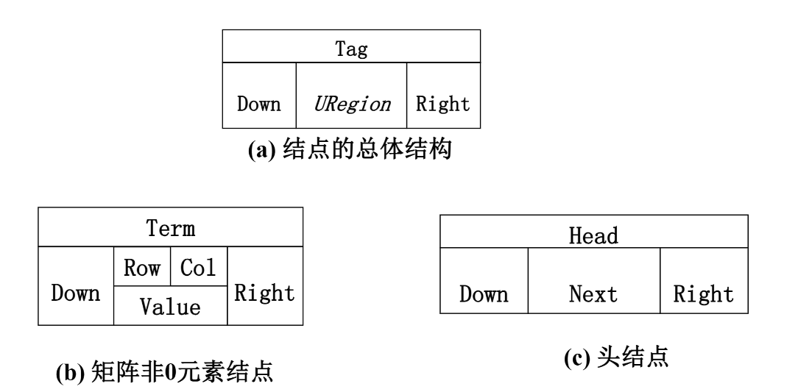

# 1. 什么是线性表   
* 由同类型数据元素构成有序序列的线性结构
* 表中元素个数称为线性表的长度
* 线性表没有元素时,称为空表
* 表起始位置称表头,表结束位置称为表尾
# 2. 线性表的实现
## 利用数组存放元素
    ```cpp
    typedef struct LNode *List;
    struct LNode
    {
        ElementType Data[MAXSIZE];
        int Last;//表尾位置
    };
    struct LNode L;//线性表
    List PtrL;//线性表的指针
    ```
    * 访问元素:`L.Data[i] `或`PtrL->Data[i]`    
    * 线性表长度:`L.Last+1`或`PtrL->Last+1`
* 初始化(建立空表)
    ```cpp
    List MakeEmpty()
    {
        List PtrL;
        PtrL=(List)malloc(sizeof(struct LNode));
        PtrL->Last=-1;
        return PtrL;
    }
    ```
* 查找
    ```cpp
    int Find(ElementType X,List PtrL)
    {
        int i=0;
        while(i<=PtrL->Last&&PtrL->Data[i]!=X)
            ++i;
        if(i>PtrL->Last) 
            return -1;    //没找到
        else 
            return i;    //找到
    }
    ```
* 插入
    ```cpp
    void Insert(ElementType X,int i,List PtrL)
    {
        if(PtrL->Last==MAXSIZE-1)
        {
            printf("表满");
            return;
        }
        else if(i<1||i-1>PtrL->Last+1)
        {
            printf("位置不合法");
            return;
        }
        for(int j=PtrL->Last;j>=i-1;j--)
        {
            PtrL->Data[j+1]=PtrL->Data[j];
        }
        PtrL->Data[i-1]=X;
        PtrL->Last++;
        return;
    }
    ```
* 删除
    ```cpp
    void Delete(int i,List PtrL)
    {
        if(i-1<0||i-1>PtrL->Last)
        {
            printf("不存在第%d个元素\n",i);
            return;
        }
        for(int j=i;j<=PtrL->Last;j++)
        {
            PtrL->Data[j-1]=PtrL->Data[j];
        }
        PtrL->Last--;
        return;
    }
    ```

## 利用"链"存放元素
```cpp
typedef struct LNode *List
{
    ElementType Data;
    List Next;//指向下一个结点
};
struct LNode L;//线性表
List PtrL;//线性表的指针
```
* 求表长
    ```cpp
    int Length(List PtrL)
    {
        List p=PtrL;    //p指向第一个结点
        int len=0;
        while(p)
        {
            p=p->Next;
            len++;
        }
        return len;
    }
    ```
* 查找
    ```cpp
    List FindKth(int K,List ptrL)//按序号查找(第K个)
    {
        List p=PtrL;
        int i=1;
        while(p!=NULL&&i<K)
        {
            p=p->Next;
            i++;
        }
        if(i==K)
        {
            return p;
        }
        return NULL;
    }
    ```
    ```cpp
    List Find(ElementType X,List PtrL)//按值查找
    {
        List p=PtrL;
        while(p!=NULL&&p->Data!=X)
        {
            p=p->Next;
        }
        return p;
    }
    ```
* 插入
    ```cpp
    List Insert(ElementType X,int i,List PtrL)
    {
        List p,s;
        if(i==1)
        {
            s=(List)malloc(sizeof(struct LNode));
            s->Data=X;
            s->Next=PtrL;
            return s;
        }
        p=FindKth(i-1,PtrL);
        if(p==NULL)
        {
            printf("参数i错");
            return NULL;
        }
        s=(List)malloc(sizeof(struct LNode));
        s->Data=X;
        s->Next=p->Next;
        p->Next=s;
        return PtrL;
    }
    ```
* 删除
    ```cpp
    List Delete(int i,List PtrL)
    {
        List p,s;
        if(i==1)
        {
            s=PtrL;
            if(PtrL!=NULL)
            {
                PtrL=PtrL->Next;
            }
            else
            {
                return NULL;
            }
            free(s);
            return PtrL;
        }
        p=FindKth(i-1,PtrL);
        if(p==NULL)
        {
            printf("第%d个结点不存在\n",i-1);
            return NULL;
        }
        else if(p->Next==NULL)
        {
            printf("第%d个结点不存在\n",i);
            return NULL;
        }
        s=p->Next;
        p->Next=s->Next;
        free(s);
        return PtrL;
    }
    ```
# 3. 广义表与多重链表
* 广义表:是线性表的推广,元素不仅能是单元素,还能是另一个广义表
    ```cpp
    typedef struct GNode *GList;
    struct GNode
    {
        int Tag;    //标志域:0表示结点是单元素,1表示结点是广义表
        union
        {
            ElementType Data;
            GList SubList;    //Data与SubList共用存储空间
        }URegion;
        GList Next; 
    };
    ```
* 多重链表:链表中的结点可能同时隶属于多个链
    * 头结点既是行的头结点,又是列的头结点
        
        
    ```cpp
    struct MultiList
    {
        int Tag;    //1为Head,0为Term
        struct MultiList *Down;    //指向下面
        struct MultiList *Right;    //指向右边
        union
        {
            ElementType Data[3];
            struct MultiList Next;    //下一个头结点
        }
    }
    ```
    * 入口Term记录了总共有几行几列和几个元素
