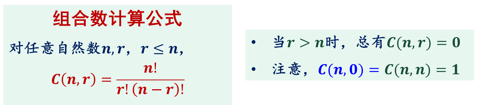

# 基本计数规则

* 加法法则：事件$A$有$m$种产生方式，事件$B$有$n$种产生方式，则“事件$A$或$B$”有**m+n**种产生方式
    * 使用条件：事件$A$与$B$产生方式不重叠

* 乘法法则：事件$A$有$m$种产生方式，事件$B$有$n$种产生方式，则“事件$A$与$B$”有**mn**种产生方式
    * 使用条件：事件$A$与$B$产生方式彼此**独立**

# 容斥原理基础
* 集合差计数公式：设$A$、$B$是有穷集合，则$|A-B|=|A|-|A⋂B|$

* 两集合容斥原理：设$A$、$B$是有穷集合，则$|A⋃B|=|A|+|B|-|A⋂B|$

* 三集合容斥原理：设$A$、$B$、$C$都是有穷集合，则$|A⋃B⋃C|=|A|+|B|+|C|-|A⋂B|-|A⋂C|-|B⋂C|+|A⋂B⋂C|$

* 容斥原理用于当**集合交**的元素个数比**集合并**的元素更容易计算的情况

    

# 鸽笼原理
* 设$k$是正整数，**k+1只或更多的**鸽子关到$k$个鸽笼里，则至少有一个鸽笼有两只或更多只鸽子

## 鸽笼原理实例1
* 从1到2n任取n+1个数，则至少有两个数，其中一个是另一个数的倍数
    1. 从2n个整数取出n+1个数看成鸽子

    2. 任何整数都可以表示成$q*2^b$的形式，这里奇数$q$导出了鸽笼

    3. 1到2n间只有n个奇数，则取出n+1个数中必然存在`q1*2^b1`和`q1*2^b2`这样两个其中一个数是另一个数的倍数

## 鸽笼原理实例2
* 正整数序列$a_1,a_2,...,a_m$中必存在若干个连续正整数的和是$m$的倍数
    * 即存在正整数$k$和$l$，满足$1≤k<l≤m$使得$a_k+a_{k+1}+...+a_l$是m的倍数

    * 考虑$s_1=a_1，s_2=a_1+a_2，...，sm=a1+a2+...+a_m$**这m个数整除m的余数**
        1. 若存在$s_i$整除m的数为0，则$a_1+a_2+...+a_i$是m的倍数

        2. 若所有s的余数都大于0，则存在$s_i$、$s_j$整除m的余数相等（s共有m个，而被m整除的余数有m-1个，s最多有m-1个不相同的余数，那剩下一个就必然有相同余数，即**鸽笼定理**），则$s_j-s_i=a+{i+1}+...+a_j（假设j>i）$是m的倍数（**两个s相减**把余数抵消了）

## 广义鸽笼原理
* 广义鸽笼原理：将$N$个物体放到$k$个盒子，则至少有一个盒子有$⌈\frac{N}{k}⌉$个物体（取顶符号，不小于它的**最小**整数）

* 将至少有**一个**盒子**至少有**的物体称为“最小容量”
    * 最小容量=$⌈\frac{物体总数}{盒子数}⌉$

    * 物体总数的最小值 =（最小容量-1）* 盒子数+1
        * 让一个盒子是最小容量，其它盒子为（最小容量 - 1）
    
    * 盒子数的最大值=$⌊\frac{物体总数-1}{最小容量-1}⌋$
        * 使所有盒子都放最小容量-1，留一个盒子放最小容量

# 集合排列组合
* 选取问题：设n元集合S，从S中选取r个元素

## 排列：设S为n元集
* 从$S$中有序选取的$r$个元素称为$S$的一个$r$排列，$S$的不同$r$排列总数记作$P^r_n$或$P(n,r)$，$r=n$的排列是$S$的全排列

* 定理：设$n$，$r$为自然数，规定$0!=1$，则有

$$
对自然数n和r，r<=n\\
P(n,r)=\begin{cases}
\frac{n!}{(n-r)!},&r<=n,\\
0,&r>n.
\end{cases}
$$

## 组合：设S为n元集
* 从$S$种无序选取的$r$个元素称为$S$的一个$r$组合，$S$的不同$r$组合总数记作$C^r_n$或$C(n,r)$，也称**二项式系数**，通常记作$(^n_r)$

* 推论：设n，r为正整数，则
    1. 提取出来：$C(n,r)=\frac n r C(n-1,r-1)$

    2. 对称：$C(n,r)=C(n,n-r)$

    3. Pascal三角：$C(n,r)=C(n-1,r-1)+C(n-1,r)$
    