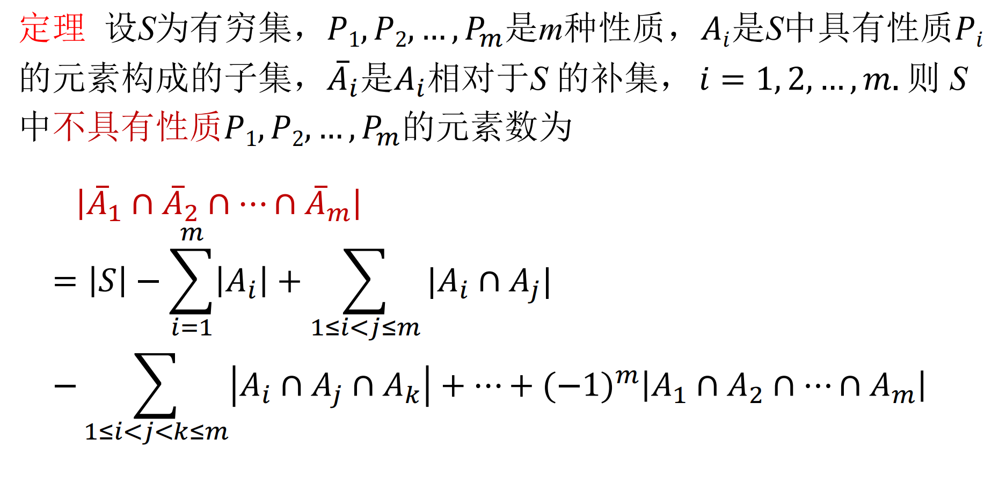
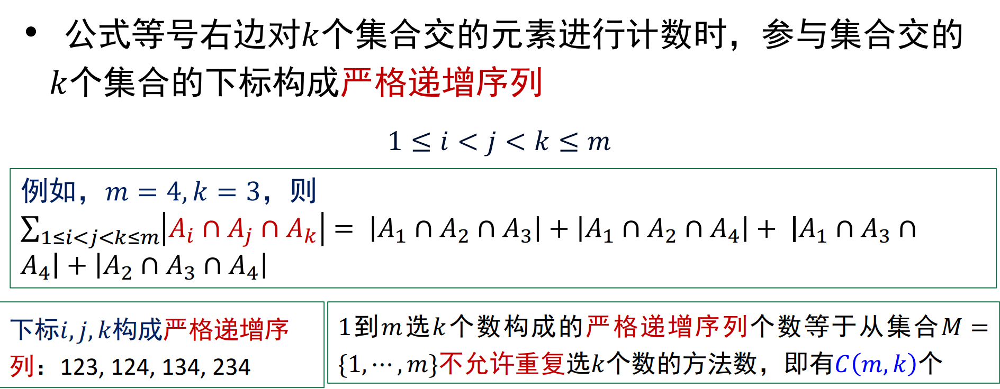

# 基本计数规则

* 加法法则：事件$A$有$m$种产生方式，事件$B$有$n$种产生方式，则“事件$A$或$B$”有**m+n**种产生方式
    * 使用条件：事件$A$与$B$产生方式不重叠

* 乘法法则：事件$A$有$m$种产生方式，事件$B$有$n$种产生方式，则“事件$A$与$B$”有**mn**种产生方式
    * 使用条件：事件$A$与$B$产生方式彼此**独立**

# 容斥原理基础
* 集合差计数公式：设A、B是有穷集合，则`|A-B|=|A|-|A⋂B|`

* 两集合容斥原理：设A、B是有穷集合，则`|A⋃B|=|A|+|B|-|A⋂B|`

* 三集合容斥原理：设A、B、C都是有穷集合，则`|A⋃B⋃C|=|A|+|B|+|C|-|A⋂B|-|A⋂C|-|B⋂C|+|A⋂B⋂C|`

* 容斥原理用于当**集合交**的元素个数比**集合并**的元素更容易计算的情况

# 鸽笼原理
* 设k是正整数，**k+1只或更多的**鸽子关到k个鸽笼里，则至少有一个鸽笼有两只或更多只鸽子

## 鸽笼原理实例1
* 从1到2n任取n+1个数，则至少有两个数，其中一个是另一个数的倍数
    1. 从2n个整数取出n+1个数看成鸽子

    2. 任何整数都可以表示成**`q*2^b`**的形式，这里奇数q导出了鸽笼

    3. 1到2n间只有n个奇数，则取出n+1个数中必然存在`q1*2^b1`和`q1*2^b2`这样两个其中一个数是另一个数的倍数

## 鸽笼原理实例2
* 正整数序列$a_1,a_2,...,a_m$中必存在若干个连续正整数的和是m的倍数
    * 即存在正整数k和l，满足$1≤k<l≤m$使得$a_k+a_{k+1}+...+a_l$是m的倍数

    * 考虑$s_1=a_1，s_2=a_1+a_2，...，sm=a1+a2+...+a_m$**这m个数整除m的余数**
        1. 若存在$s_i$整除m的数为0，则$a_1+a_2+...+a_i$是m的倍数

        2. 若所有s的余数都大于0，则存在$s_i$、$s_j$整除m的余数相等（s共有m个，而被m整除的余数有m-1个，s最多有m-1个不相同的余数，那剩下一个就必然有相同余数，即**鸽笼定理**），则$s_j-s_i=a+{i+1}+...+a_j（假设j>i）$是m的倍数（**两个s相减**把余数抵消了）

## 广义鸽笼原理
* 广义鸽笼原理：将N个物体放到k个盒子，则至少有一个盒子有$⌈\frac{N}{k}⌉$个物体（取顶符号，不小于它的**最小**整数）

* 将至少有**一个**盒子**至少有**的物体称为“最小容量”
    * 最小容量=$⌈\frac{物体总数}{盒子数}⌉$
        * 至少有一个盒子有**至少**的容量，用物体总数除以盒子数，再取顶得出最小容量

    * 物体总数的最小值=（最小容量-1）*盒子数+1
        * 让一个盒子是最小容量，其它盒子为最小容量-1
    
    * 盒子数的最大值=$⌊\frac{物体总数-1}{最小容量-1}⌋$
        * 使所有盒子都放最小容量-1，留一个盒子放最小容量

# 集合排列组合
* 选取问题：设n元集合S，从S中选取r个元素

## 排列：设S为n元集
* 从S中有序选取的r个元素称为S的一个r排列，S的不同r排列总数记作$P^r_n$或`P(n,r)`，r=n的排列是S的全排列

* 定理：设n，r为自然数，规定$0!=1$，则有

$$
对自然数n和r，r<=n\\
P(n,r)=\begin{cases}
\frac{n!}{(n-r)!},&r<=n,\\
0,&r>n.
\end{cases}
$$

## 组合：设S为n元集
* 从S种无序选取的r个元素称为S的一个r组合，S的不同r组合总数记作$C^r_n$或`C(n,r)`，也称**二项式系数**，通常记作$(^n_r)$

* 子集解释：从n元素的集合S中选取r元素（不确定数目）构成S的子集数

* 推论：设n，r为正整数，则
    1. $C(n,r)=\frac n r C(n-1,r-1)$

    2. $C(n,r)=C(n,n-r)$

    3. $C(n,r)=C(n-1,r-1)+C(n-1,r)$
    
# 多重集排列组合
* 排列的元素或者选取的元素可以重复，所以不说$n$个物体，而说$n$**类或$n$种物体**

* 定义：多重集$S={\{n_1\cdot a_1,n_2\cdot a_2,...,n_k\cdot a_k\}}（n=n_1+n_2+...+n_k$表示$S$中元素总数）

## 排列
* 从$S$中有序选取的$r$个元素称为多重集$S$的一个$r$排列。$r=n$称为全排列

* 定理：设$S=\{n1\cdot a1,n2\cdot a2,...,n_k \cdot a_k\}$为多重集
    1. $S$的全排列数是$\frac{n!}{n_1!n_2!...n_k!}$

    2. 若$r<=n_i，i=1,2,...,k$，那么$S$的$r$排列数是$k^r$

    3. 若$r<=n_i，i=1,2,...,k$，那么$S$的$r$组合数是$N=C(k+r-1,r)$

## 组合
* 从$S$中无序选取的$r$个元素称为多重集$S$的一个$r$组合

* 定理：多重集$S=\{n_1\cdot a_1,n_2 \cdot a_2,...,n_k\cdot a_k\}，=<n_i<=+\infty$，当$r<=n_i$，$S$的$r$组合数为$N=C(k+r-1,r)$
    * 证明：一个$r$组合为$\{x_1\cdot a_1,...,x_k\cdot a_k\}$，其中$x_1+x_2+...+x_k=r$，$x_i$为非负整数，这个**不定方程**的**非负整数解**对应于下述排列$r$个1，$k-1$个0的全排列数为$N=\frac{(r+k-1)!}{r!(k-1)!}=C(r+k-1,r)$

        |1...1 |$\color{red}{0}$| 1...1 |$\color{red}{0}$| 1...1 |$\color{red}{0}\color{while}{......}\color{red}{0}$|1...1|
        |-|-|-|-|-|-|-|
        |$x_1$个||$x_2$个||$x_3$个||$x_k$个|

# 二项式定理与组合等式

## 二项式定理
* 组合数$C(n,r)$又称为**二项式系数**，因为出现在二项式的幂的展开式中。二项式的幂$(x+y)^n$的展开式称为**二项式定理**

* 二项式定理：设$x$和$y$是两个变量，$n$是正整数，则：$\Sigma^n_{i=0}(^n_i)x^iy^{n-i}$

## 组合恒等式
* 递推式
    1. $(^n_k)=(^n_{n-k})$：用于化简

    2. $(^n_k)=\frac nk (^{n-1}_{k-1})$：用于求和时消去变系数

    3. $(^n_k)=(^{n-1}_k)+(^{n-1}_{k-1})$：用于求和时拆项（两项之和或两项之差），然后合并

* 基本求和式
    1. $\Sigma ^n_{k=0}(^n_k)=2^n\quad n\in N$

    2. $\Sigma ^n_{k=0}(-1)^k(^n_k)=0\quad n\in N$

* 变系数求和
    1. $\Sigma ^n_{k=0}k(^n_k)=n2^{n-1}$
        * 证明：二项式定理中令$y=1$，$(x+1)^n=(1+x)^n=(^n_0)+(^n_1)x+(^n_2)x^2+...+(^n_{n-1})x^{n-1}+(^n_n)x^n=\Sigma^n_{k=0}(^n_k)x^k=1+\Sigma ^n_{k=1}(^n_k)x^k$

        * 进行微分操作（两端对x求导）：$n(x+1)^{n-1}=\Sigma^n_{k=1}k(^n_k)x^{k-1}$

        * 令$x=1$：$n2^{n-1}=\Sigma ^n_{k=0}k(^n_k)$

    2. $\Sigma ^n_{k=0}k^2(^n_k)=n(n+1)2^{n-2}$
        * 证明：
            $$
            \Sigma ^n_{k=0}k^2(^n_k)\\
            =\Sigma ^n_{k=1}k^2(^n_k)\\
            =\Sigma ^n_{k=1}k^2\frac n k (^{n-1}_{k-1})\\
            =\Sigma ^n_{k=1}kn(^{n-1}_{k-1})\\
            =n\Sigma ^n_{k=1}(k-1+1)(^{n-1}_{k-1})\\
            =n\Sigma^n_{k=1}(k-1)(^{n-1}_{k-1})+n\Sigma ^n_{k=1}(^{n-1}_{k-1})\\
            =n\Sigma ^{n-1}_{k=0}k(^{n-1}_{k})+n\Sigma ^{n-1}_{k=0}(^{n-1}_k)\\
            =n(n-1)2^{n-2}+n2^{n-1}\\
            =n(n+1)2^{n-2}
            $$

* 变上项求和
    1. $\Sigma ^n_{l=0}(^l_k)=(^{n+1}_{k+1})\quad n,k\in N$

        

* 乘积转换式
    1. $(^n_r)(^r_k)=(^n_k)(^{n-k}_{r-k})$

* 积之和
    1. $\Sigma ^r_{k=0}(^m_k)(^n_{r-k})=(^{m+n}_r)$

        

    2. $\Sigma ^n_{k=0}(^m_k)(^n_{k})=(^{m+n}_m)$

# 非降路径问题

## 非降路径数
* 设m，n为正整数，从$(0,0)$到$(m,n)$的非降路径数：
    * m步向右，n步向上，共走m+n步

    * 非降路径数：$C(m+n,m)$，即从m+n步中选m步往右，剩下都是往上

* 从$(a,b)$到$(m,n)$的非降路径数：
    * 等于从$(0,0)$到$(m-a,n-b)$的非降路径数$C(m+n-a-b,m-a)$

* 从$(a,b)$经过$(c,d)$到$(m,n)$的非降路径数：
    * 等于从$(a,b)$到$(c,d)$的非降路径数**加上**从$(c,d)$到$(m,n)$的非降路径数

## 限制条件的非降路径数
* 设n为正整数，从$(0,0)$到$(n,n)$除端点外，不接触对角线的非降路径数

1. 先计算对角线下方的不接触非降路径，再乘以2得出结果。**因为对角线上下的不接触非降路径是对称的**

2. 计算从$(0,0)$到$(n,n)$的**对角线下方**不接触非降路径等于从$(0,1)$到$(n,n-1)$的不接触非降路径。**因为从$(0,0)$开始必定经过$(0,1)$且只有一条路，终点也是一样**

3. 计算从$(1,0)$到$(n,n-1)$的全部非降路径等于从$(0,1)$到$(n,n-1)$的**接触非降路径**，最后用全部非降路径减去全部接触非降路径得出全部非接触非降路径。**因为计算从$(0,1)$到$(n,n-1)$的*非接触非降路径*不好计算，故通过全部非降路径减去全部接触非降路径方法计算**；**而全部接触非降路径至少接触一次对角线，也就是计算出至少接触一次对角线的个数，而从对角线上方到对角线下方的路径必然会至少接触一次，所以考虑将$(0,1)$对称到$(1,0)$，计算从$(1,0)$到$(n,n-1)$的全部非降路径就能得出全部接触非降路径**

4. 计算过程：
    1. $(1,0)$到$(n,n-1)$的全部非降路径=$(^{2n-2}_{n-1})$

    2. $(1,0)$到$(n,n-1)$的全部接触非降路径=$(^{2n-2}_{n})$

    3. $(0,0)$到$(n,n)$的对角线下方不接触非降路径=$(^{2n-2}_{n-1})-(^{2n-2}_{n})$

    4. $(0,0)$到$(n,n)$的不接触非降路径=$2[(^{2n-2}_{n-1})-(^{2n-2}_{n})]=\frac2n(^{2n-2}_{n-1})$

## 栈输出的计数
* 将$1,2,...,n$按照顺序输入栈，有多少种不同的输出序列？

* 将进栈总次数记作x，出栈总次数记作y，则不同的输出序列数等于从$(0,0)$到$(n,n)$的**不穿过**对角线的非降路径数

* 计算方法与上面限制条件的非降路径数相似，只不过**不接触**的对角线为$y=x+1$，并且只计算对角线下方不接触非降路径，因为**x>=y**

* $N=(^{2n}_{n})-(^{2n}_{n-1})=\frac{1}{n+1}(^{2n}_{n})$

## 容斥定理
* 不定方程$x_1+x_2+x_3=6$有多少满足$x1<=3,x_2<=2,x_3<=4$的非负整数解
    * 记性质$P_1$为$x_1>=4$，$P_2$为$x_2>=3$，$P_3$为$x_3>=5$
        * 则是求有多少同时不满足$P_1$和$P_2$和$P_3$的解个数

        * 即答案等于非负整数解个数减去满足$P_1$或$P_2$或$P_3$的解个数

    1. 满足$P_1$或$P_2$或$P_3$的解个数：使用容斥定理
        1. 满足$P_1$的解个数：$\Sigma_{i=4}^{6}(^{(6-i)+(2-1)}_{2-1})=3+2+1=6$

        2. 满足$P_2$的解个数：$\Sigma_{i=3}^{6}(^{(6-i)+(2-1)}_{2-1})=4+3+2+1=10$

        3. 满足$P_3$的解个数：$\Sigma_{i=5}^{6}(^{(6-i)+(2-1)}_{2-1})=2+1=3$

        4. 同时满足$P_1$和$P_2$的解个数：$0$

        5. 同时满足$P_1$和$P_3$的解个数：$0$

        6. 同时满足$P_2$和$P_3$的解个数：$0$

        7. 同时满足$P_1$和$P_2$和$P_3$的解个数：$0$

        8. 满足$P_1$或$P_2$或$P_3$的解个数：$6+10+3=19$

    2. 非负整数解个数：$(^{6+(3-1)}_{3-1})=(^8_2)=28$

    3. 答案：$28-19=9$

