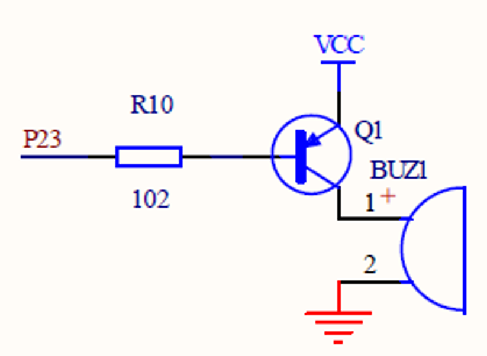

# 蜂鸣器
* 有源蜂鸣器和无源蜂鸣器：“源”指振荡源。无源内部不带振荡源，所以用直流无法鸣叫，要用2K~5K Hz的方波去驱动。
# 三极管工作原理
* 基极：用于激活晶体管
* 集电极：三极管的正极
* 发射极：三极管的负极
      
    * 箭头指向的电流或电压大于某个值时，三极管将导通，即PNP发射极流通集电极，NPN集电极流通发射极
# 蜂鸣器原理图
    
# 例子
* 蜂鸣器一直叫
```c51
#include<reg52.h>
sbit beep=P2^3;
void main()
{
	beep=0;
}
```    
