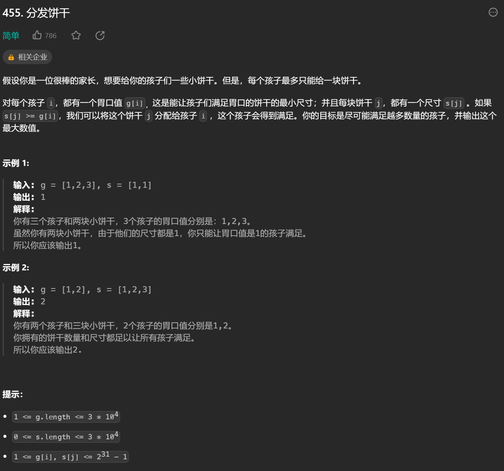
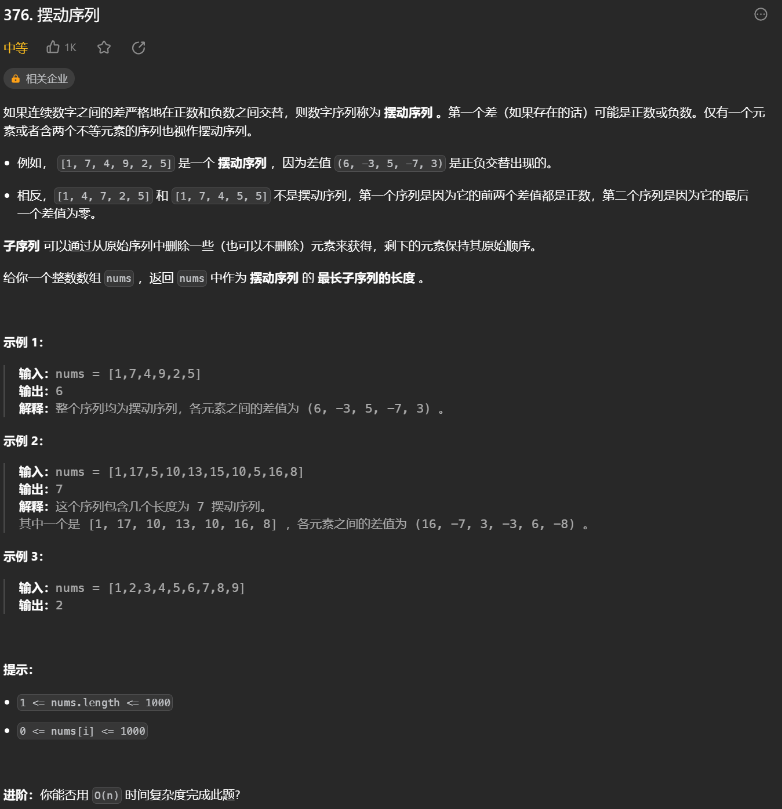

# 贪心算法
* 一般步骤：
    1. 将问题分解为若干子问题
    2. 找出适合的贪心策略
    3. 求解每一个子问题的最优解
    4. 将局部最优解堆叠成全局最优解

* 1.分发饼干

    

    思路1：将剩下最小尺寸的饼干给剩下最小胃口且满足胃口的孩子，保证饼干最小程度没有浪费

    思路2：将剩下最大尺寸的饼干给剩下最大胃口且满足胃口的孩子，保证饼干能喂饱尽可能多的孩子

* 2.摆动序列

    

    * 思路：序列中有一段段摆动序列，把每段摆动序列连接起来即可，只需要删除连接处的数字

* 3. 最大子数组和
    

    * 思路：