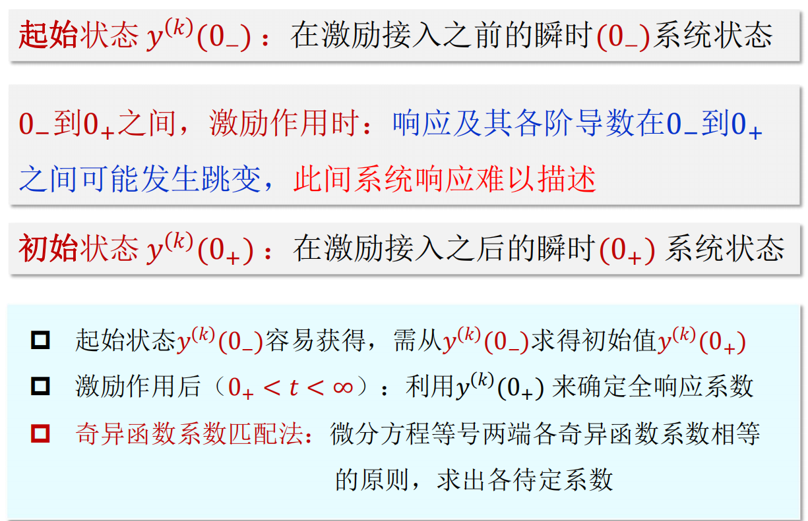

# 起始点的跳变
* 对于一个具体的电网络，系统的$0_-$状态就是系统中储能元件的**储能**情况

* 一般情况下换路期间电容两端的电压和流过电感中的电流**不会发生突变**。换路定则：$u_C(0_-)=u_C(0_+)$，$i_L(0_-)=i_L(0_-)$

* 但是当有**冲激电流**强迫作用于**电容**或有**冲激电压**强迫作用于**电感**，$0_-$到$0_+$状态就会发生跳变

* 当系统用微分方程表示时，系统的$0_-$到$0_+$状态有没有跳变取决于微分方程右端自由项是否包含$\delta(t)$及各阶导数

## 冲激函数匹配法确定初始条件
* 配平原理：$t=0$时微分方程左右两端的$\delta(t)$及各阶导数应该平衡相等（其它项也应该平衡，**我们讨论初始条件，可以不管其它项**）
    > $\frac{d}{dt}r(t)+3r(t)=3\delta'(t)~~已知r(0_-),求r(0_+)$
    > * 右端是$\delta'(t)$，左端必然含有$\delta'(t)$。若$3r(t)$含有$\delta'(t)$，则$\frac{d}{dt}r(t)$含有$\delta''(t)$，右端没有则此情况不成立。
    
    > * 则$\frac{d}{dt}r(t)$含有$3\delta'(t)$，积分乘以3得到$3r(t)$的值为$9\delta(t)$，而右端没有$9\delta(t)$，则$\frac{d}{dt}r(t)$还有另一项$-9\delta(t)$，而它使得$3r(t)$变成两项$9\delta(t)-9u(t)$
    
    > * 只看$\delta(t)$有关项**后面不管配平**（这里不确定），则$r(t)$中含有$-9u(t)$，即$r(t)$有9倍向下单位跳变 

    

    * $\Delta u(t)$积分为单位斜坡信号在$0^−$到$0^+$区间等于0