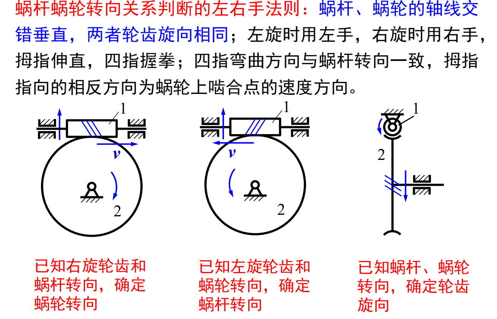
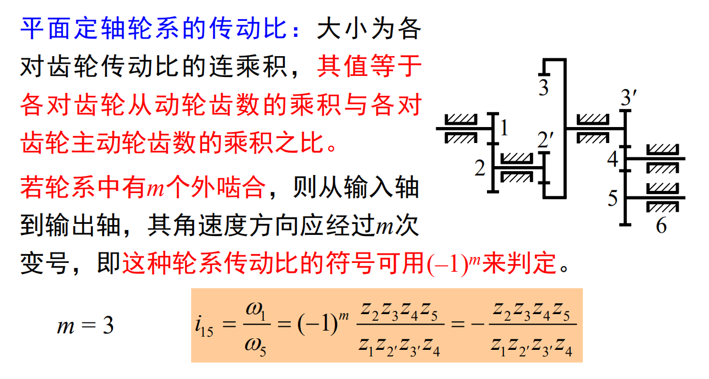
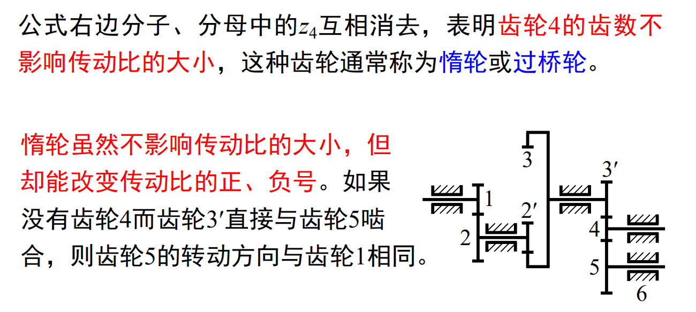
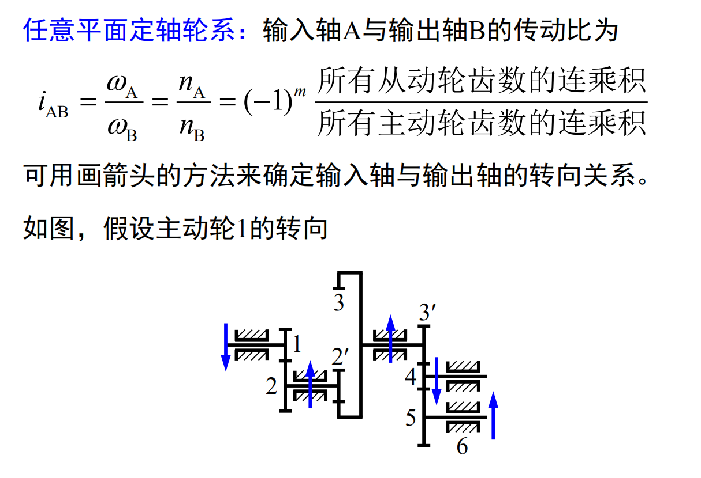
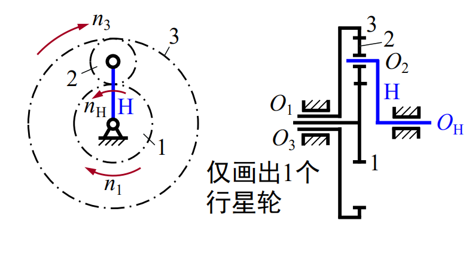
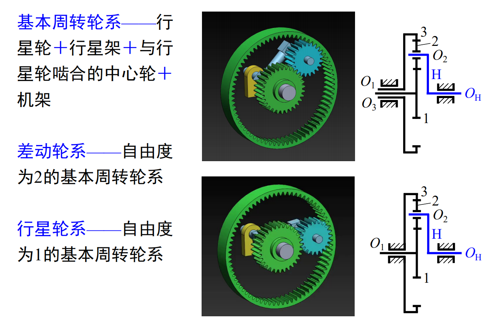
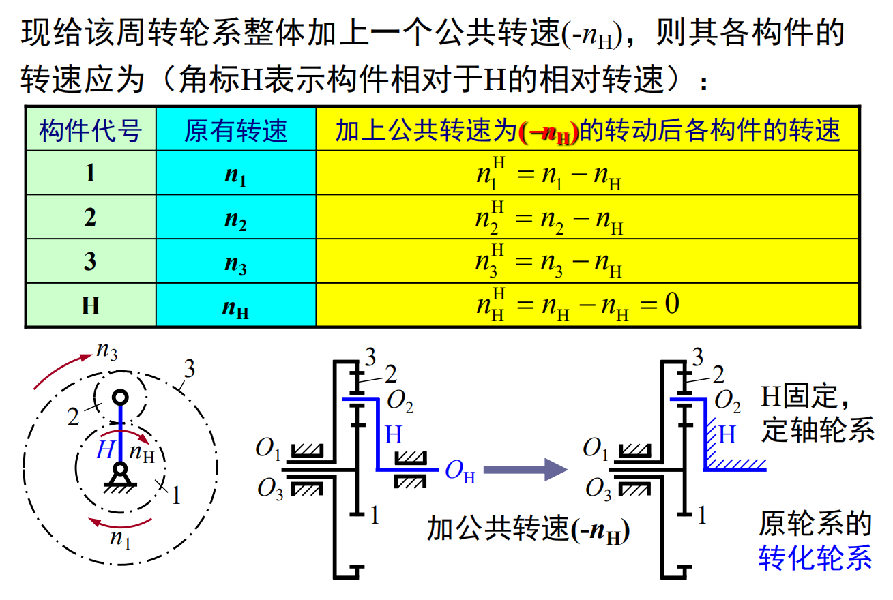
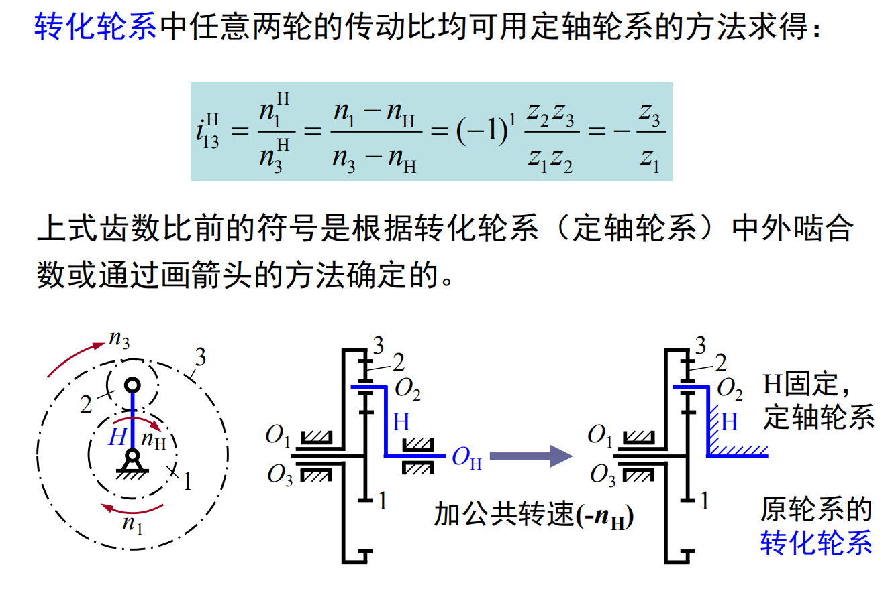
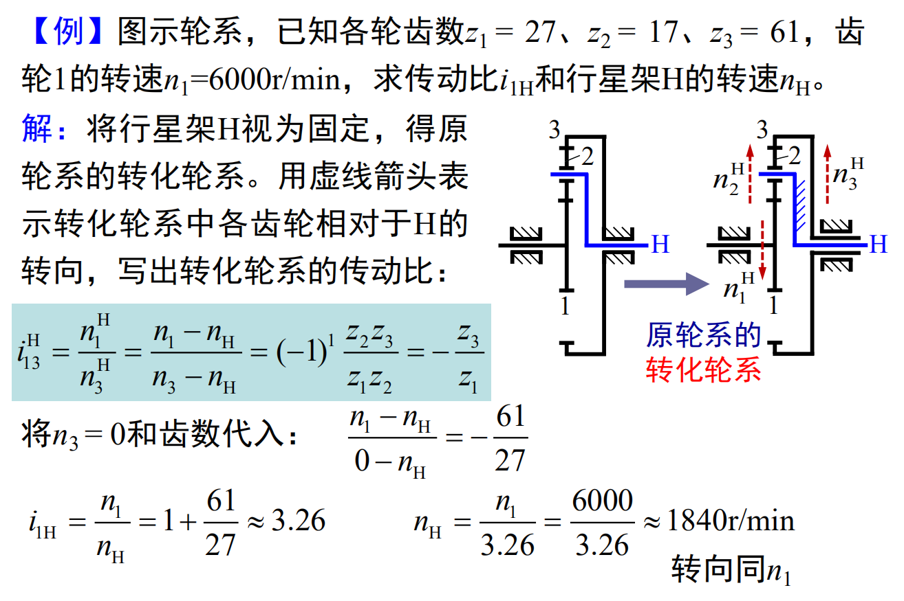
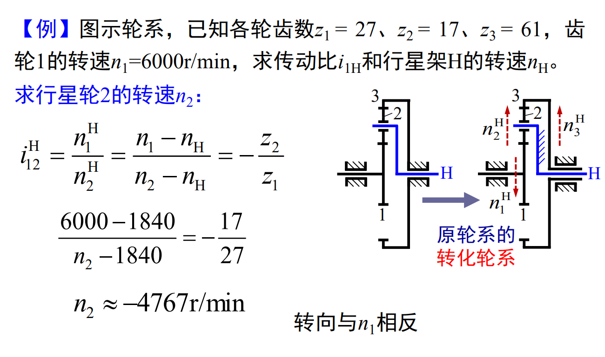

# 轮系的类型
* 轮系：由一系列互相啮合的齿轮所组成的齿轮传动系统

* 定轴轮系：运转时，各齿轮几何轴线的位置固定不动

* 周转轮系：运转时，至少有一个齿轮的几何轴线是绕着其它定轴齿轮的轴线转动

# 定轴轮系及其传动比
* 平行轴定轴轮系：仅由平面齿轮机构组成，各齿轮轴线平行

* 非平行轴定轴轮系：含有空间齿轮机构

* 蜗杆蜗轮旋向：将蜗杆或蜗轮轴线竖起，螺旋线右面高为右旋，左高为左旋

    

# 周转轮系及其传动比
* 周转轮系的组成
    * 行星轮$2$

    * 行星架或转臂$H$

    * 中心轮或太阳轮$1、3$

    * 行星架与中心轮的集合轴线重合

    

    

* 周转轮系传动比的计算

    

    

    

    
    