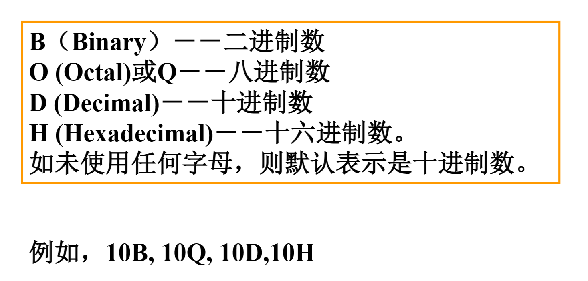
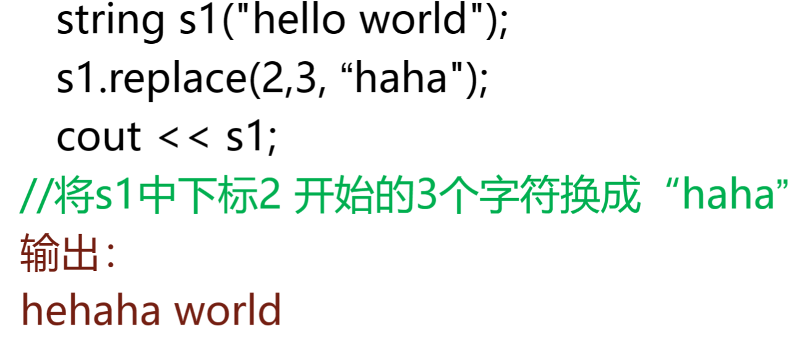
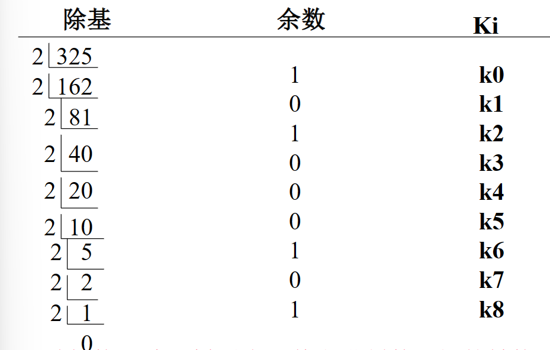
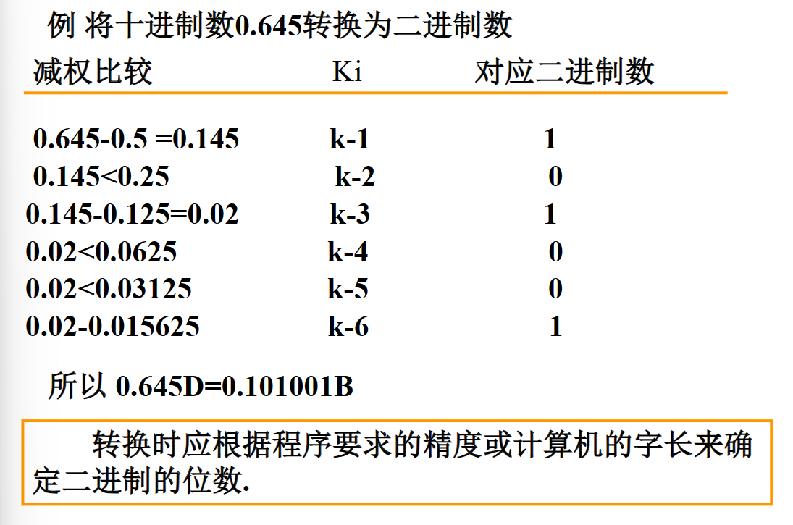
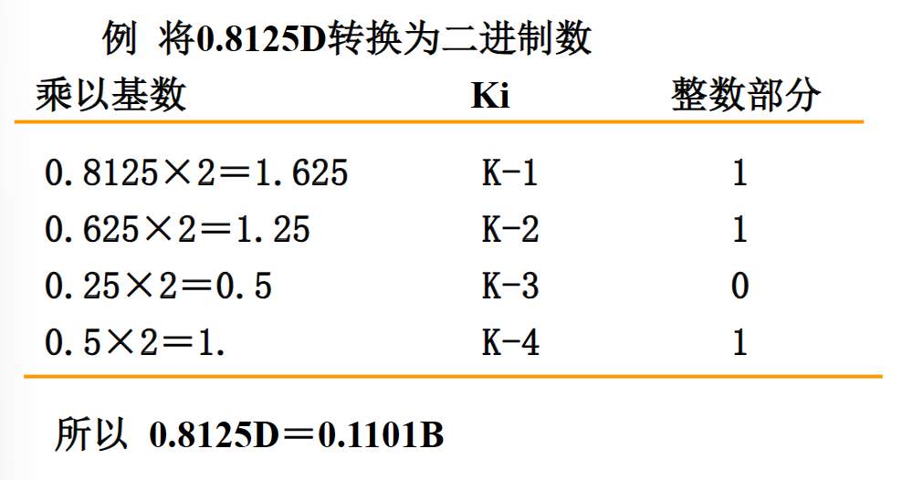
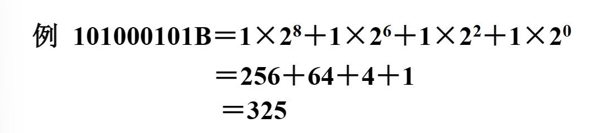
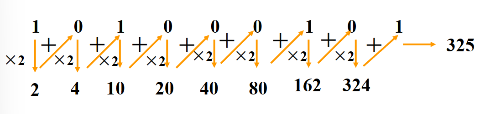
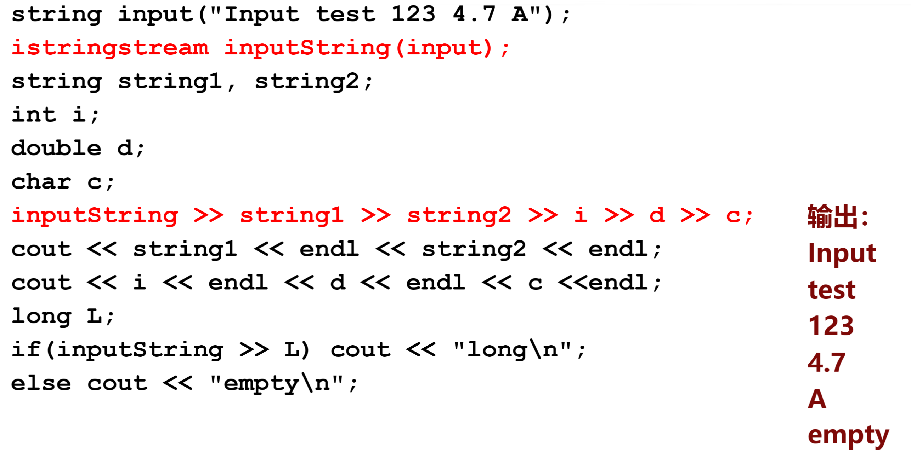

## 1. 进位计数制

* 使用一定个数的数码的组合来表示数字,这种表示方法称为进制计数制.根据所使用的数码的个数,就产生了不同的进位计数制
* 将各个位置上所表示的基本数值称为位权,简称权
    * 不同进位制和不同的位置其位权是不同的.位权乘以对应位置上的数码就等于该数位上数值的大小
* 每个数位上能使用不同的数码的个数称为基数
    * 例如:十进制有十个数码,基数为10,二进制基数为2
    * 每个数位能取得最大数码值=基数-1,如十进制为10-1=9
* 二进制与八进制,十六进制之间有非常简单的转换关系
    * 例如:3位二进制数与1位八进制数对应,4位二进制数与1位十六进制数对应
* 在书写不同进位计数制数时,为了区别,常在数的尾部用一个字母来表示

## 各种数制间的相互转换

1. 十进制整数转换为二进制数
    * 减权定位法
        * 从二进制数高位起,依次用待转换的十进制数与各位权值进行比较
        * 如够减,则该数位系数Ki=1,同时减去该位权值,余数作为下一次比较的值
        * 如不够减,则Ki=0

    * 除基取余法
        * 将十进制除以基数2,其余数为二进制数的最低位,再用其商除以2,其余数为次低位,反复做下去,直至商为0

2. 十进制小数转换为二进制数
    * 减权定位法

    * 乘基取整法

3. 二进制整数转换为十进制数
    * 按权相加法

    * 逐次乘基相加法

4. 二进制小数转换为十进制
    * 按权相加法

    * 逐次除集相加法

5. 二进制与八进制和十六进制间的转换

